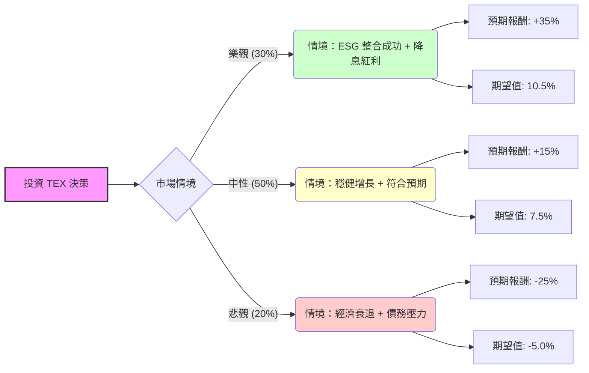

為了評估 **Terex Corporation (TEX)** 的投資價值，我結合了您提供的基本面數據，並針對最新的市場動態（特別是 2024 年下半年的收購案與財報表現）進行了深入研究。

以下是基於**決策樹分析**與**期望值分析**的詳細評估報告。

---

### 1. 核心背景與市場動態分析 (Core Assumptions)

在建立決策樹之前，我們必須考慮以下關鍵因素：
*   **ESG 收購案（關鍵變數）：** Terex 於 2024 年 10 月完成了對 Dover 旗下 Environmental Solutions Group (ESG) 的 20 億美元收購。這標誌著公司從純粹的週期性建築機械轉向更穩定的「廢棄物處理與回收」領域。
*   **利率環境：** 聯準會進入降息週期，有利於降低 Terex 的債務成本（目前 Debt/Eq 為 1.29），並刺激下游建築與基礎設施需求。
*   **估值水平：** 目前 Forward P/E 僅 11.76，遠低於當前 P/E (20.42)，顯示市場預期明年獲利將大幅增長（EPS next Y 預期成長 18.5%）。
*   **技術面：** 股價位於 SMA20, 50, 200 之上，呈現強勢多頭排列，距離 52 週高點僅約 4.6%。

---

### 2. 決策樹分析 (Decision Tree)

我們將未來一年的投資情境分為三種：**樂觀（Bull）、中性（Base）、悲觀（Bear）**。

---

### 3. 期望值計算過程 (Expected Value Calculation)

#### A. 情境假設與參數設定：
1.  **樂觀情境 (Bull Case) - 30% 機率：**
    *   **理由：** ESG 收購產生協同效應，利潤率提升；美國基礎設施法案持續發酵；降息超預期。
    *   **目標價預估：** 參考 Target Price $79.06 並加上溢價，預計可達 $91 (約 +35%)。
2.  **中性情境 (Base Case) - 50% 機率：**
    *   **理由：** 公司達到分析師預期的 EPS 成長 (18.5%)，估值修復至歷史平均水平。
    *   **目標價預估：** 接近分析師平均目標價 $78 - $80 (約 +15%)。
3.  **悲觀情境 (Bear Case) - 20% 機率：**
    *   **理由：** 高利率維持時間過長導致建築業萎縮；收購 ESG 整合失敗導致商譽減損；債務負擔加重。
    *   **目標價預估：** 回測 SMA200 支撐位約 $51 (約 -25%)。

#### B. 期望值 (EV) 計算：
$$EV = (P_{Bull} \times R_{Bull}) + (P_{Base} \times R_{Base}) + (P_{Bear} \times R_{Bear})$$
$$EV = (0.30 \times 35\%) + (0.50 \times 15\%) + (0.20 \times -25\%)$$
$$EV = 10.5\% + 7.5\% - 5.0\%$$
$$EV = 13.0\%$$

**計算結果：** 投資 TEX 的一年預期總報酬率（期望值）為 **13.0%**。

---

### 4. 綜合評估與最終結論

#### 數據亮點分析：
*   **成長性：** EPS Q/Q 高達 32.67%，且明年預期成長 18.5%，顯示基本面強勁。
*   **安全性：** Current Ratio 2.3 顯示短期流動性無虞；P/C (股價現金比) 10.04 顯示現金流相對充裕。
*   **收購轉型：** 併購 ESG 是神來之筆，能有效對抗建築業的週期性風險，提升整體估值倍數（廢棄物處理行業的 P/E 通常高於機械製造業）。

#### 潛在風險：
*   **債務比率：** Debt/Eq 1.29 略高，在利率高位時會侵蝕利潤。
*   **內部人交易：** Insider Trans 為 -0.0081，雖比例極小，但顯示內部人近期無大幅增持動作。

#### **最終結論：適合投資 (Buy / Overweight)**

**理由：**
1.  **正向期望值：** 13.0% 的期望值優於多數工業股平均水平，且風險回報比（Risk/Reward Ratio）合理。
2.  **估值吸引力：** Forward P/E 11.76 顯示股價尚未完全反映明年的成長潛力。
3.  **戰略轉型：** 透過 ESG 收購，TEX 正在從「純週期股」轉型為「成長兼具防禦股」，這有利於機構投資者進行長期配置（Inst Trans 已增加 2.22%）。
4.  **技術面支撐：** 股價站穩所有均線之上，且距離目標價仍有約 16.8% 的基本漲幅空間。

**建議操作：**
可在 $65 - $68 區間分批佈局，首個目標價看 $79，若 ESG 整合進度優於預期，可長線持有至 $90 以上。需留意每季財報中關於 ESG 部門的利潤率貢獻。