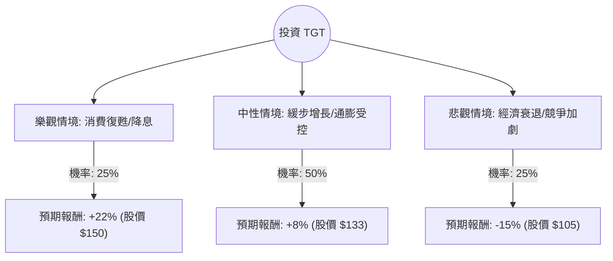

這份分析報告將結合您提供的基本面數據與最新的市場動態（截至 2024 年 6 月），利用**決策樹（Decision Tree）**與**期望值分析（Expected Value Analysis）**評估 Target (TGT) 的投資價值。

---

### 一、 市場背景與最新動態補充 (Web Search Summary)

在進行定量分析前，整合以下最新市場資訊：
1.  **Q1 財報表現**：Target 最近一季（2024 Q1）財報顯示同店銷售額下降 3.7%，反映消費者對非必需品（如家居、電子產品）支出依然謹慎。但 EPS 超出預期，顯示成本控制與庫存管理改善。
2.  **價格競爭策略**：Target 宣佈對 5,000 多種日常商品進行降價，以應對 Walmart 的競爭並吸引受通膨困擾的消費者。
3.  **利潤率回升**：毛利率（Gross Margin）回升至 25.4% 以上，主要得益於庫存減損減少與物流成本下降。
4.  **宏觀環境**：聯準會降息預期反覆，高利率環境持續壓抑消費者信用支出，對 Target 這種以非必需品為主的零售商較為不利。

---

### 二、 決策樹分析 (Decision Tree)

我們將未來一年的投資情境分為三種：**樂觀（牛市）**、**中性（基準）**、**悲觀（熊市）**。

#### 決策樹節點詳細標示：

| 情境節點 | 發生機率 (P) | 預期股價變動 (R) | 股息收益 (D) | 總報酬 (R+D) | 期望值貢獻 (P * Total R) |
| :--- | :--- | :--- | :--- | :--- | :--- |
| **樂觀 (Bull)** | 25% | +22.0% | 3.75% | 25.75% | **6.44%** |
| **中性 (Base)** | 50% | +8.0% | 3.75% | 11.75% | **5.88%** |
| **悲觀 (Bear)** | 25% | -15.0% | 3.75% | -11.25% | **-2.81%** |
| **總計** | **100%** | - | - | - | **9.51%** |

---

### 三、 核心假設與計算過程

#### 1. 核心假設：
*   **市場假設**：中性情境假設美國經濟實現「軟著陸」，消費支出維持低速增長。
*   **財務假設**：Target 的 Forward P/E 為 14.22，低於歷史平均（約 17-18），顯示估值具有安全邊際。
*   **產業趨勢**：假設 Target 的降價策略能有效止住市佔率流失，且毛利率能維持在 25% 以上。
*   **股息**：假設維持目前 3.75% 的高股息率（Dividend %: 0.0375），這在零售股中極具吸引力。

#### 2. 期望值 (Expected Value, EV) 計算：
期望值公式：$EV = \sum (Probability_i \times Return_i)$

*   **樂觀情境 (25%)**：通膨快速降溫，聯準會啟動降息，消費者重回非必需品市場。股價回升至 52 週高點附近（約 $150）。
    *   $0.25 \times (22\% + 3.75\%) = 6.4375\%$
*   **中性情境 (50%)**：經濟平穩，Target 轉型策略見效，股價回歸至分析師平均目標價（Target Price: $126.67 ~ $133）。
    *   $0.50 \times (8\% + 3.75\%) = 5.875\%$
*   **悲觀情境 (25%)**：經濟進入衰退，失業率上升，消費者僅購買必需品，Target 庫存再度積壓。股價回測 $105 支撐位。
    *   $0.25 \times (-15\% + 3.75\%) = -2.8125\%$

**總期望報酬率 = 6.44% + 5.88% - 2.81% = 9.51%**

---

### 四、 綜合評估與最終結論

#### 1. 數據亮點分析：
*   **估值優勢**：P/E 14.93 與 Forward P/E 14.22 顯示股價並未過熱，PEG 2.25 雖偏高，但考慮到其零售龍頭地位與穩定現金流，尚可接受。
*   **獲利能力**：ROE 24.04% 非常強勁，顯示管理層利用股東權益創造利潤的效率極高。
*   **技術面**：目前股價 ($123.08) 低於 SMA20 與 SMA50，顯示短期處於修正階段，但高於 SMA200 (+16.48%)，長期趨勢尚未走壞。

#### 2. 風險提示：
*   **負債比**：Debt/Eq 1.26 略高，在高利率環境下財務壓力較 Walmart 大。
*   **流動性**：Quick Ratio 0.36 偏低，需注意短期現金流調度。

#### 3. 最終判斷：

**結論：適合投資 (建議分批買入)**

**理由：**
1.  **正向期望值**：經計算後的年度預期報酬率為 **9.51%**，優於多數固定收益產品。
2.  **高股息護城河**：3.75% 的股息率提供了良好的下行保護（Downside Protection），即使股價橫盤，仍有現金流收入。
3.  **估值修復機會**：目前 P/E 處於歷史相對低位，且公司已主動採取降價策略應對競爭，最壞的庫存危機已過。
4.  **適合對象**：適合追求「價值投資」與「穩定配息」的長期投資者。短期內因消費數據波動可能仍有震盪，建議在 $120 附近分批佈局。