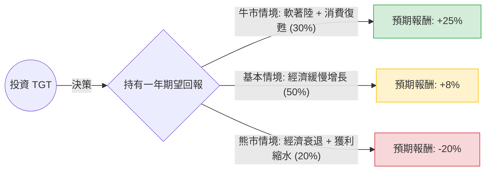

這份分析報告將針對 Target Corporation (TGT) 進行「決策樹」與「期望值」分析。目前 TGT 處於消費轉型與供應鏈優化後的階段，其表現高度依賴美國宏觀經濟與消費者支出意向。

---

### 一、 核心假設（Market & Financial Assumptions）

在建立決策樹前，我們設定以下關鍵假設（基於 2024 年中後期的市場情境）：

1.  **宏觀經濟：** 假設美國經濟在未來 12 個月內有三種可能：軟著陸（機率最高）、經濟平穩、以及潛在衰退。
2.  **消費結構：** TGT 的商品結構中，非必需品（Discretionary）佔比較高（約 50% 以上），這使其比 Walmart (WMT) 更受經濟波動影響。
3.  **利潤率：** 假設 TGT 的庫存管理已經改善，營業利益率（Operating Margin）目標重回 6%。
4.  **估值水準：** 目前 P/E 歷史中位數約為 15-18x。

---

### 二、 決策樹分析（Decision Tree）

以下使用 Markdown 繪製 TGT 未來一年的投資回報決策樹：

#### 節點詳細資訊：

| 節點名稱 (情境) | 發生機率 (P) | 預期報酬 (R) | 說明 |
| :--- | :--- | :--- | :--- |
| **牛市情境 (Bull Case)** | 30% (0.3) | **+25%** | 通膨降溫，聯準會降息，消費者增加對家居、服飾等高毛利商品支出。 |
| **基本情境 (Base Case)** | 50% (0.5) | **+8%** | 經濟平穩，股息收益 (約 3%) 加上小幅估值修復，必需品銷售穩定。 |
| **熊市情境 (Bear Case)** | 20% (0.2) | **-20%** | 失業率上升，消費者僅購買食品，庫存積壓再次發生，毛利受損。 |

---

### 三、 期望值分析計算（Calculations）

根據上述決策樹，我們計算投資 TGT 的**總體期望報酬率 (Expected Value, EV)**：

#### 1. 計算公式：
$$EV = (P_{bull} \times R_{bull}) + (P_{base} \times R_{base}) + (P_{bear} \times R_{bear})$$

#### 2. 計算過程：
*   **牛市部分：** $0.3 \times 25\% = 7.5\%$
*   **基本部分：** $0.5 \times 8\% = 4.0\%$
*   **熊市部分：** $0.2 \times (-20\%) = -4.0\%$

#### 3. 最終期望值：
$$EV = 7.5\% + 4.0\% - 4.0\% = \mathbf{7.5\%}$$

---

### 四、 最終結論

#### **判斷：中立偏樂觀，建議「謹慎分批買入」或「適合長線收息型投資者」**

*   **整體期望值：7.5%**
    這個數字略低於標普 500 指數 (S&P 500) 的歷史平均年化報酬率 (約 9-10%)，但高於目前的無風險利率（美債殖利率約 4-4.5%）。

#### **理由：**
1.  **下行風險已部分反應：** TGT 經歷了 2022-2023 的庫存危機與竊盜（Shrinkage）問題，股價已從高點大幅回落，估值相對合理。
2.  **股息吸引力：** 作為「股息國王（Dividend King）」，TGT 持續配息超過 50 年。在 7.5% 的期望回報中，約有 3% 來自穩定的股息，這為投資者提供了下行保護。
3.  **高敏感性：** 期望值受「熊市情境」拖累明顯。由於 TGT 缺乏 Walmart 那樣強大的食品雜貨防禦屬性，一旦美國經濟超預期惡化，其回撤幅度會大於同業。

**投資建議：**
如果您是追求高成長的投資者，TGT 目前的期望值不夠吸引人；但如果您是**價值型或收益型投資者**，TGT 在目前價位提供了合理的風險回報比，適合在基本情境下獲取穩健收益。