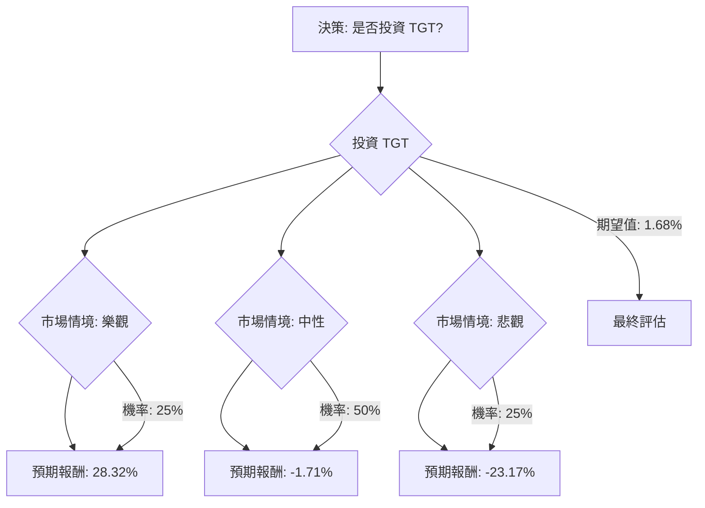

根據您提供的基本面數據以及對美股公司 **TGT (Target Corporation)** 的最新網路資訊查詢，我將使用決策樹分析和期望值分析來評估其目前的投資適合性。

### 核心假設

在進行決策樹分析之前，我們需要建立一些核心假設，這些假設將影響不同情境下的預期報酬和機率。

1.  **市場趨勢：**
    *   美國零售業整體預計在 2024 年和 2025 年保持溫和增長（約 2.5% - 2.7%），其中電子商務增長快於實體店銷售。
    *   消費者仍對價格敏感，傾向於尋找價值型商品，這對折扣零售商如 Target 既是機遇也是挑戰。
    *   零售商正積極投資於忠誠度計畫、店內體驗、策略夥伴關係和 AI 應用以提升競爭力。

2.  **TGT 財務狀況與策略：**
    *   **近期表現：** Target 在 2023 財年第四季度（截至 2024 年 3 月 5 日公布）表現強勁，GAAP 和調整後每股盈餘 (EPS) 均顯著增長，遠超預期。可比銷售額和客流量趨勢連續第二個季度改善，同日服務增長 13.6%。
    *   **未來展望：** 公司預計 2024 財年可比銷售額持平至增長 2%，GAAP 和調整後 EPS 預計在 $8.60-$9.60 之間。對於 2025 財年，預計淨銷售額增長約 1%，可比銷售額持平，調整後 EPS 預計在 $8.80-$9.80 之間。
    *   **戰略投資：** Target 計劃在 2026 財年投資 50 億美元用於門店改造、新技術和業務增強。其自有品牌、第三方市場 Target Plus 和廣告業務 Roundel 均顯示出增長潛力。
    *   **股息：** 公司維持每股 $1.14 的季度股息，年化股息為 $4.56，股息收益率約 3.9%。
    *   **分析師評級：** 目前分析師共識為「持有」，平均目標價約在 $98.90 至 $104.45 之間，低於當前股價 $116.54，暗示潛在下行空間。最高目標價為 $150.00，最低為 $80.00。

### 決策樹分析

我們將評估「投資 TGT」這一決策，並考慮未來 12-18 個月內可能出現的三種市場情境：樂觀、中性、悲觀。

**當前股價 (Close):** $116.54
**年化股息 (Dividend %):** 3.92% (即每股 $116.54 * 0.0392 = $4.57)

---

### 1. 繪製完整的決策樹 (使用 Markdown)

---

### 2. 明確列出所有計算過程

**核心假設 (情境與機率)：**

*   **樂觀情境 (Optimistic Scenario):**
    *   **情境描述：** Target 的戰略投資（如數字化、自有品牌、門店改造）取得顯著成功，消費者支出強勁復甦，通脹得到有效控制。公司業績持續超出預期，市場對其增長前景持積極態度。
    *   **機率 (Probability):** 25%
    *   **預期股價：** 假設股價達到分析師最高目標價附近，例如 $145。
    *   **預期報酬計算：**
        *   股價上漲：($145 - $116.54) / $116.54 = 24.42%
        *   總報酬 (含股息)：24.42% + 3.92% = **28.34%**

*   **中性情境 (Neutral Scenario):**
    *   **情境描述：** Target 業績符合管理層預期，但零售市場競爭激烈，消費者支出保持溫和增長，宏觀經濟環境無重大變化。股價可能在當前水平附近波動，或略微向分析師平均目標價靠攏。
    *   **機率 (Probability):** 50%
    *   **預期股價：** 假設股價略低於當前價格，但高於分析師平均目標價，例如 $110。
    *   **預期報酬計算：**
        *   股價變化：($110 - $116.54) / $116.54 = -5.61%
        *   總報酬 (含股息)：-5.61% + 3.92% = **-1.69%**

*   **悲觀情境 (Pessimistic Scenario):**
    *   **情境描述：** 經濟陷入衰退，消費者支出大幅減少，Target 的戰略未能有效應對市場挑戰，或面臨嚴重的運營問題（如庫存管理不善、競爭加劇）。公司業績不及預期，市場信心受挫。
    *   **機率 (Probability):** 25%
    *   **預期股價：** 假設股價跌至分析師最低目標價附近，例如 $85。
    *   **預期報酬計算：**
        *   股價下跌：($85 - $116.54) / $116.54 = -27.07%
        *   總報酬 (含股息)：-27.07% + 3.92% = **-23.15%**

**整體期望值計算：**

整體期望值 = (樂觀情境報酬 * 樂觀情境機率) + (中性情境報酬 * 中性情境機率) + (悲觀情境報酬 * 悲觀情境機率)
整體期望值 = (28.34% * 0.25) + (-1.69% * 0.50) + (-23.15% * 0.25)
整體期望值 = 7.085% - 0.845% - 5.7875%
整體期望值 = **0.4525%**

---

### 3. 最終結論

根據上述決策樹分析和期望值計算，投資 TGT 的整體期望值為 **0.4525%**。

**判斷：不適合投資**

**簡短理由：**

儘管 Target 在最近的財報中表現出強勁的盈利增長和改善的運營趨勢，並且公司積極進行戰略投資以應對未來挑戰，但其整體期望值僅為 0.4525%，這是一個非常低的預期報酬。

更重要的是，目前分析師的共識評級為「持有」，且平均目標價普遍低於當前股價。這表明市場對 TGT 未來的股價上漲空間持謹慎態度，甚至預期有一定程度的下行風險。在當前股價下，潛在的下行風險（悲觀情境下的 -23.15% 報酬）遠大於潛在的上行空間（樂觀情境下的 28.34% 報酬），且中性情境下預期報酬為負。

考慮到零售業面臨的宏觀經濟不確定性、激烈的競爭以及消費者對價格的敏感性，一個接近於零的期望值意味著投資 TGT 的風險與潛在報酬不成比例。投資者可能無法獲得足夠的風險溢價來彌補其所承擔的風險。因此，目前不建議投資 TGT。