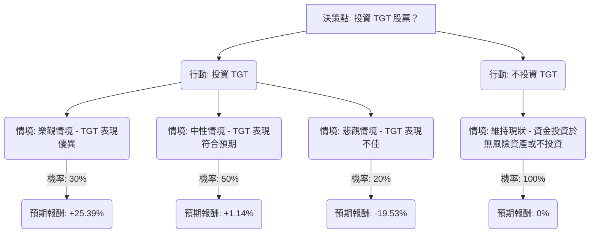

根據您提供的基本面數據以及最新的市場資訊，我們將使用決策樹分析和期望值分析來評估美股公司 TGT (Target Corporation) 目前是否適合投資。

### 核心假設

1.  **投資期限**：短期至中期（約一年），與分析師的目標價區間相符。
2.  **市場情境**：考量美國零售業的宏觀經濟環境、消費者支出趨勢及通膨壓力。
3.  **公司表現**：基於 TGT 近期的財報、戰略舉措（如 Target Circle 升級、美妝業務拓展、效率提升）以及分析師預期。
4.  **報酬計算**：包含股價潛在漲跌幅及股息收益率。

### 最新資訊摘要

*   **TGT 2023 年第四季財報 (2024 年 3 月 5 日公布)**：營收和調整後每股盈餘 (EPS) 均超出預期，淨利潤增長 58%。然而，可比銷售額下降 4.4%。公司預計 2024 年第一季可比銷售額將下降 3-5%。
*   **TGT 2024 年第一季財報 (2024 年 5 月 22 日公布)**：符合預期，EPS 為 2.03 美元（去年同期為 2.05 美元）。可比銷售額下降 3.7%，但數位銷售額增長 1.4%。公司預計 2024 年第二季可比銷售額將增長 0-2%，全年可比銷售額預計增長 0-2%，GAAP 和調整後 EPS 預計為 8.60 至 9.60 美元。
*   **分析師評級與目標價**：目前分析師普遍給予「持有」評級，平均目標價約在 99.50 美元至 103.21 美元之間。最高目標價為 126 美元至 150 美元，最低目標價為 63 美元至 80 美元。當前股價約為 111.30 美元，高於平均目標價。
*   **產業趨勢**：
    *   **消費者支出**：預計 2024-2025 年美國消費者支出將趨於疲軟，特別是中低收入家庭，主要受儲蓄減少、租金和房價上漲以及學貸償還的影響。 不過，也有報告指出 2025 年第三季消費者支出有所增長，並預計在 2025 年和 2027/2028 年繼續增長。
    *   **通膨影響**：通膨仍高於疫情前水平，導致工資、運輸和原材料成本上升，壓縮零售商利潤。消費者傾向減少非必需品支出，並轉向自有品牌商品。
    *   **電商發展**：電商持續增長，預計 2024 年底將佔零售總額的 20% 以上，行動商務將佔主導地位。TGT 的數位業務在近期財報中表現良好。
*   **TGT 公司策略**：TGT 積極推動效率提升、重振營收增長、客流量和市場份額。近期進行了董事會改組，並在 2026 年 1 月底推出了大規模美妝產品線和店內體驗升級。
*   **未來盈餘預期**：Zacks 預計 TGT 本季 (2025 年第四季，預計 2026 年 3 月 3 日公布) EPS 為 2.16 美元，年減 10.37%。2025 財年全年 EPS 預期為 7.3 美元 (年減 17.61%)，2026 財年預期為 7.74 美元 (年增 6.1%)。

### 決策樹分析 (Decision Tree Analysis)

**決策點：投資 TGT 股票？**

*   **當前股價 (P0)**：111.30 美元
*   **年度股息**：每股 1.14 美元/季，即每年 4.56 美元。
*   **股息收益率**：(4.56 / 111.30) ≈ 4.10%

### 計算過程

#### 1. 投資 TGT 的情境分析

*   **樂觀情境 (Optimistic Scenario)**
    *   **情境名稱**：TGT 戰略成功，市場環境改善，消費者支出強勁，公司業績超出預期。
    *   **機率 (Probability)**：30%
    *   **股價預期 (P1_optimistic)**：假設股價達到分析師高目標價 135 美元。
    *   **股價漲幅**：($135 - $111.30) / $111.30 = 0.2129 = 21.29%
    *   **總預期報酬**：股價漲幅 + 股息收益率 = 21.29% + 4.10% = **25.39%**

*   **中性情境 (Neutral Scenario)**
    *   **情境名稱**：TGT 業績符合預期，市場環境平穩，消費者支出趨於疲軟但未大幅惡化。股價可能略有回調，但股息提供支撐。
    *   **機率 (Probability)**：50%
    *   **股價預期 (P1_neutral)**：假設股價小幅下跌至 108 美元 (仍高於分析師平均目標價，反映公司韌性)。
    *   **股價漲幅**：($108 - $111.30) / $111.30 = -0.0296 = -2.96%
    *   **總預期報酬**：股價漲幅 + 股息收益率 = -2.96% + 4.10% = **1.14%**

*   **悲觀情境 (Pessimistic Scenario)**
    *   **情境名稱**：通膨持續高企，消費者支出大幅下滑，經濟衰退，TGT 戰略未能奏效，市場份額流失。
    *   **機率 (Probability)**：20%
    *   **股價預期 (P1_pessimistic)**：假設股價跌至分析師低目標價 85 美元。
    *   **股價漲幅**：($85 - $111.30) / $111.30 = -0.2363 = -23.63%
    *   **總預期報酬**：股價漲幅 + 股息收益率 = -23.63% + 4.10% = **-19.53%**

#### 2. 不投資 TGT 的情境分析

*   **情境名稱**：資金不投入 TGT 股票，假設投資於無風險資產或單純持有現金。
*   **機率 (Probability)**：100%
*   **預期報酬**：**0%** (簡化處理，實際可為無風險利率)

### 期望值分析 (Expected Value Analysis)

*   **投資 TGT 的整體期望值 (EV_Invest)**：
    (0.30 * 25.39%) + (0.50 * 1.14%) + (0.20 * -19.53%)
    = 7.617% + 0.57% - 3.906%
    = **4.281%**

*   **不投資 TGT 的整體期望值 (EV_Not_Invest)**：
    (1.00 * 0%) = **0%**

### 最終結論

根據上述決策樹和期望值分析，投資 TGT 股票的整體期望值為 **4.281%**，而不投資的期望值為 0%。

**判斷：適合投資**

**理由**：
儘管 TGT 面臨消費者支出疲軟和通膨壓力等宏觀經濟逆風，且分析師平均目標價低於當前股價，但公司近期財報表現超出預期，並積極透過戰略調整（如美妝業務拓展、Target Circle 升級、效率提升）來應對挑戰。其穩定的股息收益率也為投資提供了基礎回報。綜合考量不同情境下的潛在報酬與機率，投資 TGT 的期望值為正，顯示其在當前市場條件下仍具備一定的投資價值，優於單純不投資。然而，投資者應注意其股價波動性，並密切關注後續財報及市場動態。