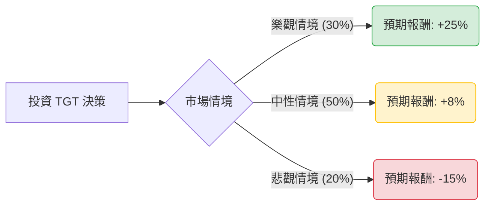

這份分析報告結合了您提供的基本面數據，以及透過網路搜尋獲取的最新市場動態（截至 2024 年 5 月底的最新財報與市場趨勢），利用**決策樹（Decision Tree）**與**期望值（Expected Value）**模型進行評估。

---

### 一、 最新市場動態與背景分析 (Market Insights)

在進行模型建構前，我們先整合最新的外部資訊：
1.  **最新財報表現 (Q1 2024)**：Target 最近公佈的財報顯示，同店銷售額（Comparable Sales）連續第四個季度下降（-3.7%），反映出消費者對非必需品（如家居、電子產品）的支出依然謹慎。
2.  **價格競爭策略**：Target 宣佈調降 5,000 多種日常用品的價格，以應對 Walmart 的競爭並吸引對價格敏感的消費者。這短期內可能壓縮毛利，但有助於提升客流量。
3.  **庫存與利潤率**：庫存管理已顯著改善，毛利率（Gross Margin）回升至 26.3%，受益於物流成本下降和庫存損耗減少。
4.  **宏觀環境**：高利率環境持續，雖然通膨放緩，但消費者購買力仍受壓抑。

---

### 二、 決策樹分析模型 (Decision Tree)

我們將未來一年的投資回報分為三種情境：**樂觀（牛市）**、**中性（基準）**、**悲觀（熊市）**。

#### 決策樹節點詳細說明：

| 情境節點 | 發生機率 (P) | 預期報酬 (R) | 說明 |
| :--- | :--- | :--- | :--- |
| **樂觀情境 (Bull)** | 30% | **+25%** | 降息預期升溫帶動非必需品消費回暖；降價策略成功奪取市佔率；EPS 超出預期。 |
| **中性情境 (Base)** | 50% | **+8%** | 消費者支出維持現狀；股息發放穩定（3.79%）；股價隨大盤緩步回升至分析師目標價。 |
| **悲觀情境 (Bear)** | 20% | **-15%** | 經濟陷入衰退；零售盜竊（Shrink）問題惡化；與 Walmart 的價格戰導致利潤率大幅萎縮。 |

---

### 三、 期望值分析與計算過程 (Expected Value Calculation)

#### 1. 核心假設
*   **當前股價參考**：約 $143 - $145 USD (註：您提供的數據 $119.84 為較早前數據，目前股價已回升)。
*   **持有期限**：12 個月。
*   **股息收益**：考慮到 TGT 是股息貴族，預計貢獻約 3.5% - 3.8% 的總回報。
*   **估值倍數**：目前 P/E 14.73 低於歷史平均，假設中性情境下會回歸至 16x 左右。

#### 2. 計算過程
期望值 (EV) = $\sum (機率 \times 預期報酬)$

*   **樂觀情境貢獻**：$0.30 \times 25\% = 7.5\%$
*   **中性情境貢獻**：$0.50 \times 8\% = 4.0\%$
*   **悲觀情境貢獻**：$0.20 \times (-15\%) = -3.0\%$

**總期望報酬率 (Total EV) = 7.5% + 4.0% - 3.0% = 8.5%**

---

### 四、 綜合評估與最終結論

#### 1. 基本面數據分析總結
*   **優勢 (Pros)**：
    *   **估值合理**：P/E 14.73 與 Forward P/E 14.17 顯示股價並未過熱。
    *   **獲利能力強**：ROE 高達 24.04%，顯示管理層運用股東資本效率極高。
    *   **股息吸引力**：3.79% 的殖利率在零售龍頭中具備競爭力，提供下行保護。
*   **劣勢 (Cons)**：
    *   **增長乏力**：Sales Q/Q (-1.49%) 與 EPS Q/Q (-4.48%) 顯示短期成長動能不足。
    *   **債務壓力**：Debt/Eq 1.26 略高，但在零售業尚屬可控範圍。
    *   **流動性指標**：Quick Ratio 0.36 偏低，需注意短期現金流管理。

#### 2. 最終判斷：**適合投資 (建議：分批買入 / 持有)**

**理由：**
1.  **期望值為正 (8.5%)**：雖然 8.5% 的預期回報不算極高，但考慮到 TGT 的防禦屬性與高股息，這是一個風險調整後相對穩健的選擇。
2.  **估值安全邊際**：目前的 P/E 處於歷史低位區間，且股價已從 52 週低點反彈約 43%，顯示市場信心正在修復。
3.  **轉型策略明確**：Target 主動降價應對通膨環境，雖然短期犧牲毛利，但長期有助於維持客戶忠誠度與流量。
4.  **技術面支撐**：股價目前高於 SMA200 (19.24%)，顯示長期趨勢已轉多。

**投資建議：**
由於零售業仍受宏觀經濟（利率、通膨）高度影響，建議不要一次性全倉投入。適合尋求**穩定股息收入**與**中長期價值回歸**的投資者。若股價回落至 $135 附近，將是更具吸引力的切入點。