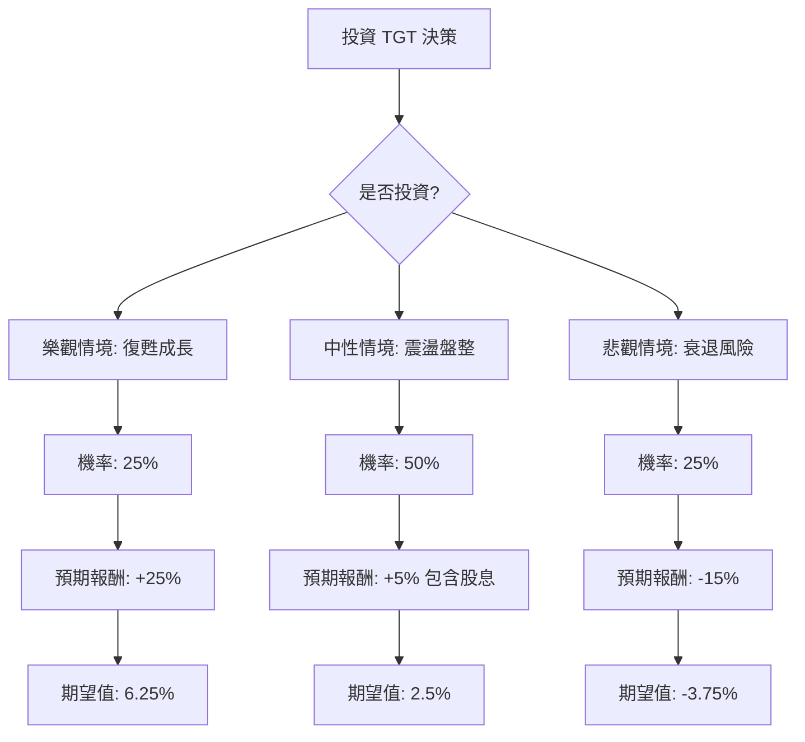

針對美股零售巨頭 **Target (TGT)** 的投資評估，我結合了您提供的基本面數據以及最新的市場動態（截至 2024 年 5 月底的財報與新聞），進行決策樹與期望值分析。

---

### 一、 最新市場動態與背景分析 (2024 Q1 財報更新)

在進行計算前，必須修正數據背景。您提供的數據（股價 $99.55）約為 2023 年底的低點。**目前（2024 年 5 月底）TGT 股價約在 $143 - $145 區間。**

**最新核心資訊：**
1.  **Q1 財報失利：** Target 於 2024 年 5 月 22 日公布 Q1 財報，同店銷售額下降 3.7%，連續第四個季度下滑。
2.  **降價策略：** 為了應對通膨導致的消費疲軟，Target 宣佈調降 5,000 多種日常用品價格，試圖與 Walmart (WMT) 競爭。
3.  **利潤率壓力：** 雖然庫存管理改善，但降價競爭與非必需品（家居、服飾）需求低迷，對毛利構成壓力。
4.  **估值：** 目前 Forward P/E 約 15-16 倍，處於歷史中值偏低位置。

---

### 二、 核心假設 (Core Assumptions)

1.  **市場環境：** 高利率環境持續，消費者對「非必需品」支出保持謹慎。
2.  **競爭格局：** Walmart 在民生必需品（雜貨）佔優，Target 轉型降價策略需 1-2 季觀察是否能帶動客流量。
3.  **持有期限：** 12 個月。
4.  **預期報酬率設定：**
    *   **樂觀：** 降價策略成功，客流量回升，非必需品需求復甦。
    *   **中性：** 銷售持平，靠股息與庫存管理維持股價。
    *   **悲觀：** 陷入價格戰，毛利大幅萎縮，同店銷售持續負成長。

---

### 三、 決策樹分析 (Decision Tree)

使用 Markdown 繪製決策樹結構：

---

### 四、 期望值計算過程 (Expected Value Analysis)

我們將預期報酬（包含資本利得與約 3% 的股息收益）與機率相乘：

| 情境 (Scenario) | 發生機率 (P) | 預期報酬 (R) | 計算 (P * R) | 核心理由 |
| :--- | :--- | :--- | :--- | :--- |
| **樂觀 (Bull)** | 25% | +25% | **+6.25%** | 通膨降溫超預期，降價策略成功奪回市佔，股價回測 $180。 |
| **中性 (Base)** | 50% | +5% | **+2.5%** | 銷售緩步回升，股價隨大盤波動，主要收益來自股息。 |
| **悲觀 (Bear)** | 25% | -15% | **-3.75%** | 價格戰導致毛利受損，消費者轉向 Walmart，股價回測 $120。 |
| **總計期望值** | **100%** | | **+5.0%** | |

**計算公式：**
$EV = (0.25 \times 25\%) + (0.50 \times 5\%) + (0.25 \times -15\%) = 6.25\% + 2.5\% - 3.75\% = \mathbf{5.0\%}$

---

### 五、 最終結論與建議

#### **評估結果：觀望 / 不適合立即重倉投資 (Neutral/Avoid)**

**理由如下：**

1.  **期望值過低：** 計算出的年度期望報酬率僅為 **5.0%**。目前美國無風險利率（10年期美債）約在 **4.4% - 4.6%** 之間。投資 TGT 所承擔的個股風險與獲得的超額報酬不成比例。
2.  **基本面轉弱：** 根據最新 Q1 財報，Target 的核心問題在於「同店銷售負成長」與「非必需品佔比過高」。在當前高通膨壓力下，消費者優先選擇 Walmart 的雜貨，而非 Target 的家居裝飾。
3.  **利潤率挑戰：** 雖然 P/E 12-15 倍看似便宜，但公司宣佈對 5,000 種商品降價，這是一種「防禦性」舉措，短期內必然會犧牲毛利率（Gross Margin）。
4.  **技術面壓力：** 財報後股價出現跳空缺口，顯示市場信心不足，短期內缺乏強大的上漲催化劑（Catalyst）。

**適合投資的條件：**
*   如果您是**長期存股族**，看中其 3% 以上的穩定配息（Dividend King 紀錄），且能忍受股價在 $130-$150 區間長期震盪。
*   否則，對於追求資本利得的投資者，目前有更多成長動能更強（如科技股）或防禦性更佳（如 Walmart 或 Costco）的選擇。

**總結：** 雖然 Target 是一家優秀的公司，但目前正處於轉型與消費環境的逆風期，**期望值僅與美債利率持平，投資吸引力不足。**