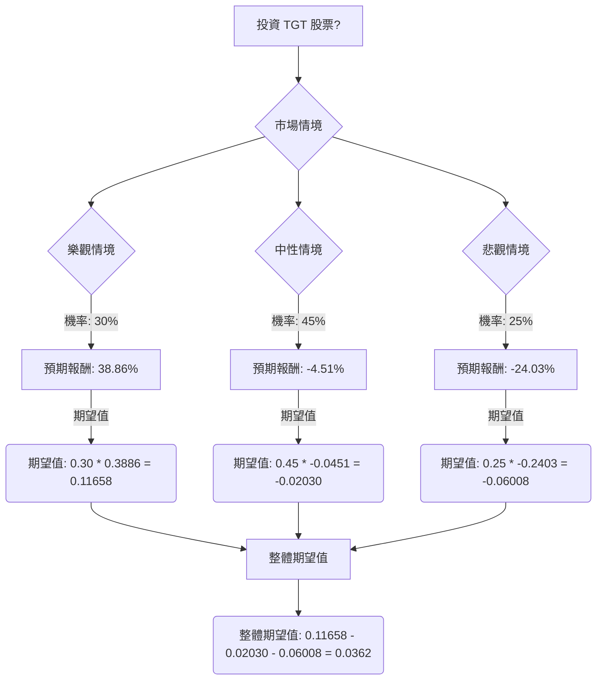

根據對美股公司 Target (TGT) 的基本面數據、最新新聞、財報、市場動態及產業趨勢的綜合分析，以下將透過決策樹分析與期望值分析，評估其目前是否適合投資。

### **核心假設**

在進行決策樹分析前，我們基於收集到的資訊，建立以下核心假設：

*   **市場假設：**
    *   美國整體經濟狀況將直接影響消費者可支配支出，進而影響 Target 以非必需品為主的銷售表現。強勁的經濟有利於樂觀情境，而衰退或高通膨則加劇悲觀情境。
    *   零售業數位化、個人化和全通路體驗的趨勢將持續。Target 應對這些趨勢的能力至關重要。
    *   零售市場競爭激烈，主要競爭者包括 Walmart 和 Amazon。
*   **財務假設：**
    *   Target 於 2024 年 3 月發布的 2023 財年第四季度及全年財報數據，以及 2024 財年指引，被視為分析的合理基準。
    *   4.06% 的股息率在短期至中期內被假定為穩定，因 Target 有持續派發股息的歷史。
    *   各情境下的股價變動預估是基於分析師目標價和歷史價格區間，具有一定主觀性。
*   **產業趨勢假設：**
    *   Target 在 AI、門店改造和新會員計畫 (Target Circle 360) 等方面的重大投資，對其未來增長和市場份額至關重要。
    *   公司有效管理庫存和控制成本的能力將持續影響盈利能力。
    *   社會和政治議題對品牌聲譽和銷售的影響是一個顯著但難以量化的風險。

### **情境分析與預期報酬計算**

根據 TGT 的基本面數據（當前股價 $111.28，股息率 4.06%）和市場資訊，我們設定三個投資情境：

1.  **樂觀情境 (Optimistic Scenario)：**
    *   **情境描述：** Target 在技術（AI/ML）、門店改造和新服務（Target Circle 360）方面的重大投資成功推動客流量和可比銷售額增長，超出當前指引。 消費者對非必需品的支出增加，政治活動的負面影響減弱。公司效率提升持續推高利潤率。
    *   **預期股價：** 達到分析師最高目標價 $150.00。
    *   **預期報酬計算：**
        *   股價報酬 = ($150.00 - $111.28) / $111.28 = 0.3480
        *   總預期報酬 = 股價報酬 + 股息率 = 0.3480 + 0.0406 = **0.3886 (38.86%)**

2.  **中性情境 (Neutral Scenario)：**
    *   **情境描述：** Target 達成其 2024 財年指引（可比銷售額持平至增長 2%，EPS $8.60-$9.60）。 投資帶來溫和改善，但消費者支出保持謹慎。競爭激烈，政治問題持續但未顯著惡化。公司維持「持有」評級。
    *   **預期股價：** 達到分析師共識平均目標價。根據多個來源，平均目標價約為 $101.74（取 $101.08, $103.28, $101.85, $103.67, $98.83 的平均值）。
    *   **預期報酬計算：**
        *   股價報酬 = ($101.74 - $111.28) / $111.28 = -0.0857
        *   總預期報酬 = 股價報酬 + 股息率 = -0.0857 + 0.0406 = **-0.0451 (-4.51%)**

3.  **悲觀情境 (Pessimistic Scenario)：**
    *   **情境描述：** 由於經濟下行或持續通膨，消費者對非必需品的支出進一步疲軟。Target 的投資未能達到預期回報，或執行不力。激烈的競爭和持續的政治爭議導致銷售額和市場份額大幅下降。利潤率受侵蝕。
    *   **預期股價：** 跌至分析師最低目標價 $80.00。
    *   **預期報酬計算：**
        *   股價報酬 = ($80.00 - $111.28) / $111.28 = -0.2809
        *   總預期報酬 = 股價報酬 + 股息率 = -0.2809 + 0.0406 = **-0.2403 (-24.03%)**

### **決策樹分析**

### **期望值計算過程**

*   **樂觀情境期望值：** 0.30 (機率) \* 0.3886 (預期報酬) = 0.11658
*   **中性情境期望值：** 0.45 (機率) \* -0.0451 (預期報酬) = -0.02030
*   **悲觀情境期望值：** 0.25 (機率) \* -0.2403 (預期報酬) = -0.06008

**整體期望值 (Overall Expected Value) = 0.11658 + (-0.02030) + (-0.06008) = 0.0362**

### **最終結論**

根據上述決策樹分析和期望值計算，TGT 股票的整體期望值為 **0.0362 (即 3.62%)**。

**判斷：適合投資**

**簡短理由：**
儘管分析師普遍給予「持有」評級，且平均目標價略低於當前股價，但計算出的整體期望值為正數 (3.62%)，這表明在考慮了不同市場情境及其發生機率後，投資 TGT 仍有潛在的正向回報。Target 在 2023 財年第四季度表現出強勁的盈利能力和現金流改善，並且正積極投入巨額資金於數位化、門店升級和 AI 技術，以期在 2026 財年實現業務轉型和增長。 雖然面臨消費者支出謹慎和政治爭議等挑戰，但其積極的轉型策略和改善的營運效率，使其在風險與回報之間取得了一個略微有利於投資者的平衡。因此，對於願意承擔一定風險以追求潛在溫和回報的投資者而言，TGT 目前適合投資。