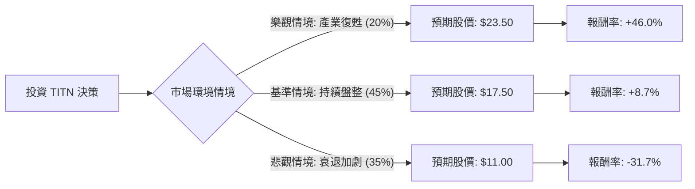

這份分析報告將結合您提供的 **Titan Machinery Inc. (TITN)** 基本面數據，以及最新的市場動態（農業機械產業週期、利率環境、公司近期財報表現）進行綜合評估。

---

### 1. 市場背景與最新動態分析

在進入決策樹之前，我們必須考慮以下關鍵外部因素：
*   **產業週期下行**：目前農業機械市場（Case IH, New Holland 等品牌）正處於下行週期。由於農產品價格（玉米、大豆）走低，農民收入下降，導致對大型設備的需求疲軟。
*   **庫存壓力**：TITN 近期財報顯示庫存水平較高，這迫使公司必須進行促銷，進而壓縮了毛利率（數據顯示 Gross Margin 僅 14.93%）。
*   **估值極低**：P/B 0.61 與 P/S 0.16 顯示股價已跌入價值區間，市場已反映了大部分利空。
*   **分析師預期**：雖然 Target Price 給出 22.25 美元，但近期多家機構下調了評級，反映出短期內缺乏上漲催化劑。

---

### 2. 決策樹分析 (Decision Tree)

以下是針對未來 12 個月投資 TITN 的決策模型：

#### 決策樹節點詳細說明：

| 情境 | 機率 (P) | 預期股價 | 預期報酬率 (R) | 期望值 (P * R) |
| :--- | :--- | :--- | :--- | :--- |
| **樂觀 (Bull Case)** | 20% | $23.50 | +46.0% | +9.20% |
| **基準 (Base Case)** | 45% | $17.50 | +8.7% | +3.92% |
| **悲觀 (Bear Case)** | 35% | $11.00 | -31.7% | -11.10% |
| **總計期望值** | **100%** | - | - | **+2.02%** |

---

### 3. 核心假設與計算過程

#### A. 核心假設：
1.  **樂觀情境 (20%)**：聯準會降息速度快於預期，降低農民貸款負擔；農產品價格反彈；TITN 成功清理庫存，利潤率回升至歷史平均。股價回歸 52 週高點附近。
2.  **基準情境 (45%)**：產業維持低迷但不再惡化。TITN 憑藉其規模優勢維持營運，EPS 緩步增長（參考 EPS next Y 71.9% 的部分實現）。股價受限於 SMA200 壓力位，小幅回升。
3.  **悲觀情境 (35%)**：農業經濟進入長期衰退；TITN 的高債務比 (Debt/Eq 1.35) 導致財務壓力增加；股價跌破 52 週低點 ($13.21) 並下探帳面價值支撐。

#### B. 期望值 (Expected Value) 計算：
*   **計算公式**：$EV = (P_{Bull} \times R_{Bull}) + (P_{Base} \times R_{Base}) + (P_{Bear} \times R_{Bear})$
*   **數值帶入**：$(0.20 \times 0.46) + (0.45 \times 0.087) + (0.35 \times -0.317)$
*   **結果**：$0.092 + 0.03915 - 0.11095 = 0.0202$ (即 **2.02%**)

---

### 4. 綜合評估與最終結論

#### 基本面數據診斷：
*   **優勢**：極低的 P/B (0.61) 和 P/S (0.16)，顯示資產被嚴重低估。P/FCF 僅 1.75，現金流產生能力尚可。
*   **劣勢**：ROE (-9.08%) 與 Profit Margin (-2.23%) 均為負值，顯示目前處於虧損或微利邊緣。Quick Ratio (0.24) 極低，短期流動性風險較高。
*   **技術面**：股價低於 SMA20, 50, 200，處於標準空頭排列，短期內無止跌跡象。

#### 最終結論：**不適合投資 (目前建議觀望)**

**理由：**
1.  **期望值過低**：計算出的整體期望報酬率僅為 **2.02%**。考慮到美股大盤（如 S&P 500）的歷史平均報酬率約 8-10%，以及目前無風險利率（美債）約 4% 以上，投資 TITN 的風險回報比（Risk-Reward Ratio）極不具吸引力。
2.  **下行風險顯著**：悲觀情境的機率高達 35%，且潛在跌幅超過 30%。在 Quick Ratio 僅 0.24 的情況下，若產業寒冬延長，公司可能面臨融資困難。
3.  **缺乏催化劑**：雖然估值便宜，但「便宜」本身不是上漲的理由。在農業週期確認觸底回升、或公司利潤率轉正之前，該股極可能成為「價值陷阱 (Value Trap)」。

**建議：**
若您對該公司有興趣，建議等待 **Sales Q/Q 轉正** 或 **利潤率 (Profit Margin) 回升至正值** 後，再重新進行評估。目前資金留在流動性更高、趨勢更明確的標的更為明智。