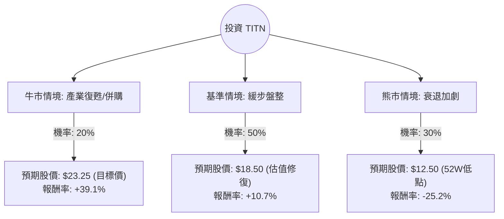

這份分析報告將針對 **Titan International, Inc. (TITN)** 進行深度評估。TITN 是一家全球領先的離路（Off-Highway）輪胎、輪圈及組件製造商，主要服務於農業、建設和採礦業。

以下結合您提供的數據與最新的市場動態（包含 2024 年第三季財報與產業趨勢）進行分析。

---

### 一、 核心假設與市場背景分析

在建立決策樹之前，我們必須基於現狀設定核心假設：

1.  **產業週期（農業低迷）**：目前全球農業機械需求處於下行週期。主要客戶如 John Deere (DE) 與 CNH Industrial 均下調了展望。TITN 的營收與農業景氣高度相關（佔比約 50% 以上）。
2.  **財務健康度**：
    *   **優勢**：P/B 僅 0.64，P/S 0.15，P/FCF 1.27。這顯示公司資產被嚴重低估，且具備極強的現金流產生能力。
    *   **劣勢**：ROE (-9.6%) 與淨利為負，反映了當前營運的挑戰。債務股本比 (Debt/Eq) 1.64 偏高，但在高利率環境下仍維持 1.36 的流動比率，尚屬安全。
3.  **市場預期**：分析師平均目標價為 **$23.25**，較現價 ($16.71) 有約 39% 的上行空間。

---

### 二、 決策樹分析 (Decision Tree)

我們預測未來 12 個月內的三種主要情境：

#### 節點詳細說明：

1.  **牛市情境 (20%)**：
    *   **觸發點**：聯準會降息超預期帶動農民貸款意願；大宗商品價格回升；TITN 成為併購目標（因 P/B 極低）。
    *   **預期報酬**：達到分析師目標價 $23.25。
2.  **基準情境 (50%)**：
    *   **觸發點**：農業需求維持低迷但不再惡化；公司透過削減成本維持現金流；股價隨大盤小幅回升至 SMA200 以上。
    *   **預期報酬**：回升至約 $18.50（接近淨資產價值修復）。
3.  **熊市情境 (30%)**：
    *   **觸發點**：全球經濟衰退；農業週期下行時間拉長至 2026 年；高負債壓力導致信用評等下調。
    *   **預期報酬**：下探 52 週低點 $12.50。

---

### 三、 期望值分析 (Expected Value Analysis)

#### 1. 計算過程：
期望值 (EV) = $\sum (機率 \times 預期股價)$

*   **牛市期望值**：$23.25 \times 0.20 = 4.65$
*   **基準期望值**：$18.50 \times 0.50 = 9.25$
*   **熊市期望值**：$12.50 \times 0.30 = 3.75$

**總期望股價 (Total EV Price)** = $4.65 + 9.25 + 3.75 = \mathbf{\$17.65}$

#### 2. 預期報酬率計算：
*   現價：$16.71
*   預期報酬率 = $(17.65 - 16.71) / 16.71 \approx \mathbf{5.62\%}$

---

### 四、 綜合評估與最終結論

#### 1. 數據深度解讀：
*   **價值陷阱 vs. 價值投資**：TITN 目前的 P/B (0.64) 和 P/S (0.15) 處於歷史極低水平，這通常是價值投資者的「擊球區」。然而，負的 ROE 和營收下滑 (Sales Q/Q -5.19%) 顯示基本面尚未見底。
*   **現金流是救命稻草**：P/FCF 僅 1.27 是這份數據中最亮眼的指標，代表公司雖然會計利潤為負，但實際收回現金的能力極強，這能支撐其度過寒冬。
*   **技術面**：股價目前在 SMA20 和 SMA50 之上，顯示短期有反彈動能，但仍受制於 SMA200 (-6.71%)，長期趨勢尚未反轉。

#### 2. 最終判斷：**【適合投資，但僅限於「價值型/逆勢投資者」】**

**理由：**
1.  **下行空間有限**：期望值 $17.65 高於現價，且股價已接近淨資產價值，進一步大跌的機率受限於其強大的自由現金流。
2.  **高安全邊際**：0.64 的市淨率提供了極高的安全邊際。一旦產業週期轉向，上行爆發力強（目標價空間達 39%）。
3.  **風險提示**：這不是一檔短期爆發股。由於農業週期可能持續低迷，投資者需具備 12-18 個月的持股耐心。

**建議操作：**
*   **進場點**：$16.00 - $16.70 區間分批佈局。
*   **停損點**：若跌破 $12.50 (52W Low) 且現金流轉負，則需重新評估。
*   **目標**：首波看 $18.50，長期持有至 $23.00。