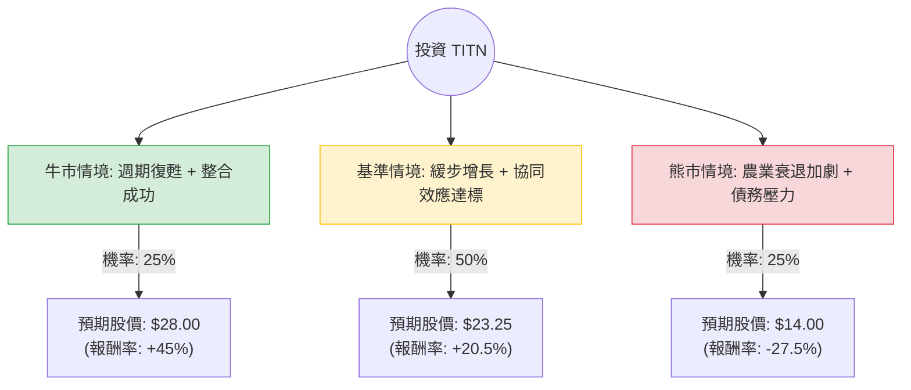

這份分析報告將結合您提供的基本面數據與最新的市場動態（包含 Carlstar 收購案、農業機械週期及宏觀經濟環境），利用**決策樹（Decision Tree）**與**期望值分析（Expected Value Analysis）**評估 Titan International, Inc. (TITN) 的投資價值。

---

### 一、 核心假設與市場背景分析

在建立模型前，我們必須考慮以下關鍵因素：

1.  **收購整合（Carlstar Group）**：TITN 於 2024 年初完成了對 Carlstar 的收購。這顯著擴大了其產品組合（增加拖車、高爾夫球車等輪胎業務），預計每年可產生 2,500 萬至 3,000 萬美元的協同效應。
2.  **農業週期下行**：目前全球農業機械市場（TITN 的核心市場）正處於下行週期。農產品價格下跌導致農民購買意願降低，這反映在 TITN 近期營收 Q/Q 下降 5.19% 的數據中。
3.  **估值安全邊際**：目前 **P/B 為 0.75**，**P/S 為 0.18**，且 **P/FCF 僅 1.49**。這顯示股價已大幅低於其帳面價值與現金流價值，具備極強的「深價值（Deep Value）」特徵。
4.  **財務風險**：負債權益比（Debt/Eq）為 1.64，略高，但長期負債比（LT Debt/Eq）為 0.39，顯示短期債務壓力主要來自收購融資，需觀察現金流回收速度。

---

### 二、 決策樹分析 (Decision Tree)

以下決策樹模擬了未來 12 個月內 TITN 可能面臨的三種主要情境：

#### 節點詳細說明：

1.  **牛市情境 (Bull Case) - 25% 機率**：
    *   **條件**：聯準會降息超預期帶動農業貸款增加；Carlstar 整合進度超前，利潤率回升至 15% 以上。
    *   **預期報酬**：股價回歸歷史高點區域，約 **$28.00**。
2.  **基準情境 (Base Case) - 50% 機率**：
    *   **條件**：農業市場在 2025 年初觸底；公司達成分析師預期的 EPS 增長（EPS next Y 預計增長 50.7%）；股價回歸目標價。
    *   **預期報酬**：分析師平均目標價 **$23.25**。
3.  **熊市情境 (Bear Case) - 25% 機率**：
    *   **條件**：全球經濟衰退導致大宗商品價格崩盤；高負債比在營收下滑時產生流動性風險。
    *   **預期報酬**：回測 52 週低點附近，約 **$14.00**。

---

### 三、 期望值計算 (Expected Value Analysis)

我們以目前股價 **$19.30** 為基準進行計算：

| 情境 | 預期股價 (A) | 發生機率 (B) | 加權價值 (A × B) |
| :--- | :--- | :--- | :--- |
| **牛市情境** | $28.00 | 0.25 | $7.00 |
| **基準情境** | $23.25 | 0.50 | $11.625 |
| **熊市情境** | $14.00 | 0.25 | $3.50 |
| **總計期望值** | | **1.00** | **$22.125** |

#### 計算過程：
1.  **期望股價 (Expected Price)** = $7.00 + $11.625 + $3.50 = **$22.125**
2.  **預期報酬率 (Expected Return)** = ($22.125 - $19.30) / $19.30 = **+14.64%**

---

### 四、 最終結論

#### **評估結果：適合投資 (Suitable for Investment)**

#### **判斷理由：**

1.  **正向期望值**：計算得出的期望股價為 $22.125，較現價有約 **14.6% 的上行空間**。這在當前高波動的市場中屬於具吸引力的風險回報比。
2.  **極低的估值倍數（安全邊際）**：
    *   **P/B 0.75** 意味著你正以 75 折的價格購買公司的淨資產。
    *   **P/FCF 1.49** 顯示公司產生現金的能力極強，這對於應對 1.64 的債務比至關重要。
3.  **技術面支撐**：股價目前站上 SMA20 (+6.96%)、SMA50 (+15.97%) 與 SMA200 (+8.5%)，顯示短期與長期趨勢已轉多，市場正在消化最壞的農業週期消息。
4.  **增長潛力**：雖然今年 EPS 為負，但市場預期明年 EPS 增長率高達 **50.7%**，這主要歸功於 Carlstar 的併購貢獻與成本優化。

#### **風險提示：**
*   **週期性風險**：若農業機械需求復甦慢於預期，股價可能在 $17-$19 區間震盪較久。
*   **債務壓力**：需密切關注下一季財報的利息保障倍數，確保收購債務不會侵蝕現金流。

**建議操作：** 考慮到 P/B 低於 1 的安全邊際，建議可於 $19 附近分批布局，首要目標價設為 $23.25，若突破則看至 $26 以上。