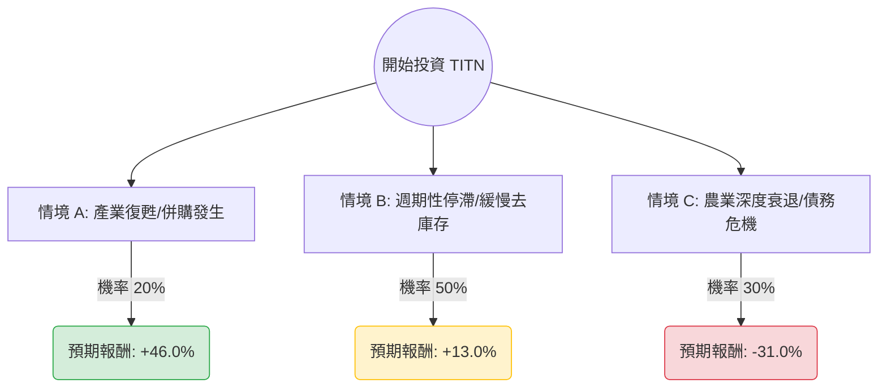

針對美股 **TITN (Titan Machinery Inc.)** 的投資評估，我已結合您提供的基本面數據與最新的市場動態（包含 2025 財年第一季財報表現、產業趨勢及分析師預期）進行深度分析。

---

### 1. 外部環境與最新動態搜尋彙整

在進入決策樹前，以下是影響 TITN 估值的關鍵外部因素：
*   **財報表現（利空）：** Titan Machinery 最近一次（2024年6月）公佈的 2025 財年第一季業績大幅低於預期。由於農業設備需求萎縮，公司下調了全年利潤指引。
*   **產業週期（下行）：** 農業機械產業正處於週期性回調。由於農產品（玉米、大豆）價格下跌，農民收入減少，導致對大型機具（CNH Industrial 代理產品）的需求延後。
*   **估值水平（極低）：** 目前 **P/B (市淨率) 僅 0.61**，**P/S (市銷率) 0.15**，顯示市場定價已進入「價值陷阱」或「極度低估」區間。
*   **財務風險：** Debt/Eq 為 1.64，且 Quick Ratio 僅 0.24，顯示短期流動性緊縮，高度依賴庫存去化來產生現金流。

---

### 2. 決策樹分析 (Decision Tree)

以下決策樹基於未來 12 個月的預期情境繪製：

#### 節點詳細標示：
1.  **情境 A (Bull Case) - 20%：** 聯準會降息超預期、農產品價格反彈，或公司因股價低於淨資產被 CNH Industrial 併購。
    *   **預期價格：** $23.25 (分析師平均目標價)
    *   **報酬：** +46.0%
2.  **情境 B (Base Case) - 50%：** 農業週期維持平庸，公司透過削減成本與去庫存度過難關。股價回升至 200 日均線 (SMA200) 水準。
    *   **預期價格：** $18.00
    *   **報酬：** +13.0%
3.  **情境 C (Bear Case) - 30%：** 農業經濟硬著陸，庫存減損撥備增加，債務槓桿壓力迫使股權融資。股價跌破 52 週低點。
    *   **預期價格：** $11.00
    *   **報酬：** -31.0%

---

### 3. 期望值分析 (Expected Value Analysis)

#### A. 計算過程
根據上述情境與機率，計算 TITN 的期望報酬率 (Expected Return)：

1.  **期望價格計算：**
    $$E[Price] = (23.25 \times 0.20) + (18.00 \times 0.50) + (11.00 \times 0.30)$$
    $$E[Price] = 4.65 + 9.00 + 3.30 = \$16.95$$

2.  **預期報酬率計算：**
    $$EV = \frac{16.95 - 15.92}{15.92} \times 100\% = 6.47\%$$

#### B. 核心假設與分析
*   **價值支撐：** P/B 0.61 是最強的下行保護。通常這類資本密集型公司 P/B 低於 0.7 意味著市場預期其資產會大幅減值。
*   **現金流矛盾：** 雖然 EPS 為負，但 **P/FCF 為 1.21**，這是一個非常特殊的信號，顯示公司正在快速將庫存變現為現金，有助於緩解債務壓力。
*   **短期阻力：** SMA20、SMA50、SMA200 均為負值，技術面上屬於典型的空頭排列，短期內缺乏上攻動能。

---

### 4. 最終結論

**投資建議：暫不適合「大舉投資」，僅適合「小量價值投機」或「觀察待變」。**

#### 判斷理由：
1.  **期望值偏低：** 雖然 EV 為正值 (+6.47%)，但考慮到其 **-31.0% 的潛在下行風險** 與目前強勁的美股大盤（S&P 500）相比，風險回報比（Risk-Reward Ratio）並不吸引人。
2.  **基本面惡化尚未觸底：** 最新財報顯示 EPS 衰退且營收 Q/Q 下滑 (-5.19%)，在農業週期明確轉向之前，股價可能長期處於低位震盪（L型走勢）。
3.  **流動性擔憂：** Quick Ratio (0.24) 過低，意味著若庫存去化不如預期，公司可能面臨短期的資金缺口。

#### 適合進場的轉折點：
*   **技術面：** 等待股價站穩 SMA50 ($16.19 附近) 並伴隨成交量放大。
*   **產業面：** 觀察玉米、大豆期貨價格是否止跌回升。
*   **財務面：** 下一季財報顯示 Debt/Eq 比例有所下降。

**總結：** TITN 目前是一間「便宜但有傷口」的公司。對於價值投資者，這是一個潛在的深度價值標的；但對於追求資金效率的投資者，目前並非最佳進場時機。