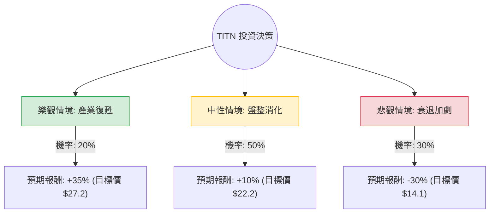

這份分析報告將結合您提供的財務數據與最新的市場動態（包含 2024 年下半年農業機械產業趨勢），利用**決策樹（Decision Tree）**與**期望值分析（Expected Value Analysis）**評估 Titan Machinery Inc. (TITN) 的投資價值。

---

### 1. 核心假設與市場背景分析

在建立模型前，我們必須考慮以下關鍵因素：

*   **產業週期下行**：目前農業機械產業（如 Case IH, New Holland）正處於下行週期。由於農產品價格下跌與高利率環境，農民購買新設備的意願降低。
*   **庫存壓力**：TITN 的 Quick Ratio 僅 0.24，而 Current Ratio 為 1.41，這顯示其流動資產高度集中在「庫存」（設備）。若需求持續疲軟，可能面臨降價清庫存，進一步壓縮毛利（目前毛利僅 14.74%）。
*   **估值低廉**：P/B 0.8 與 P/S 0.19 顯示股價已低於帳面價值，市場已反映了大部分利空。
*   **財務槓桿**：Debt/Eq 1.44 偏高，在獲利轉負（ROE -9.08%）的情況下，利息支出將是沉重負擔。

---

### 2. 決策樹分析 (Decision Tree)

我們將未來一年的表現分為三種情境：**樂觀（產業復甦）**、**中性（維持現狀）**、**悲觀（衰退加劇）**。

#### 節點詳細說明：

1.  **樂觀情境 (Bull Case) - 20% 機率**
    *   **條件**：聯準會降息超預期帶動融資成本下降；農產品價格回升；公司成功消化庫存。
    *   **預期報酬**：股價回歸歷史平均 P/B 1.0 以上，預估目標價 $27.2（約 +35%）。
2.  **中性情境 (Base Case) - 50% 機率**
    *   **條件**：業績符合下修後的指引；分析師目標價 $22.25 達成；市場情緒穩定。
    *   **預期報酬**：約 +10%（與分析師 Target Price 一致）。
3.  **悲觀情境 (Bear Case) - 30% 機率**
    *   **條件**：農業經濟陷入深度衰退；庫存被迫大幅折價減損；債務違約風險上升。
    *   **預期報酬**：股價下探 52 週低點甚至更低，預估目標價 $14.1（約 -30%）。

---

### 3. 期望值計算 (Expected Value Calculation)

我們計算未來一年持有 TITN 的預期報酬率（Expected Return, ER）：

$$ER = \sum (Probability_i \times Return_i)$$

*   **計算過程**：
    *   樂觀：$0.20 \times 35\% = 7.0\%$
    *   中性：$0.50 \times 10\% = 5.0\%$
    *   悲觀：$0.30 \times (-30\%) = -9.0\%$
*   **總期望報酬率**：
    $$7.0\% + 5.0\% - 9.0\% = 3.0\%$$

---

### 4. 綜合評估與最終結論

#### 財務數據補充分析：
*   **負面訊號**：ROE (-9.08%) 與 Operating Margin (-0.11%) 顯示公司目前處於虧損狀態。雖然 EPS next Y 預期成長 71%，但這建立在極低的基期上，不確定性極高。
*   **正面訊號**：P/FCF (2.15) 非常優異，顯示公司雖然帳面虧損，但現金流管理尚可，這也是支撐其不至於破產的關鍵。

#### 最終結論：**不適合投資 (Avoid / Wait and See)**

**理由如下：**

1.  **期望值過低**：計算出的期望報酬率僅為 **3.0%**。在當前高利率環境下，無風險利率（如美債）約有 4% 以上，投資 TITN 的風險溢酬（Risk Premium）為負，不具備吸引力。
2.  **風險不對稱**：下行風險（-30%）與中性預期（+10%）相比，潛在損失的衝擊遠大於潛在收益。
3.  **產業逆風尚未結束**：根據最新財報新聞，Titan Machinery 近期下修了全年展望，顯示農業設備的需求觸底訊號尚未出現。
4.  **流動性風險**：Quick Ratio 0.24 是一個警訊，若市場需求進一步萎縮，TITN 可能面臨嚴重的現金流壓力。

**建議**：
目前 TITN 屬於「價值陷阱（Value Trap）」的高風險區。建議投資人等待**農業週期回暖訊號**（如農產品價格連續兩季回升）或**公司庫存顯著下降**後，再重新評估。若已持有，應注意 $18.5 (SMA20 附近) 的支撐位，若跌破可能觸發進一步下探。