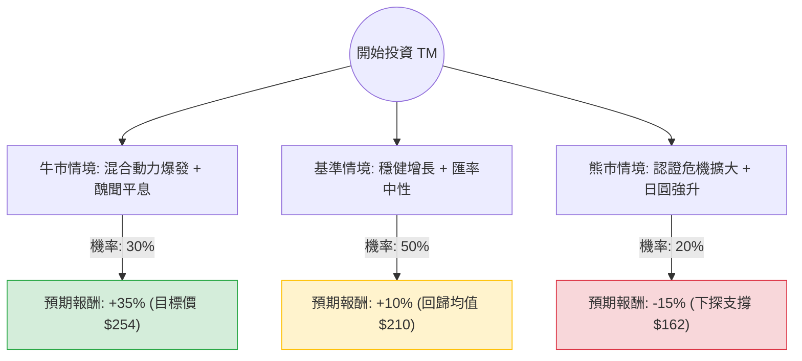

這份分析報告將結合您提供的基本面數據與最新的市場動態（包含豐田汽車 Toyota Motor, TM 的近期挑戰與機遇），利用**決策樹（Decision Tree）**與**期望值（Expected Value）**進行投資評估。

---

### 一、 核心假設與市場背景分析

在建立決策樹之前，我們必須考慮以下關鍵因素：

1.  **混合動力（Hybrid）優勢**：在全球純電動車（EV）需求放緩之際，豐田憑藉強大的油電混合技術，利潤創下歷史新高。
2.  **認證醜聞與停產風險**：近期日本國土交通省針對豐田車型認證違規的調查，導致部分車型暫停出貨，這對短期產能與品牌形象有負面影響。
3.  **匯率波動**：日圓近期走強（從 160 回升至 140-150 區間），這對依賴出口的豐田來說，會侵蝕海外利潤折算回日圓的表現。
4.  **估值面**：目前 P/B 僅 0.97（低於帳面價值），P/E 9.55，顯示股價處於歷史低位，具備價值投資的安全邊際。

---

### 二、 決策樹分析 (Decision Tree)

以下為針對未來 12 個月投資 TM 的決策路徑預測：

#### 節點詳細說明：

1.  **牛市情境 (Optimistic Case) - 30% 機率**
    *   **條件**：認證醜聞在 1-2 季內完全解決；美國市場對 Hybrid 需求持續強勁；聯準會降息帶動汽車消費。
    *   **預期報酬**：參考分析師目標價 $254.02，相較於現價 $190.5，潛在漲幅約 **33.3%**（加上 3.14% 股息，總計約 **36%**，取整數 **35%**）。

2.  **基準情境 (Base Case) - 50% 機率**
    *   **條件**：生產逐步恢復正常；日圓匯率維持在 145 附近波動；全球銷量持平或微增。
    *   **預期報酬**：股價回到 SMA200（約 $210）附近，漲幅約 **10%**。

3.  **熊市情境 (Pessimistic Case) - 20% 機率**
    *   **條件**：日本政府擴大調查導致更多主力車型停產；日圓快速升破 130；全球經濟衰退導致高價車需求萎縮。
    *   **預期報酬**：股價跌破 52 週低點，下探至 $162 左右，跌幅約 **-15%**。

---

### 三、 期望值分析 (Expected Value Analysis)

#### 1. 計算過程：
期望值 (EV) = (牛市機率 × 牛市報酬) + (基準機率 × 基準報酬) + (熊市機率 × 熊市報酬)

*   **EV = (0.30 × 0.35) + (0.50 × 0.10) + (0.20 × -0.15)**
*   **EV = 0.105 + 0.05 - 0.03**
*   **EV = 0.125 (即 12.5%)**

#### 2. 核心數據支持：
*   **估值安全邊際**：P/B 0.97 意味著你以低於公司資產淨值的價格買入，這在大型藍籌股中非常罕見。
*   **獲利能力**：ROE 10.39% 與 Forward P/E 8.19 顯示公司依然高效獲利，且未來一年盈餘預計增長 12.1% (EPS next Y)。
*   **技術面壓力**：目前股價低於 SMA20, 50, 200，顯示短期處於空頭排列，這解釋了為何 Perf Quarter 為 -23.03%，但也提供了低位分批佈局的機會。

---

### 四、 最終結論

**投資建議：適合投資 (分批買入 / Value Play)**

#### 理由如下：

1.  **期望值為正 (12.5%)**：在考慮了最壞的認證醜聞與匯率風險後，整體期望報酬率仍優於多數保守型投資工具，且高於目前的無風險利率。
2.  **極具吸引力的估值**：P/E 9.55 與 P/B 0.97 顯示市場已過度反應（Oversold）近期的負面新聞。對於長線投資者而言，這是典型的「在利空出盡前佈局」。
3.  **股息防禦性**：3.14% 的股息率提供了持股信心，在等待股價回升至目標價 $254 的過程中，有穩定的現金流。
4.  **產業地位**：豐田在混合動力市場的統治力是其護城河，這在純電轉型陣痛期是極大的競爭優勢。

**風險提示**：
短期內股價可能因日本官方調查結果而持續震盪。建議採取**分批進場策略**，首批資金於 $190 附近建立底倉，若股價受大盤拖累下探至 $175-$180 區間則可加碼。