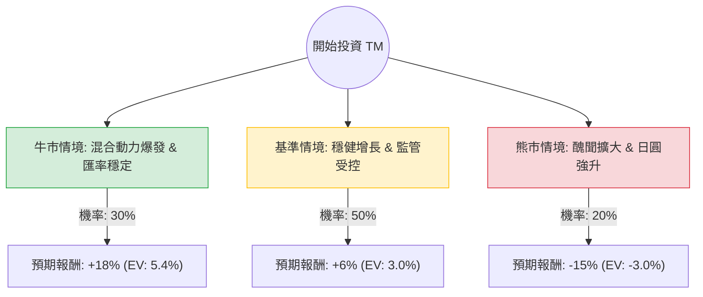

這份分析報告結合了您提供的基本面數據，以及針對 **Toyota Motor Corporation (TM)** 的最新市場動態（包含 2024 年財報表現、認證造假醜聞、油電混合車市場趨勢及日圓匯率影響）進行的綜合評估。

---

### 一、 核心假設與市場背景分析

在構建決策樹之前，我們設定以下三個核心假設：

1.  **混合動力車（HEV）的持續領先**：在全球純電動車（BEV）需求放緩之際，豐田憑藉強大的油電技術獲取了超額利潤。這是目前支撐股價的核心動力。
2.  **監管與醜聞風險**：近期日本國土交通省針對豐田等車企的「認證造假」調查，可能導致部分車型停產或品牌形象受損，這是短期最大的不確定性。
3.  **匯率與宏觀環境**：日圓走勢對豐田利潤影響巨大。若日圓走強（日銀升息），將直接侵蝕海外營收折算後的利潤。

---

### 二、 決策樹分析（Decision Tree）

以下為未來 12 個月的投資情境預測：

#### 節點詳細說明：

1.  **牛市情境 (Bull Case) - 30% 機率**：
    *   **描述**：全球對 HEV 需求持續高漲，豐田產能全開；認證醜聞迅速平息，未造成大規模罰款；日圓維持在 150 左右的低位。
    *   **預期報酬**：股價挑戰歷史新高，加上 2.59% 股息，總回報約 **+18%**。

2.  **基準情境 (Base Case) - 50% 機率**：
    *   **描述**：營收穩定增長（如數據顯示 Sales Q/Q +9.4%），雖然受到認證造假事件干擾導致部分車型短期停產，但整體獲利能力（ROE 12.5%）依然強勁。
    *   **預期報酬**：股價隨大盤波動，緩步向目標價 $236.83 靠攏，總回報約 **+6%**。

3.  **熊市情境 (Bear Case) - 20% 機率**：
    *   **描述**：認證造假事件引發大規模召回或長期停產令；日本央行意外大幅升息導致日圓強升；全球經濟衰退壓抑汽車消費。
    *   **預期報酬**：估值修正至 P/E 8 倍以下，股價回測 SMA200 支撐，總回報約 **-15%**。

---

### 三、 期望值分析（Expected Value Analysis）計算過程

我們將各情境的機率與預期報酬相乘，得出整體期望值：

| 情境 | 機率 (P) | 預期報酬 (R) | 期望值 (P * R) |
| :--- | :--- | :--- | :--- |
| **牛市情境** | 0.30 | +18% | +5.4% |
| **基準情境** | 0.50 | +6% | +3.0% |
| **熊市情境** | 0.20 | -15% | -3.0% |
| **總計期望值** | **1.00** | | **+5.4%** |

**計算公式：**
$EV = (0.30 \times 18\%) + (0.50 \times 6\%) + (0.20 \times -15\%) = 5.4\% + 3.0\% - 3.0\% = 5.4\%$

**考慮股息後的總期望回報：**
$5.4\% (\text{資本利得 EV}) + 2.59\% (\text{股息率}) = \mathbf{7.99\%}$

---

### 四、 綜合評估與最終結論

#### 1. 基本面數據亮點：
*   **估值極具吸引力**：P/E 僅 9.6，遠低於美股平均水平，且 P/S 0.89 顯示營收含金量高。
*   **財務穩健**：Current Ratio 1.25 且 Quick Ratio 1.1，短期償債能力無虞。
*   **技術面強勢**：股價位於 SMA20, 50, 200 之上，呈現多頭排列，且距離 52W 高點僅 -3.65%，顯示市場信心尚存。

#### 2. 潛在風險：
*   **認證醜聞**：這是目前最大的變數，若後續調查顯示高層授意造假，將引發 ESG 資金撤出。
*   **增長瓶頸**：EPS next Y 預期增長 18.89% 雖然不錯，但 Target Price ($236.83) 與現價 ($227.04) 空間僅剩約 4.3%，上行空間受限。

#### 最終結論：**適合投資（但建議分批買入或等待回調）**

**理由：**
1.  **期望值為正**：經風險加權後的總期望回報約為 **7.99%**，優於現金部位，且在傳統產業中表現穩健。
2.  **防禦性強**：在電動車市場動盪中，豐田的混合動力策略已被證明是現階段的「避風港」。
3.  **低估值保護**：不到 10 倍的 P/E 提供了較高的安全邊際（Margin of Safety），即便發生熊市情境，下行空間也相對有限。

**建議操作：**
由於目前股價接近 52 週高點且目標價空間有限，建議不要在現價重倉。可關注 **$215 - $220**（約 SMA50 附近）的支撐位進行佈局，以獲取更高的風險回報比。