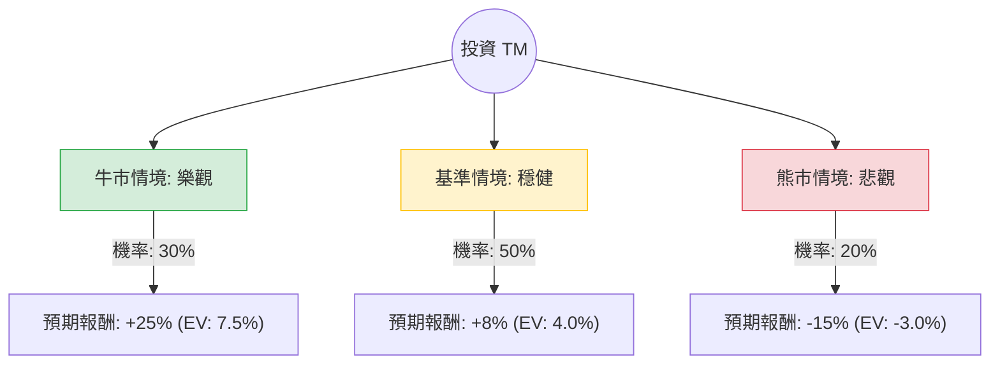

這份分析報告針對 **Toyota Motor Corporation (TM)** 進行評估。我們將結合您提供的基本面數據，以及最新的市場動態（如：油電混合車需求激增、日圓匯率波動、認證測試醜聞等）進行決策樹與期望值分析。

---

### 一、 市場現況與核心假設 (Core Assumptions)

在建立模型前，我們先整合最新資訊：
1.  **混合動力車 (Hybrid) 紅利**：全球純電動車 (EV) 需求放緩，豐田憑藉強大的 Hybrid 產品線，利潤創下歷史新高。
2.  **日圓匯率影響**：豐田約 50% 的產量在海外，日圓貶值對其出口利潤有極大貢獻。若日圓未來升值，將構成匯損風險。
3.  **認證醜聞與監管風險**：近期日本政府對豐田多款車型認證違規進行調查，短期內可能影響產能與品牌聲譽。
4.  **財務數據亮點**：Forward P/E 僅 11.18，且預期明年 EPS 增長 19.22%，顯示估值仍具吸引力。

---

### 二、 決策樹分析 (Decision Tree)

我們以 **未來 12 個月** 的投資回報為目標，設定三種主要情境：

#### 節點詳細說明：

1.  **牛市情境 (Bull Case) - 30% 機率**
    *   **條件**：Hybrid 需求持續強勁，日圓維持弱勢（150以上），認證醜聞迅速平息，固態電池研發有重大突破。
    *   **預期報酬**：+25%（股價挑戰 $298+）。

2.  **基準情境 (Base Case) - 50% 機率**
    *   **條件**：全球車市平穩，豐田維持市場份額，EPS 增長符合預期（19%），日圓小幅回升。
    *   **預期報酬**：+8%（股價接近分析師目標價 $258 左右，含股息）。

3.  **熊市情境 (Bear Case) - 20% 機率**
    *   **條件**：全球經濟衰退導致購車需求下降，日圓大幅升值（低於 140），認證醜聞導致大規模停產或鉅額罰款，中國電動車品牌強勢擠壓海外市場。
    *   **預期報酬**：-15%（股價回測 $200 支撐位）。

---

### 三、 期望值計算 (Expected Value Analysis)

根據上述情境，我們計算投資 TM 的總體期望報酬率：

$$E(R) = \sum (P_i \times R_i)$$

*   **牛市期望值**：$0.30 \times 25\% = 7.5\%$
*   **基準期望值**：$0.50 \times 8\% = 4.0\%$
*   **熊市期望值**：$0.20 \times (-15\%) = -3.0\%$

**總體期望報酬率 (Total EV) = 7.5% + 4.0% - 3.0% = 8.5%**

此外，考慮到 **2.45% 的股息收益率 (Dividend Yield)**，總預期回報約為 **10.95%**。

---

### 四、 核心假設與數據解讀

1.  **估值優勢**：P/E 12.67 倍與 Forward P/E 11.18 倍，相較於標普 500 平均水平顯著偏低。P/S 僅 0.93，代表市場對其營收的定價非常保守。
2.  **成長動能**：EPS Next Y 預期增長 19.22%，這是支撐「基準情境」最重要的數據。
3.  **技術面**：目前股價距離 52 週高點僅 -3.74%，且位於 SMA20, 50, 200 之上，顯示強勢多頭排列。
4.  **風險點**：P/FCF (股價自由現金流比) 高達 113.22，顯示近期資本支出極大（可能用於電池工廠建設），現金流壓力較大。

---

### 五、 最終結論

#### **判斷：適合投資 (Buy / Hold)**

**理由：**
1.  **正向期望值**：經風險加權後的期望報酬率為 **8.5%**，加上 **2.45%** 的股息，總回報接近 **11%**，優於多數保守型投資標的。
2.  **產業錯位優勢**：在特斯拉等純電企面臨增長瓶頸時，豐田的混合動力策略正處於「收割期」，這為未來 1-2 年提供了強大的獲利護城河。
3.  **安全邊際**：低 P/E 與低 P/B (1.26) 提供了良好的下行保護。即便發生熊市情境，其強大的資產負債表（Current Ratio 1.26）也能支撐其度過難關。
4.  **技術面支撐**：股價處於上升通道，且機構持倉穩定（Inst Trans +1.05%）。

**建議操作：**
*   目前股價接近 52 週高點，建議採 **「分批買入」** 策略，以防日圓匯率劇烈波動或認證醜聞後續發酵帶來的短期回撤。
*   **止損位**：若股價跌破 SMA200（約 $198-$200 區間），則需重新評估基本面是否惡化。