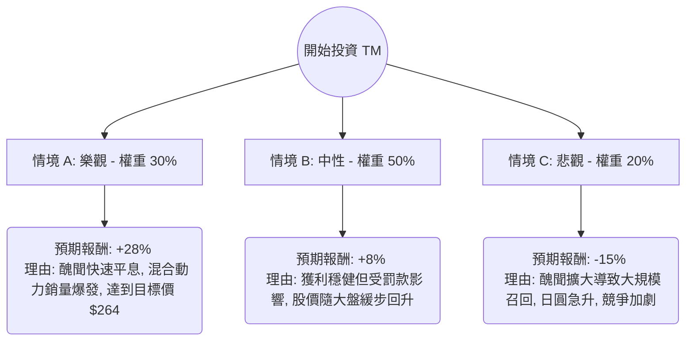

這份分析報告將結合您提供的財務數據與最新的市場動態（包含豐田汽車 Toyota Motor, TM 的認證造假醜聞、油電混合車市場需求及日圓匯率波動），利用**決策樹（Decision Tree）**與**期望值分析（Expected Value Analysis）**來評估其投資價值。

---

### 一、 核心假設與市場背景分析

在建立決策樹之前，我們基於數據與最新資訊設定以下核心假設：

1.  **產業趨勢（利多）**：全球純電動車（EV）需求放緩，消費者轉向油電混合動力車（Hybrid）。豐田作為混合動力領導者，其 **Forward P/E (9.61)** 顯示估值仍具吸引力。
2.  **企業風險（利空）**：豐田近期深陷「認證造假醜聞」（涉及多款車型安全測試），導致部分生產線停工，這反映在 **Perf Month (-14.79%)** 的跌幅中。
3.  **財務體質**：ROE 10.34% 穩健，P/B 1.08 接近帳面價值，下行空間受限。
4.  **匯率因素**：日圓若持續走強，將不利於豐田的出口獲利（目前日圓處於相對低位，對豐田有利）。

---

### 二、 決策樹分析 (Decision Tree)

以下為未來 12 個月的投資情境預測：

#### 節點詳細說明：

| 節點 (情境) | 發生機率 (P) | 預期報酬率 (R) | 期望值 (P * R) |
| :--- | :--- | :--- | :--- |
| **情境 A：樂觀 (Bull Case)** | 30% (0.30) | +28.0% | +8.4% |
| **情境 B：中性 (Base Case)** | 50% (0.50) | +8.0% | +4.0% |
| **情境 C：悲觀 (Bear Case)** | 20% (0.20) | -15.0% | -3.0% |
| **總計期望報酬率** | **100%** | -- | **+9.4%** |

---

### 三、 計算過程與邏輯

#### 1. 期望值 (Expected Value, EV) 計算：
$$EV = (0.30 \times 28\%) + (0.50 \times 8\%) + (0.20 \times -15\%)$$
$$EV = 8.4\% + 4.0\% - 3.0\% = 9.4\%$$

#### 2. 估值參考：
*   **目前股價**：$206.73
*   **分析師目標價**：$264.74 (潛在漲幅約 28%)
*   **股息收益**：約 2.84% (提供額外的安全邊際)

#### 3. 核心邏輯：
*   **樂觀情境 (30%)**：基於 `EPS next Y %: 15.82%` 的增長預期。若豐田能迅速處理認證危機，市場將重新關注其強大的現金流與混合動力市場份額。
*   **中性情境 (50%)**：考慮到 `Perf Month: -14.79%` 已部分消化利空，股價可能在 SMA200 ($203 附近) 獲得支撐，呈現小幅反彈。
*   **悲觀情境 (20%)**：若日本政府處罰加重或全球經濟衰退，股價可能回測 52 週低點 ($155 附近)。

---

### 四、 最終結論

**投資建議：適合投資 (建議分批買進)**

#### 判定理由：
1.  **期望值為正 (9.4%)**：即便計入了近期嚴重的造假醜聞風險，整體的期望報酬率仍優於一般的無風險利率，且具備正向預期。
2.  **估值極具吸引力**：P/E 10.93 與 P/B 1.08 顯示股價並未過熱。在美股高估值的環境下，TM 屬於相對安全的價值標的。
3.  **技術面支撐**：股價目前接近 SMA200 (206.73 vs SMA200 漲幅僅 1.6%)，這通常是長期投資者的強力支撐位。
4.  **產業護城河**：儘管有短期行政干擾，豐田在混合動力技術與供應鏈管理的領先地位短期內難以被比亞迪或特斯拉取代。

#### 風險提示：
*   **短期波動**：認證醜聞的後續調查報告可能導致股價短期內再次下探。
*   **匯率風險**：需密切關注日銀 (BoJ) 的貨幣政策，日圓走強是最大的獲利變數。

**總結：** 對於追求穩健增長與股息的長期投資者，目前的跌幅提供了一個良好的介入點。建議將資金分為 3-4 批，在股價站穩 SMA200 後逐步建立頭寸。