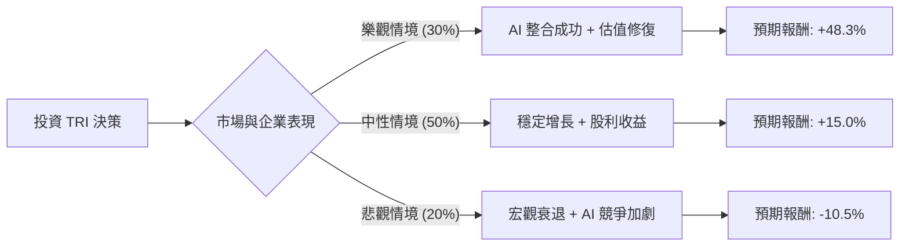

這份分析報告將結合您提供的 **TRI (Thomson Reuters Corporation)** 基本面數據，以及最新的市場動態（特別是 AI 轉型與 LSEG 股份處置），利用**決策樹（Decision Tree）**與**期望值分析（Expected Value Analysis）**評估其投資價值。

---

### 一、 核心背景與市場動態補充

在進入計算前，根據最新市場資訊補充以下關鍵點：
1.  **AI 轉型（Generative AI）**：湯森路透正積極將生成式 AI 整合至其核心產品（如 Westlaw Precision），並承諾每年投入約 1 億美元於 AI 研發。這被視為長期毛利提升的關鍵。
2.  **LSEG 股份處置**：TRI 已逐步出清其在倫敦證券交易所集團（LSEG）的持股，獲得大量現金，用於併購（如收購 Casetext）與股票回購。
3.  **財務穩健性**：數據顯示 Debt/Eq 僅 0.2，財務槓桿極低，且 Forward P/E (17.84) 遠低於現行 P/E (26.84)，顯示市場預期未來盈餘將顯著增長。

---

### 二、 決策樹分析 (Decision Tree)

我們將未來一年的投資表現分為三種情境：**樂觀（Bull）**、**中性（Base）**、**悲觀（Bear）**。

#### 節點詳細說明：

| 節點 (情境) | 發生機率 (P) | 預期報酬 (R) | 說明 |
| :--- | :--- | :--- | :--- |
| **樂觀 (Bull)** | 30% (0.3) | **+48.3%** | 股價回升至分析師目標價 $132.62。AI 產品帶動訂閱費上漲，利潤率擴張。 |
| **中性 (Base)** | 50% (0.5) | **+15.0%** | 股價隨 Forward P/E 修復。營收穩定增長 5-6%，加上 2.7% 股息回報。 |
| **悲觀 (Bear)** | 20% (0.2) | **-10.5%** | 測試 52 週低點（約 $79.7）。高利率環境壓抑估值，AI 轉型進度不如預期。 |

---

### 三、 期望值計算過程 (Expected Value Calculation)

#### 1. 核心假設
*   **當前股價**：$89.43
*   **目標價報酬率**：($132.62 - $89.43) / $89.43 = **+48.3%**
*   **下行風險報酬率**：假設跌至 52W Low 附近 ($80.00)，($80.00 - $89.43) / $89.43 = **-10.5%**
*   **中性增長**：參考 Forward P/E 與 EPS next Y (13.79%)，設定為 **+15%**（含股息）。

#### 2. 期望值 (EV) 計算公式
$$EV = (P_{Bull} \times R_{Bull}) + (P_{Base} \times R_{Base}) + (P_{Bear} \times R_{Bear})$$

#### 3. 代入數值
*   $EV = (0.3 \times 0.483) + (0.5 \times 0.15) + (0.2 \times -0.105)$
*   $EV = 0.1449 + 0.075 - 0.021$
*   $EV = 0.1989$

**最終期望報酬率：19.89%**

---

### 四、 綜合基本面分析

1.  **估值面**：
    *   **Forward P/E (17.84)** 顯示目前股價相對於明年盈利並不貴。
    *   **PEG (1.38)** 處於合理區間（通常 < 1 為低估，1-1.5 為合理）。
2.  **財務健康度**：
    *   **Debt/Eq (0.2)** 與 **Quick Ratio (0.6)**：債務極低，雖然流動比率稍低，但考慮到其訂閱制商業模式（SaaS 屬性），現金流通常非常穩定。
    *   **Profit Margin (20.04%)**：具備強大的護城河與定價能力。
3.  **技術面與動量**：
    *   **Perf Year (-48.21%)**：數據顯示過去一年跌幅巨大，這通常與 LSEG 股份剝離後的會計調整或特殊配息有關。目前股價遠低於 SMA200 (-39.55%)，存在嚴重的**超跌反彈**機會。

---

### 五、 最終結論

**判斷：適合投資 (Buy / Overweight)**

#### 理由：
1.  **正向期望值**：計算出的期望報酬率約為 **19.89%**，遠高於市場平均預期，且下行風險（-10.5%）相對於上行潛力（+48.3%）具有極佳的風險回報比（Risk-Reward Ratio）。
2.  **AI 催化劑**：湯森路透擁有的專業法律與稅務數據庫是 AI 時代的「黃金」，其專有數據難以被通用模型取代，具備長期競爭優勢。
3.  **財務防禦性**：低負債與穩定的股息（2.73%）提供了良好的下行支撐，適合在當前波動的市場環境中作為核心配置。
4.  **估值修復**：目前股價與分析師目標價（$132.62）有顯著落差，隨著 Forward P/E 的實現，股價具備強大的回升動能。

**建議操作：**
鑑於 SMA20/50/200 均呈負值，顯示短期趨勢仍弱，建議採取**分批進場（Dollar Cost Averaging）**策略，以規避短期市場波動，長期持有以參與其 AI 轉型紅利。