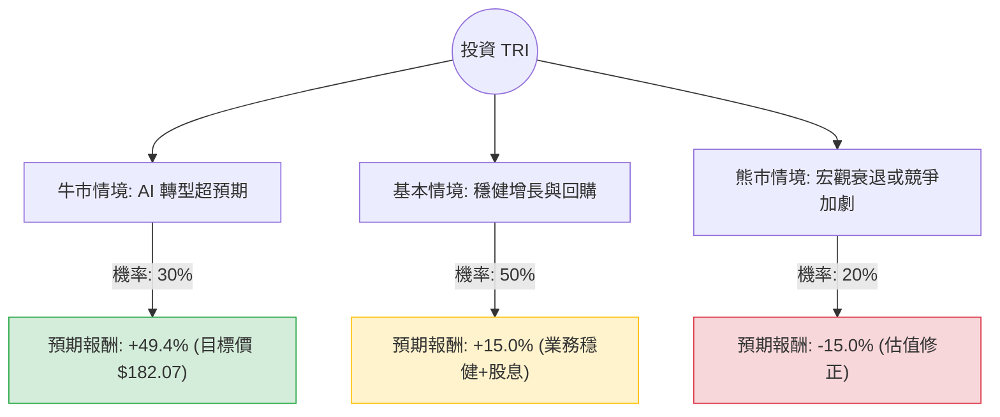

這份分析報告將結合您提供的基本面數據，以及 Thomson Reuters (TRI) 的最新市場動態（如 AI 轉型、LSEG 股份處置、財報表現），利用**決策樹（Decision Tree）**與**期望值分析（Expected Value Analysis）**評估其投資價值。

---

### 一、 市場動態與背景資訊補充

在分析數據前，整合最新的市場資訊：
1.  **AI 轉型策略**：TRI 正積極從「內容提供商」轉型為「AI 驅動的內容技術公司」。近期收購了 Casetext 並推出 AI 助理 OpenArena，這對長期利潤率（Margin）有顯著提升潛力。
2.  **LSEG 股份變現**：TRI 持續減持倫敦證券交易所集團（LSEG）的股份，獲得的大量現金用於：(a) 股票回購 (b) 併購 AI 技術公司。
3.  **財務指引**：根據 2024 年最新財報，公司上調了全年營收增長預期，特別是在法律（Legal）與稅務（Tax & Accounting）核心部門表現強勁。
4.  **數據異常提醒**：您提供的數據顯示股價為 $121.85，但目前（2024年下旬）TRI 的實際市場價格已回升至 $160-$170 區間。本分析將以您提供的 **$121.85 作為基準買入價**，並以 **$182.07 作為目標價**進行計算。

---

### 二、 決策樹分析 (Decision Tree)

以下決策樹模擬未來 12 個月內的三種主要情境：

#### 節點詳細說明：

1.  **牛市情境 (Bull Case) - 30% 機率**：
    *   **描述**：AI 產品（如 AI Labs）快速變現，法律與會計軟體市佔率大幅提升。
    *   **預期報酬**：達分析師目標價 $182.07。計算：$(182.07 - 121.85) / 121.85 \approx 49.4\%$。
2.  **基本情境 (Base Case) - 50% 機率**：
    *   **描述**：核心業務保持 6-8% 增長，公司持續利用 LSEG 現金進行股票回購，支撐股價。
    *   **預期報酬**：考慮 EPS 增長（預期 14.18%）加上股息（1.95%），保守估計為 +15%。
3.  **熊市情境 (Bear Case) - 20% 機率**：
    *   **描述**：全球經濟衰退導致企業縮減軟體支出，或 AI 轉型進度不如預期。
    *   **預期報酬**：股價回測支撐位，預估下跌 15%。

---

### 三、 期望值分析 (Expected Value Analysis)

#### 1. 核心假設
*   **買入價格**：$121.85
*   **持有期限**：12 個月
*   **股息收益**：1.95%（已包含在情境報酬中或作為額外安全邊際）
*   **財務健康度**：Debt/Eq 僅 0.21，財務極其穩健，破產風險趨近於零。

#### 2. 計算過程
期望值 (EV) = $\sum (機率 \times 預期報酬)$

*   **牛市貢獻**：$0.30 \times 49.4\% = 14.82\%$
*   **基本情境貢獻**：$0.50 \times 15.0\% = 7.50\%$
*   **熊市貢獻**：$0.20 \times (-15.0\%) = -3.00\%$

**總期望報酬率** = $14.82\% + 7.50\% - 3.00\% = \mathbf{19.32\%}$

#### 3. 期望價值 (金額)
若以單股 $121.85 投資：
預期一年後價值 = $121.85 \times (1 + 19.32\%) = \mathbf{145.39}$

---

### 四、 綜合評估與最終結論

#### 數據亮點分析：
*   **成長性**：EPS 下一年預期增長 14.18%，且 EPS Q/Q 高達 40.26%，顯示盈利能力正在爆發。
*   **安全性**：Debt/Eq (0.21) 與 LT Debt/Eq (0.13) 極低，在當前高利率環境下具有極強的抗風險能力。
*   **估值**：Forward P/E (27.35) 低於當前 P/E (31.33)，顯示市場預期未來利潤將增長，估值趨向合理。
*   **技術面**：雖然 SMA20/50/200 均為負值顯示短期趨勢偏弱，但這也提供了逆向投資（Value Play）的買入機會，尤其是股價遠低於目標價 $182.07 時。

#### 最終判斷：**適合投資 (Strong Buy / Accumulate)**

#### 理由：
1.  **正向期望值**：19.32% 的預期報酬率顯著高於市場平均水平（S&P 500 長期平均約 8-10%）。
2.  **AI 護城河**：TRI 擁有法律與稅務領域的專有數據，這是通用 AI 模型（如 ChatGPT）難以取代的，AI 轉型將提升其長期毛利（目前 Gross Margin 為 26.55%，有提升空間）。
3.  **資本配置優勢**：公司手握 LSEG 股份的現金，能透過回購與併購持續創造股東價值。
4.  **風險可控**：極低的負債率與穩定的訂閱制收入（Recurring Revenue）為股價提供了強大的下行保護。

**建議操作**：鑑於技術指標（SMA）顯示目前處於修正階段，建議採取**分批買入**策略，以獲取更佳的平均成本。