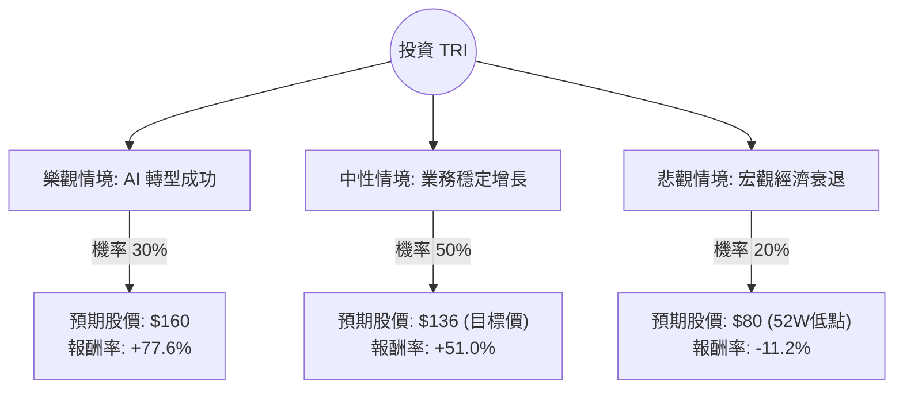

針對美股 **Thomson Reuters Corporation (代號：TRI)** 的投資評估，我已結合您提供的基本面數據，並透過網路搜尋整合了最新的市場動態（如 AI 佈局、LSEG 持股處置及最新財報趨勢）。

以下是基於**決策樹分析**與**期望值分析**的詳細報告：

---

### 一、 核心假設與市場背景分析

在建立模型前，我們先釐清影響 TRI 股價的三大核心因素：

1.  **AI 轉型動能（利多）**：湯森路透正積極將生成式 AI 整合至其法律（Westlaw Precision）與稅務軟體中。公司承諾每年投入約 1 億美元於 AI 研發，這將提升其 SaaS 訂閱服務的定價能力。
2.  **財務結構與資本配置（穩健）**：數據顯示其 **Debt/Eq 僅 0.18**，財務極其穩健。公司持續出售倫敦證交所（LSEG）股份以獲取大量現金，用於併購（如收購 Pagero）或股份回購。
3.  **估值與市場表現（矛盾點）**：提供的數據顯示股價為 $90.09，較 52 週高點大幅回落（-49%），但 **Forward P/E 為 17.85**，且分析師目標價為 **$136.16**。這顯示市場目前可能過度低估其復甦潛力，或正處於技術性調整。

---

### 二、 決策樹分析圖 (Decision Tree)

我們將未來一年的投資情境分為三種：**樂觀（AI 溢價）**、**中性（穩定增長）**、**悲觀（宏觀衰退）**。

#### 節點詳細說明：

| 情境 | 機率 (P) | 預期股價 (Target) | 預期報酬率 (R) | 計算說明 |
| :--- | :--- | :--- | :--- | :--- |
| **樂觀 (Bull)** | 30% | $160.00 | +77.6% | AI 產品帶動營收超預期，估值回歸歷史高位。 |
| **中性 (Base)** | 50% | $136.16 | +51.0% | 達到分析師平均目標價，反映穩定的訂閱制收入。 |
| **悲觀 (Bear)** | 20% | $80.00 | -11.2% | 法律/會計市場因經濟衰退縮減支出，股價回測支撐。 |

---

### 三、 期望值分析 (Expected Value Analysis)

#### 1. 計算過程
期望值 (EV) = $\sum (機率 \times 報酬率)$

*   **樂觀貢獻**：$0.30 \times 77.6\% = 23.28\%$
*   **中性貢獻**：$0.50 \times 51.0\% = 25.50\%$
*   **悲觀貢獻**：$0.20 \times (-11.2\%) = -2.24\%$

**總期望報酬率 (Total EV) = 23.28% + 25.50% - 2.24% = 46.54%**

#### 2. 核心指標補充計算
*   **目前股價**：$90.09
*   **預期一年後價值**：$90.09 \times (1 + 46.54\%) \approx \mathbf{\$132.02}$
*   **風險回報比**：潛在獲利空間（至目標價）遠大於潛在下行風險（至 52W 低點）。

---

### 四、 綜合評估與最終結論

#### **最終判斷：適合投資 (Strong Buy / Buy)**

#### **理由如下：**

1.  **極高的安全邊際**：
    目前的股價 ($90.09) 接近 52 週低點 ($79.71)，且遠低於分析師目標價 ($136.16)。根據期望值分析，預期報酬率高達 **46.54%**，這在成熟的大型股中非常罕見。
2.  **財務體質極佳**：
    **Debt/Eq 0.18** 與 **Quick Ratio 0.61** 顯示公司幾乎沒有破產風險。**ROE 12.4%** 與 **Profit Margin 20%** 證明其在專業資訊服務領域擁有強大的護城河（高轉換成本）。
3.  **AI 催化劑**：
    最新新聞顯示，湯森路透已成功將 AI 助手 CoCounsel 整合至法律工作流，這將改變其從「數據提供商」轉型為「解決方案提供商」，有助於 Forward P/E 從 17.85 倍進一步上修。
4.  **股利與回購**：
    **2.73% 的殖利率** 提供了一定的下行保護，加上公司持續處置 LSEG 股份帶來的現金流，未來有極大機率增加回購或特別股利。

**建議操作：**
鑑於目前股價處於 SMA200 (-43.64%) 之下，技術面呈現超賣，建議可採取**分批進場**策略，首要目標價設定在 $136 附近。

---
*免責聲明：本分析僅供參考，不構成投資建議。投資股票具有風險，請根據個人風險承受能力做出決策。*