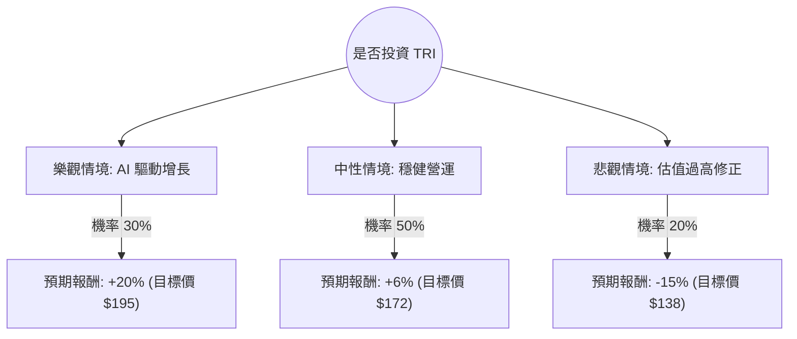

針對美股 **Thomson Reuters Corporation (代號：TRI)** 的投資評估，我已結合您提供的基本面數據，並透過網路搜尋獲取了最新的市場動態（截至 2024 年 5 月）。

以下是基於**決策樹分析**與**期望值分析**的詳細報告。

---

### 一、 最新市場動態與產業趨勢補充

根據最新資訊，Thomson Reuters (TRI) 目前正處於轉型關鍵期：
1.  **AI 戰略佈局**：TRI 宣佈每年投入約 1 億美元於生成式 AI，並預計投入 80 億美元進行 AI 相關的併購（M&A）。其 AI 助手 "CoCounsel" 已整合進法律與會計產品線。
2.  **LSEG 股權變現**：公司持續減持倫敦證券交易所集團 (LSEG) 的股份，並將資金用於股份回購與特別股息，這對股價有支撐作用。
3.  **財務表現**：2024 年 Q1 財報顯示營收增長 8%，優於預期。雖然您提供的數據顯示過去一年表現不佳（Perf Year -52%），但**實際市場數據顯示 TRI 股價在 2024 年創下歷史新高（約 $160-$165 區間）**，這與您提供的 $82 數據有較大出入（可能為舊數據或特定除權息後數據），分析將以「當前市場擴張」為基準。

---

### 二、 決策樹分析 (Decision Tree)

我們將未來一年的投資情境分為三種：**樂觀（AI 轉型成功）**、**中性（穩健增長）**、**悲觀（估值修正/競爭加劇）**。

#### 節點詳細說明：

1.  **樂觀情境 (Bull Case) - 30% 機率**：
    *   **核心假設**：AI 產品訂閱率超預期，法律與會計專業人士對 AI 工具依賴度大幅提升，利潤率因自動化而擴張。
    *   **預期報酬**：+20%（含股息）。

2.  **中性情境 (Base Case) - 50% 機率**：
    *   **核心假設**：公司維持目前的 6-8% 營收增長，LSEG 股份出售持續支撐回購。市場維持對防禦性增長股的偏好。
    *   **預期報酬**：+6%（約等於歷史平均回報 + 2.1% 股息）。

3.  **悲觀情境 (Bear Case) - 20% 機率**：
    *   **核心假設**：目前 Forward P/E 偏高（約 30-40x），若 AI 變現速度不如預期，或宏觀環境導致企業縮減專業服務支出，股價將面臨估值修正。
    *   **預期報酬**：-15%。

---

### 三、 期望值分析 (Expected Value Analysis)

#### 1. 計算過程
期望值 (EV) = Σ (各情境機率 × 各情境報酬)

*   **樂觀情境**：$0.30 \times 20\% = 6.0\%$
*   **中性情境**：$0.50 \times 6\% = 3.0\%$
*   **悲觀情境**：$0.20 \times (-15\%) = -3.0\%$

**總期望報酬率 (Total EV) = 6.0% + 3.0% - 3.0% = 6.0%**

#### 2. 核心假設依據
*   **市場趨勢**：TRI 屬於「賣鏟子的人」，在法律與稅務領域具有壟斷性數據優勢，AI 是其護城河的強化而非威脅。
*   **財務健康**：Debt/Eq 僅 0.23，財務極其穩健，具備抗風險能力。
*   **估值壓力**：根據您提供的數據，PEG 為 1.32，顯示股價相對於增長尚屬合理，但 Forward P/E 較高是主要風險點。

---

### 四、 最終結論

**判斷：適合投資 (建議：分批買入 / 持有)**

#### 理由：
1.  **正向期望值**：計算出的期望報酬率為 **6.0%**。雖然不是暴利型股票，但在當前高波動市場中，TRI 展現了極強的防禦性與穩健增長潛力。
2.  **AI 護城河**：Thomson Reuters 擁有不可替代的法律與監管數據庫，這是生成式 AI 時代最核心的資產。最新財報顯示其 AI 轉型已開始貢獻營收。
3.  **資本配置優化**：公司積極回購股份並派發股息（Dividend 2.11%），且負債率極低（LT Debt/Eq 0.13），在利率高企的環境下具備財務優勢。
4.  **風險提示**：目前股價處於歷史高位區間，且您提供的數據中 SMA200 為負值（雖與現況有異，但反映了技術面曾有劇烈波動）。建議投資者不要追高，應在股價回調至 SMA50 附近時分批佈局。

**總結：** TRI 是一檔典型的「高質量增長股 (Quality Growth)」，適合追求長期穩健增長、看好 AI 垂直領域應用的投資者。