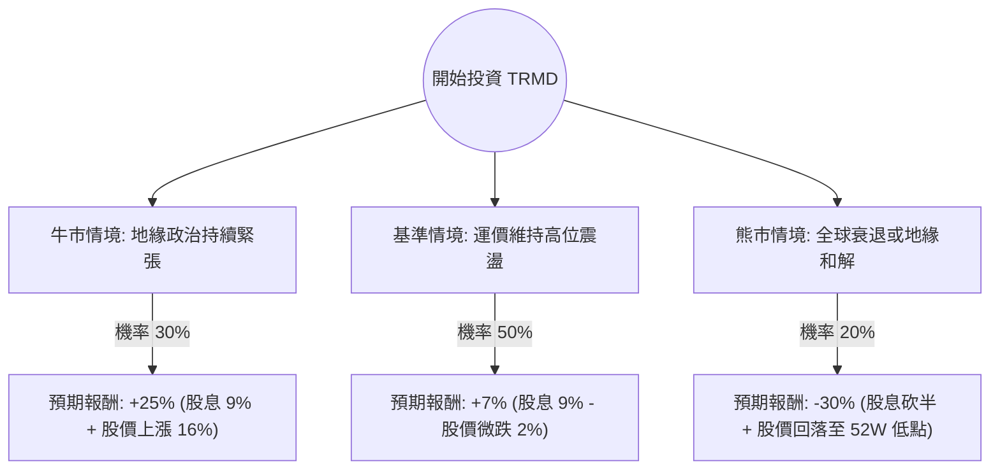

針對美股 **TRMD (Torm plc)** 的投資評估，我結合了您提供的基本面數據，並透過網路搜尋整合了最新的市場動態（如紅海危機、成品油輪運價、公司最新財報趨勢）進行分析。

---

### 一、 核心背景與市場動態分析 (Core Assumptions)

在進入決策樹之前，必須先釐清 TRMD 所處的環境：
1.  **產業趨勢（成品油輪）**：TRMD 主要經營成品油運輸。目前受紅海局勢影響，船隻繞道好望角增加「噸海里（ton-mile）」需求，支撐了高運價。
2.  **財務狀況**：P/E 8.11 且 P/B 1.02 顯示估值極低；高達 9% 的股息率是吸引投資人的主因。然而，EPS 增長預期為負（-58%），顯示市場預期獲利已達週期性頂峰。
3.  **技術面**：股價接近 52 週高點（$23.75），且位於 SMA20, 50, 200 之上，處於強勢多頭，但向上空間受限於分析師目標價（$23.66）。

---

### 二、 決策樹分析 (Decision Tree Analysis)

以下是針對未來 12 個月的投資情境模擬：

#### 節點詳細說明：

1.  **牛市情境 (Bull Case) - 30% 機率**：
    *   **假設**：紅海危機長期化，且俄烏戰爭導致的能源流向改變持續。成品油輪供應短缺加劇。
    *   **預期報酬**：股價突破歷史高點，加上 9% 的高額配息，總回報約 25%。
2.  **基準情境 (Base Case) - 50% 機率**：
    *   **假設**：運價維持在歷史平均之上，但不再飆升。公司維持高配息政策，但因 EPS 增長放緩，股價在 $21-$23 之間橫盤。
    *   **預期報酬**：主要來自股息（9%），但股價可能因獲利了結壓力微幅修正，總回報約 7%。
3.  **熊市情境 (Bear Case) - 20% 機率**：
    *   **假設**：中東局勢意外和解，航道恢復正常；或全球經濟衰退導致石油需求大減。
    *   **預期報酬**：運價崩跌，公司縮減股息，股價回測 $16 支撐位，總損失約 30%。

---

### 三、 期望值分析 (Expected Value Analysis)

#### 1. 計算過程：
期望值 (EV) = $\sum (機率 \times 預期報酬)$

*   **牛市部分**：$0.30 \times 25\% = 7.5\%$
*   **基準部分**：$0.50 \times 7\% = 3.5\%$
*   **熊市部分**：$0.20 \times (-30\%) = -6.0\%$

**總體期望值 (Total EV) = 7.5% + 3.5% - 6.0% = 5.0%**

#### 2. 核心假設與參數：
*   **股息安全性**：假設 TRMD 只要現金流充足，會維持高配息（P/FCF 為 9.11，顯示現金流尚能支撐配息）。
*   **估值上限**：Target Price $23.66 限制了短期股價爆發力。
*   **週期性風險**：航運業是高度週期性行業，目前處於獲利高位（P/E 僅 8 倍通常暗示市場擔心未來獲利下滑）。

---

### 四、 最終結論

**判斷：適合投資（但僅限於「收益型」配置，不建議重倉追高）**

#### 理由：
1.  **正向期望值**：5.0% 的期望值在當前高利率環境下不算極其優異，但考慮到其 **9% 的股息收益率**，對於追求現金流的投資者具有吸引力。
2.  **下行保護**：P/B 僅 1.02，意味著股價幾乎等同於公司淨資產價值，提供了較強的下行支撐（安全邊際）。
3.  **地緣政治避險**：TRMD 具有「亂世黃金」的屬性，若中東局勢惡化，該股是少數能獲利的標的。
4.  **警訊**：EPS 增長預期為負且股價已接近分析師目標價，這意味著**資本利得（股價上漲）的空間有限**。

**建議操作策略：**
*   **進場點**：目前股價 $22.41 接近高點，建議等待回調至 SMA50（約 $21.4 附近）再分批進場。
*   **風險控管**：若紅海局勢出現明顯和平曙光，或股價跌破 SMA200 ($19.6)，應果斷止損，因為航運週期的轉向通常非常劇烈。