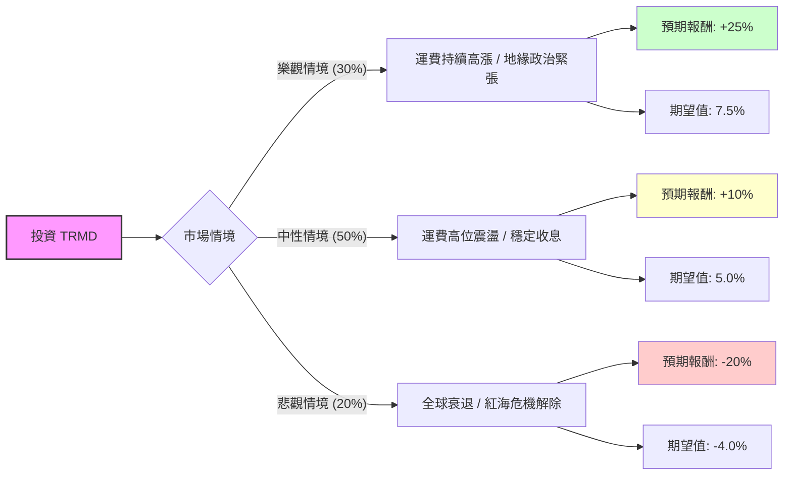

這份分析報告將結合您提供的 **TRMD (Torm plc)** 基本面數據，以及當前航運市場（特別是成品油輪 Product Tanker）的最新動態，利用**決策樹（Decision Tree）**與**期望值（Expected Value）**進行投資評估。

---

### 一、 核心假設與市場背景分析

在建立模型前，我們必須基於數據與現狀設定核心假設：

1.  **產業趨勢（成品油輪市場）：**
    *   **利多：** 紅海危機導致航線繞道（好望角），增加了航行天數（Ton-mile demand），支撐了運費（Spot Rates）。
    *   **利空：** 2025 年預計有較多新船下水，且全球經濟增速放緩可能壓抑成品油需求。
2.  **財務狀況：**
    *   TRMD 擁有極高的股息率（7.72%）與健康的資產負債表（Debt/Eq 0.46）。
    *   **警訊：** 數據顯示明年 EPS 預期衰退 -24.62%，這反映了市場預期運費可能從高峰回落。
3.  **估值：**
    *   目前 P/E 9.67 低於歷史平均，但 Forward P/E 10.7 顯示增長動能放緩。目標價 $30.2 距離現價約有 10% 的空間。

---

### 二、 決策樹分析 (Decision Tree)

我們將未來一年的投資情境分為三種：**樂觀（牛市）、中性（基準）、悲觀（熊市）**。

#### 決策樹節點詳細說明：

1.  **樂觀情境 (Probability: 30%)**
    *   **描述：** 地緣政治衝突持續，且夏季旅遊旺季帶動航空燃油與汽油需求超預期。
    *   **預期報酬：** 股價回升至 $32-$34 + 領取約 8% 股息 = **+25%**。
2.  **中性情境 (Probability: 50%)**
    *   **描述：** 運費維持在獲利平衡點之上，公司維持高配息政策，股價在目標價 $30 附近波動。
    *   **預期報酬：** 股價微漲 + 領取約 8% 股息 = **+10%**。
3.  **悲觀情境 (Probability: 20%)**
    *   **描述：** 經濟衰退導致需求萎縮，或紅海局勢迅速平息導致航道恢復正常，運費大幅回落。
    *   **預期報酬：** 股價跌至 52 週低點區域 ($22) + 股息縮水 = **-20%**。

---

### 三、 期望值計算 (Expected Value Analysis)

我們計算投資 TRMD 一年的總期望報酬率（Expected Return）：

$$EV = (P_{Bull} \times R_{Bull}) + (P_{Base} \times R_{Base}) + (P_{Bear} \times R_{Bear})$$

*   **計算過程：**
    *   樂觀：$0.30 \times 25\% = 7.5\%$
    *   中性：$0.50 \times 10\% = 5.0\%$
    *   悲觀：$0.20 \times (-20\%) = -4.0\%$
*   **總期望報酬率：**
    $$7.5\% + 5.0\% - 4.0\% = \mathbf{8.5\%}$$

---

### 四、 綜合評估與最終結論

#### 1. 數據深度解析
*   **技術面：** SMA200 為 +25.71%，顯示長期趨勢仍向上，但近期（Perf Month -5.86%）處於回檔修正。
*   **獲利能力：** ROE 13.34% 表現穩健，但 EPS Q/Q 僅增長 9.5%，對比去年同期的爆發性增長已明顯放緩。
*   **風險點：** **EPS next Y % (-24.62%)** 是最大的隱憂，這代表分析師普遍認為目前的獲利是「週期性頂部」。

#### 2. 最終判斷：適合投資 (建議：分批買入 / 領息策略)

**判斷理由：**
1.  **正向期望值：** 8.5% 的期望報酬率在當前高利率環境下仍具吸引力，且這尚未完全計入複利效應。
2.  **高股息護城河：** 7.72% 的股息率為股價提供了強大的下行支撐（Downside Protection）。即便股價不漲，持有成本也會隨時間降低。
3.  **地緣政治溢價：** 只要中東局勢未完全平息，成品油輪的供給吃緊狀態將持續，TRMD 作為純成品油輪標的，受益最直接。
4.  **估值合理：** P/E 9.67 倍遠低於美股大盤，且 P/B 1.26 顯示資產溢價不高，安全邊際尚可。

**投資建議：**
*   **進場點：** 目前股價 $27.47 接近 SMA20 ($27.40)，建議在 $26-$27 區間分批佈局。
*   **停損點：** 若股價跌破 $23.5 (跌破 SMA200 且基本面轉壞)，應考慮離場。
*   **目標：** 長期持有以領取股息為主，並在股價達到 $31-$32 附近時進行部分獲利了結。

**風險提示：** 航運股屬於高度週期性行業，需密切關注「波羅的海成品油運價指數 (BCTI)」的走勢。