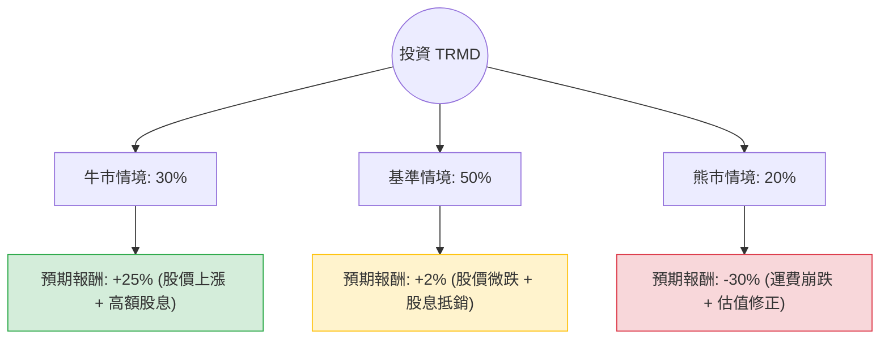

針對美股公司 **TORM plc (TRMD)** 的投資評估，我結合了您提供的基本面數據，並透過網路搜尋整合了最新的市場動態（如紅海危機、成品油輪供需、最新財報表現）。

以下是基於**決策樹分析**與**期望值分析**的詳細報告。

---

### 一、 核心背景與市場動態分析

在進入計算前，必須釐清 TRMD 的核心營運環境：
1.  **產業趨勢**：TRMD 專注於成品油運輸（Product Tanker）。目前受惠於紅海局勢導致的航線繞道（增加噸海里需求）以及全球成品油庫存偏低。
2.  **財務現況**：P/E 僅 9.98，股息率高達 7.32%，顯示公司現金流充沛。然而，EPS Q/Q 下降 42.78%，顯示獲利動能有放緩跡象。
3.  **估值預警**：目前股價 ($27.67) 已高於分析師平均目標價 ($25.15)，且處於 52 週高點附近，技術面有超買風險。

---

### 二、 決策樹分析 (Decision Tree)

我們將未來一年的投資情境分為三種：**牛市（地緣政治持續緊張）**、**基準（市場供需平衡）**、**熊市（全球經濟衰退/地緣政治和解）**。

#### 節點詳細說明：

1.  **牛市情境 (Probability: 30%)**
    *   **條件**：紅海危機持續整年，俄烏戰爭導致航路持續受阻，成品油輪供給增長率低於 2%。
    *   **預期報酬**：股價挑戰 $32 + 8% 股息 ≈ **+25%**。
2.  **基準情境 (Probability: 50%)**
    *   **條件**：運費維持在高位但不再攀升，公司維持現有派息政策。由於目前股價已高於目標價，股價可能回落至 $25 附近。
    *   **預期報酬**：股價變動 (-10%) + 股息 (+12% 預期) ≈ **+2%**。
3.  **熊市情境 (Probability: 20%)**
    *   **條件**：中東局勢意外和解，全球經濟衰退導致石油需求下降，運費（Spot Rates）崩盤。
    *   **預期報酬**：股價回測 $18 + 減少的股息 ≈ **-30%**。

---

### 三、 期望值分析 (Expected Value Analysis)

#### 1. 核心假設
*   **持有期間**：12 個月。
*   **總報酬計算**：(期末股價 - 期初股價) / 期初股價 + 期間股息率。
*   **當前價格**：$27.67。
*   **分析師目標價**：$25.15（隱含 -9% 的下行空間）。

#### 2. 計算過程
期望值 (EV) = Σ (各情境機率 × 各情境報酬)

*   **牛市 (Bull)**: $0.30 \times 25\% = 7.5\%$
*   **基準 (Base)**: $0.50 \times 2\% = 1.0\%$
*   **熊市 (Bear)**: $0.20 \times (-30\%) = -6.0\%$

**總期望報酬率 (Total EV) = 7.5% + 1.0% - 6.0% = 2.5%**

---

### 四、 綜合評估與最終結論

#### 1. 數據解讀
*   **低期望值**：2.5% 的預期報酬率對於波動極大的航運股來說顯然過低，甚至低於無風險利率（美債殖利率約 4.5%）。
*   **估值過高**：目前股價 $27.67 已透支了大部分利多，且高於目標價 $25.15。
*   **技術面風險**：SMA20, 50, 200 均顯示股價處於極高位（SMA200 偏離度達 33%），短期回檔壓力大。

#### 2. 最終結論：**不適合投資 (建議觀望)**

#### 3. 理由：
1.  **風險報酬比不對稱**：雖然 TRMD 財務穩健且股息誘人，但目前股價處於週期高點。2.5% 的期望值無法補償航運業高波動的風險。
2.  **獲利動能放緩**：EPS Q/Q 下降 42.78% 是一個警訊，顯示最暴利的階段可能已過。
3.  **缺乏安全邊際**：股價已超過分析師公允價值，現在進場屬於「追高」，一旦地緣政治緩解，股價將面臨劇烈修正。

**建議操作**：若已持有者可考慮逢高減碼或設置嚴格停損；未持有者建議等待股價回落至 $22 - $24 區間（靠近 SMA200 或目標價以下）再行評估。