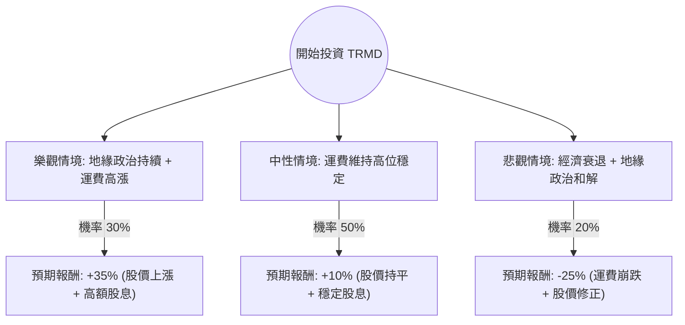

這份分析報告將結合您提供的基本面數據與最新的市場動態（包含紅海危機、成品油輪產業趨勢及 TORM plc 的最新財報表現），利用**決策樹（Decision Tree）**與**期望值分析（Expected Value Analysis）**評估 TRMD 的投資價值。

---

### 一、 核心假設與市場背景分析

在建立決策樹前，我們必須基於現狀設定核心假設：

1.  **產業趨勢（利多）**：紅海局勢持續緊張，迫使油輪繞道好望角，增加「噸海里（Ton-mile）」需求。成品油輪（Product Tanker）供給增長受限（新船訂單量低）。
2.  **財務狀況（穩健）**：TRMD 擁有極高的股息發放率與強勁的現金流。P/E 12.17 倍與 Forward P/E 11.05 倍顯示估值尚屬合理。
3.  **風險因素（利空）**：全球經濟衰退可能導致石油需求下降；地緣政治若突然和解，運費（Spot Rates）將面臨修正壓力。
4.  **技術面**：股價已接近 52 週高點（-0.87%），且遠高於 SMA200（+44.75%），短期有過熱回調風險。

---

### 二、 決策樹分析 (Decision Tree)

我們將未來一年的投資情境分為三種：**樂觀（牛市）**、**中性（基準）**、**悲觀（熊市）**。

#### 決策樹節點詳細說明：

| 情境節點 | 發生機率 (P) | 預期報酬 (R) | 說明 |
| :--- | :--- | :--- | :--- |
| **樂觀情境** | 30% (0.3) | +35% | 紅海危機長期化，運費維持歷史高位，TRMD 繼續收購二手船擴張，股息率維持 15% 以上。 |
| **中性情境** | 50% (0.5) | +10% | 運費受季節性波動影響但整體穩定，股價在當前區間震盪，主要收益來自 6-10% 的股息。 |
| **悲觀情境** | 20% (0.2) | -25% | 地緣政治迅速降溫，全球經濟衰退導致需求萎縮，運費回歸均值，股價回測 SMA200。 |

---

### 三、 期望值計算 (Expected Value Calculation)

期望值（EV）計算公式：
$EV = (P_{Bull} \times R_{Bull}) + (P_{Base} \times R_{Base}) + (P_{Bear} \times R_{Bear})$

**計算過程：**
1.  **樂觀貢獻**：$0.3 \times 35\% = 10.5\%$
2.  **中性貢獻**：$0.5 \times 10\% = 5.0\%$
3.  **悲觀貢獻**：$0.2 \times (-25\%) = -5.0\%$

**總期望報酬率：**
$10.5\% + 5.0\% - 5.0\% = \mathbf{10.5\%}$

---

### 四、 綜合評估與最新資訊補充

1.  **運費環境**：根據最新航運報告，LR2 與 MR 型油輪（TRMD 的主力）運費仍遠高於盈虧平衡點。TRMD 的營運槓桿極高，運費每上升 $1,000/天，對 EPS 的貢獻顯著。
2.  **資產價值**：TRMD 近期持續進行船隊更新（如收購 8 隻 MR 船），在二手船價上漲的背景下，其 P/B 1.59 雖然不算極低，但反映了船隊資產的增值。
3.  **股息政策**：TRMD 採行積極的分紅政策。數據顯示其 Dividend % 為 6.13%，但若考慮到季度特別股息，實際年化殖利率可能更高，這為股價提供了下行支撐。
4.  **分析師目標價**：數據顯示 Target Price 為 $33.12，與現價 $32.64 極為接近，暗示**短期上漲空間受限**。

---

### 五、 最終結論

#### **判斷：適合投資（但建議採取「分批買入」或「回調買入」策略）**

**理由：**
1.  **正向期望值**：10.5% 的預期報酬率在當前高利率環境下仍具吸引力，且主要由強勁的現金流（股息）支撐。
2.  **產業護城河**：成品油輪供給端在未來兩年內幾乎沒有大規模新船下水，這決定了運費的「下限」較高。
3.  **風險提示**：目前股價處於 52 週高點附近，且 Perf Year 達 102%，技術面有超買跡象。Target Price 顯示分析師認為目前價格已接近公允價值。

**操作建議：**
*   **進場點**：不建議在當前歷史高位附近全力追高。建議等待股價回落至 SMA20 或 SMA50（約 $28-$30 區間）時進場，以提高安全邊際。
*   **核心價值**：這是一檔典型的「收息型」週期股，適合追求高股息且能承受航運業波動的投資者。

***

**免責聲明：** 本分析僅供參考，不構成任何投資建議。投資股票具有風險，請根據自身風險承受能力做出決策。