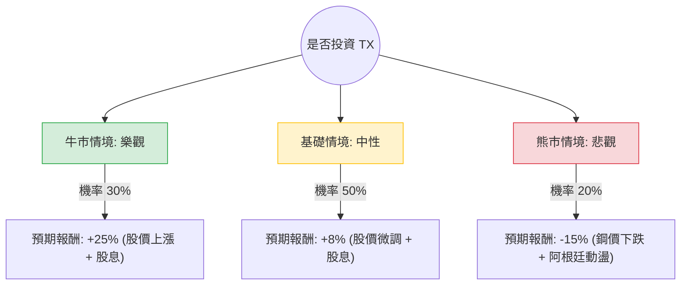

這份分析報告將結合您提供的基本面數據，以及針對 **Ternium S.A. (TX)** 的最新市場動態（如墨西哥近岸外包趨勢、鋼鐵價格走勢及阿根廷宏觀經濟）進行綜合評估。

---

### 一、 市場動態與核心假設 (Core Assumptions)

在進入決策樹之前，我們必須考慮以下關鍵外部因素：

1.  **墨西哥近岸外包 (Nearshoring) 紅利**：Ternium 是墨西哥最大的扁鋼生產商。隨著美墨加協定（USMCA）及供應鏈移往北美，汽車與工業對鋼鐵需求強勁。公司正投資 32 億美元在墨西哥建設新廠。
2.  **阿根廷風險**：TX 有相當比例的業務在阿根廷。雖然米萊（Milei）政府推行改革，但高通膨與貨幣貶值仍是短期劇烈波動的來源。
3.  **估值與財務健康**：
    *   **P/B 0.71**：股價低於淨值，具備高度安全邊際。
    *   **Debt/Eq 0.19**：負債比極低，財務極其穩健。
    *   **EPS 下年度預期增長 74.9%**：這是極強的成長動能。
    *   **股息率 6.23%**：提供良好的現金流支撐。

---

### 二、 決策樹分析 (Decision Tree Analysis)

我們以 **1 年持有期** 為基準，預測三種可能的情境：

#### 節點詳細說明：

1.  **牛市情境 (Bull Case) - 30% 機率**：
    *   **條件**：墨西哥新廠進度超前，美國經濟強韌帶動鋼鐵需求，鋼價回升。
    *   **預期報酬**：股價回升至歷史高點區域（約 $50-52），加上 6% 股息，總報酬約 **25%**。
2.  **基礎情境 (Base Case) - 50% 機率**：
    *   **條件**：市場維持現狀，雖然分析師目標價（$40.77）低於現價，但強勁的 EPS 增長（74.9%）抵銷估值修正壓力。
    *   **預期報酬**：股價在 $42-$45 震盪，主要收益來自 **6% 股息 + 2% 資本利得 = 8%**。
3.  **熊市情境 (Bear Case) - 20% 機率**：
    *   **條件**：全球經濟衰退導致鋼鐵需求萎縮，阿根廷經濟崩潰影響合併報表。
    *   **預期報酬**：股價回測 $35 支撐位，跌幅約 20%，扣除 6% 股息後，總報酬約 **-15%**。

---

### 三、 期望值計算 (Expected Value Calculation)

期望值 (EV) = $\sum (機率 \times 預期報酬)$

*   **牛市貢獻**：$0.30 \times 25\% = 7.5\%$
*   **基礎貢獻**：$0.50 \times 8\% = 4.0\%$
*   **熊市貢獻**：$0.20 \times (-15\%) = -3.0\%$

**總體期望報酬率 (Total EV) = 7.5% + 4.0% - 3.0% = 8.5%**

---

### 四、 綜合評估與最終結論

#### 1. 數據亮點分析：
*   **價值面**：P/B 0.71 顯示資產被低估，P/S 0.55 顯示營收含金量高。
*   **成長面**：Forward P/E 僅 8.1，對比 EPS next Y 74.9% 的增長，PEG 遠低於 1，極具吸引力。
*   **技術面**：目前股價接近 52 週高點（$43.35 vs $43.49），且位於 SMA20/50/200 之上，短期有過熱風險，但長期趨勢向上。

#### 2. 投資建議：
**結論：適合投資 (建議分批買入)**

#### 3. 判斷理由：
1.  **正向期望值**：8.5% 的期望報酬率在當前高利率環境下具備競爭力，且這尚未計入墨西哥長期戰略地位的溢價。
2.  **極高的安全邊際**：低負債（Debt/Eq 0.19）與低於淨值的股價（P/B 0.71）限制了下行空間。即使在悲觀情境下，強大的現金流與股息也能緩衝損失。
3.  **強大的成長引擎**：下年度 EPS 預期增長 75% 是最強的催化劑。雖然分析師目標價目前較為保守（$40.77），但這通常是基於落後的財務模型，未完全反映近岸外包帶來的結構性需求增長。
4.  **風險提示**：目前股價處於 52 週高位，短期可能出現技術性回檔。建議投資者不要在今日一次性梭哈，而是採取**分批進場**策略，或等待股價回測 SMA50（約 $38-$40 區間）時加碼。

**最終判斷：TX 是一間財務極其健康、享受地緣政治紅利且估值低廉的優質工業股，適合追求「價值+高股息」的投資者。**