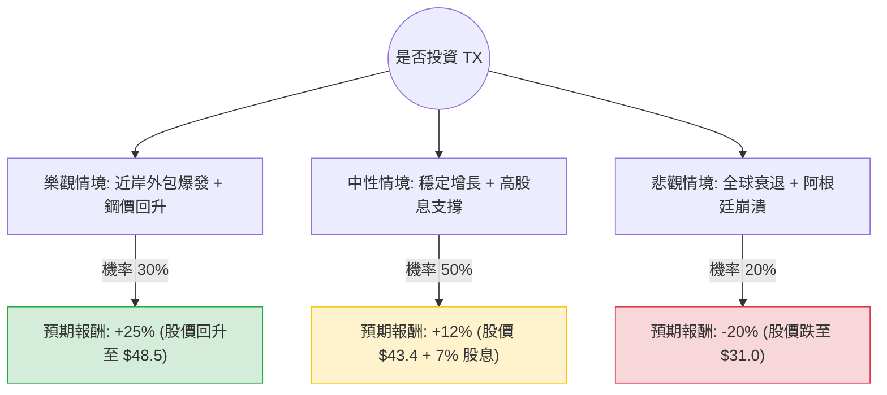

這份分析報告將結合您提供的財務數據與最新的市場動態（包含 Ternium S.A. 的最新財報、墨西哥近岸外包趨勢及鋼鐵產業現況），利用**決策樹（Decision Tree）**與**期望值分析（Expected Value Analysis）**評估 **TX (Ternium S.A.)** 的投資價值。

---

### 一、 核心背景與市場動態分析 (Web Search Summary)

在進入模型前，根據最新資訊總結以下關鍵點：
1.  **墨西哥近岸外包 (Nearshoring) 紅利**：TX 是墨西哥最大的鋼鐵生產商。隨著北美供應鏈轉移至墨西哥，其在 Pesquería 的新廠投資（預計 2026 投產）是長期增長引擎。
2.  **阿根廷經濟風險**：TX 有相當比例的業務在阿根廷，受該國高通膨與匯率波動影響，短期利潤承壓。
3.  **鋼鐵價格與利差**：全球鋼鐵需求（尤其是中國）疲軟導致價格波動，但 TX 的低成本結構與垂直整合使其毛利優於同行。
4.  **財務健康度**：P/B 僅 0.64，遠低於淨資產價值；Forward P/E 6.02 顯示市場預期明年獲利將大幅回升（對比目前 P/E 13.26）。

---

### 二、 決策樹分析 (Decision Tree)

我們將未來一年的投資回報分為三種情境：**樂觀（牛市）**、**中性（基準）**、**悲觀（熊市）**。

#### 1. 樂觀情境 (Bull Case) - 機率 30%
*   **描述**：墨西哥工業需求超預期，美國經濟軟著陸帶動汽車鋼材需求，鋼價反彈。
*   **預期報酬計算**：股價回歸至 52 週高點附近（約 $48.5），加上約 7% 的股息，總回報約 **+25%**。

#### 2. 中性情境 (Base Case) - 機率 50%
*   **描述**：鋼價維持現狀，阿根廷業務風險被墨西哥業務抵銷。公司維持高額派息。
*   **預期報酬計算**：股價回升至分析師目標價 $40.8（約 +5%），加上 7% 股息，總回報約 **+12%**。

#### 3. 悲觀情境 (Bear Case) - 機率 20%
*   **描述**：全球經濟衰退，鋼鐵需求萎縮；美國對墨西哥鋼鐵加徵關稅（貿易摩擦）。
*   **預期報酬計算**：股價回測 52 週低點（約 $31），總回報約 **-20%**。

---

### 三、 期望值計算 (Expected Value Calculation)

**核心假設：**
*   **持有期限**：12 個月。
*   **股息收益**：假設公司維持目前的派息政策（Dividend %: 0.0697）。
*   **估值修復**：基於 Forward P/E 6.02 與 P/B 0.64 的極低估值，下行空間受資產價值支撐。

**計算過程：**
$$EV = (P_{Bull} \times R_{Bull}) + (P_{Base} \times R_{Base}) + (P_{Bear} \times R_{Bear})$$

*   $0.30 \times 25\% = 7.5\%$
*   $0.50 \times 12\% = 6.0\%$
*   $0.20 \times (-20\%) = -4.0\%$

**總期望報酬率 (Total EV) = 7.5% + 6.0% - 4.0% = 9.5%**

---

### 四、 綜合評估與最終結論

#### 1. 數據亮點分析
*   **極低估值**：P/B 0.64 意味著你以 64 折買入公司的淨資產。PEG 0.16 顯示相對於其增長潛力，股價極其便宜。
*   **財務穩健**：Debt/Eq 僅 0.22，現金流充沛（P/C 2.43），這讓 TX 有能力在產業低谷期維持高股息並持續投資新廠。
*   **技術面**：目前股價低於 SMA50 (-7.07%) 但高於 SMA200 (+6.39%)，顯示短期處於回檔修正，但長期趨勢尚未破壞。

#### 2. 風險提示
*   **短期波動**：EPS Q/Q 下降 56%，反映了近期鋼鐵利差縮減的壓力。
*   **地緣政治**：美國大選臨近，針對墨西哥進口鋼鐵的關稅討論可能成為短期利空。

#### 3. 最終結論：適合投資 (Suitable for Investment)

**判斷理由：**
1.  **正向期望值**：9.5% 的期望回報率在當前高利率環境下具備吸引力，且這尚未計入墨西哥長期近岸外包的結構性增長。
2.  **安全邊際高**：0.64 的 P/B 提供強大的下行保護。即使在悲觀情境下，公司的資產價值與低負債也能防止股價崩潰。
3.  **高現金補償**：近 7% 的股息率讓投資者在等待估值修復（Forward P/E 實現）的過程中能獲得穩定的現金流。

**建議策略：**
考慮到短期 EPS 波動與 SMA50 的負乖離，建議**分批買入**，以規避短期鋼價波動風險，長期持有以獲取墨西哥工業化紅利與高額股息。