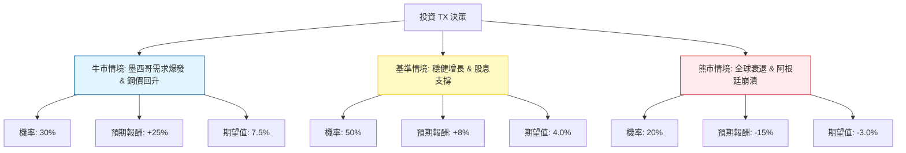

這份分析報告將結合您提供的基本面數據，以及針對 **Ternium S.A. (TX)** 的最新市場動態（墨西哥近岸外包趨勢、阿根廷經濟風險、鋼鐵價格走勢）進行綜合評估。

---

### 一、 外部環境與最新動態分析 (Web Search Summary)

在進入決策樹之前，我們先整合當前市場對 TX 的關鍵影響因素：

1.  **墨西哥近岸外包 (Nearshoring) 紅利**：Ternium 是墨西哥最大的鋼鐵生產商之一。隨著美墨加協定 (USMCA) 強化，大量製造業移往墨西哥，帶動汽車與工業用鋼需求。公司正投資 32 億美元在墨西哥 Pesquería 興建新廠，預計 2026 年投產，這是長期增長核心。
2.  **阿根廷經濟波動**：TX 有相當比例的業務位於阿根廷（Ternium Argentina）。阿根廷的高通膨與匯率貶值是主要負面因素，近期米萊（Milei）政府的改革雖可能長期利好，但短期內需求萎縮與匯兌損失仍是壓力。
3.  **鋼鐵週期與利差**：全球鋼鐵價格受中國產能過剩影響有所承壓，但 TX 的 **Forward P/E (6.43)** 與 **P/B (0.7)** 顯示估值極低，市場已部分反映悲觀預期。
4.  **財務穩健度**：負債比 (Debt/Eq 0.22) 極低，且擁有 6.3% 的高殖利率，提供強大的下行保護。

---

### 二、 決策樹分析 (Decision Tree)

以下使用 Markdown 繪製決策樹，評估未來一年的投資預期報酬。

#### 決策樹節點詳細說明：

1.  **牛市情境 (Bull Case) - 30% 機率**：
    *   **條件**：墨西哥新廠進度超前，美國汽車需求強勁，鋼價因全球基建需求回升。
    *   **預期報酬**：股價回歸 P/B = 1.0 的水準，加上 6% 股息，預計總報酬約 **+25%**。
2.  **基準情境 (Base Case) - 50% 機率**：
    *   **條件**：墨西哥業務抵銷阿根廷的疲軟，鋼價維持震盪。
    *   **預期報酬**：股價隨盈餘緩步增長，主要收益來自 **6.3% 股息** 與小幅資本利得，預計總報酬約 **+8%**。
3.  **熊市情境 (Bear Case) - 20% 機率**：
    *   **條件**：全球經濟陷入衰退，阿根廷發生極端貨幣危機，鋼鐵利差嚴重縮減。
    *   **預期報酬**：股價下探 52 週低點，扣除股息後總報酬約 **-15%**。

---

### 三、 期望值計算與核心假設

#### 1. 期望值 (Expected Value, EV) 計算過程：
$$EV = (P_{Bull} \times R_{Bull}) + (P_{Base} \times R_{Base}) + (P_{Bear} \times R_{Bear})$$
$$EV = (0.30 \times 25\%) + (0.50 \times 8\%) + (0.20 \times -15\%)$$
$$EV = 7.5\% + 4.0\% - 3.0\% = 8.5\%$$

#### 2. 核心假設：
*   **估值安全邊際**：目前 P/B 僅 0.7，遠低於歷史平均，這意味著即便在差勁的環境下，資產價值也提供了支撐。
*   **股息政策**：假設公司維持現有派息力度（現金流充足，P/C 僅 2.69，顯示現金充裕）。
*   **成長動能**：Forward P/E (6.43) 遠低於 Trailing P/E (14.67)，顯示分析師預期明年獲利將大幅改善（EPS next Y 增長 25.8%）。

---

### 四、 最終結論

**判斷：適合投資 (Buy / Overweight)**

#### 理由：
1.  **正向期望值**：經過風險加權後的預期報酬率為 **8.5%**，優於多數傳統避險資產，且在鋼鐵循環股中表現穩健。
2.  **極高的安全邊際**：P/B 0.7 與 PEG 0.17 顯示該股被嚴重低估。即便市場情緒不佳，投資者仍可領取 **6.3% 的高股息** 作為等待價值回歸的補償。
3.  **戰略地位優勢**：TX 是「近岸外包」趨勢下的直接受益者。墨西哥業務的結構性增長能有效對沖阿根廷的宏觀風險。
4.  **財務結構健康**：Debt/Eq 0.22 確保了公司在面對高利率環境或行業低谷時，不會有生存危機。

**建議操作：**
目前股價 ($42.91) 接近 52 週高點附近，但 SMA200 顯示長期趨勢向上。建議採取**分批買入**策略，以獲取長期股息並參與墨西哥工業化的增長紅利。

---
*風險提示：鋼鐵業具高度週期性，需密切關注美國汽車業罷工風險及阿根廷匯率政策變化。*