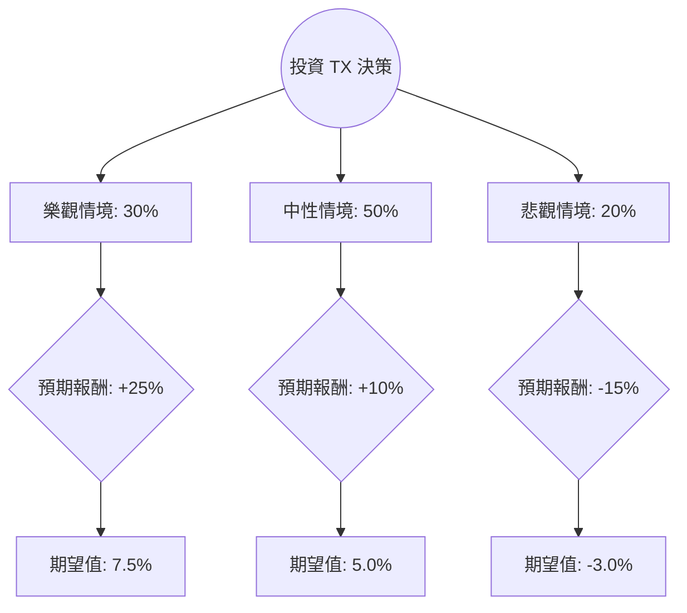

這份分析報告針對 **Ternium S.A. (TX)** 進行評估。Ternium 是拉丁美洲領先的鋼鐵生產商，主要業務集中在墨西哥、阿根廷及巴西。

透過結合您提供的數據與最新的市場動態（如墨西哥近岸外包趨勢、鋼鐵價格波動及公司資本支出計畫），以下是基於**決策樹分析**與**期望值分析**的投資評估。

---

### 一、 核心假設與市場背景分析

在構建決策樹前，我們設定以下核心假設：

1.  **墨西哥近岸外包（Nearshoring）紅利**：Ternium 正在墨西哥 Pesquería 進行大規模投資（新生產線預計 2026 年投產），短期內受惠於北美汽車與工業需求。
2.  **阿根廷經濟風險**：阿根廷佔其營收重要比例，該國的高通膨與匯率波動是主要不確定性。
3.  **估值修復**：目前 **P/B 僅 0.75**，遠低於淨資產價值；**Forward P/E 8.23** 顯示市場預期明年獲利將大幅改善（EPS 預計增長 30.35%）。
4.  **股息支撐**：約 **5.9% 的殖利率**為股價提供了較強的下行保護。

---

### 二、 決策樹分析 (Decision Tree)

我們將未來一年的投資表現分為三種情境：**樂觀（牛市）**、**中性（基準）**、**悲觀（熊市）**。

#### 節點詳細說明：

| 情境 | 機率 | 預期報酬 (資本利得 + 股息) | 說明 |
| :--- | :--- | :--- | :--- |
| **樂觀 (Bull)** | 30% | **+25%** | 墨西哥需求超預期，鋼價回升，阿根廷經濟穩定，估值回歸 P/B 1.0。 |
| **中性 (Base)** | 50% | **+10%** | 獲利符合預期 (EPS 成長 30%)，但受全球經濟放緩壓制，股價隨獲利小幅增長。 |
| **悲觀 (Bear)** | 20% | **-15%** | 全球衰退導致鋼鐵需求萎縮，阿根廷比索劇烈貶值，獲利大幅侵蝕。 |

---

### 三、 期望值分析 (Expected Value Analysis)

#### 1. 計算過程
期望值 (EV) = Σ (各情境機率 × 各情境報酬)

*   **樂觀情境 EV**: $0.30 \times 25\% = 7.5\%$
*   **中性情境 EV**: $0.50 \times 10\% = 5.0\%$
*   **悲觀情境 EV**: $0.20 \times (-15\%) = -3.0\%$

**總體預期報酬率 (Total EV) = 7.5% + 5.0% - 3.0% = 9.5%**

#### 2. 考慮股息後的總回報
由於 TX 具有穩定的派息紀錄（殖利率 5.93%），若將股息視為相對確定的現金流：
*   **調整後總期望回報 = 9.5% (資本利得期望值) + 5.9% (股息) = 15.4%**

---

### 四、 綜合基本面評估

*   **價值面 (Value)**：P/B 0.75 顯示股價被低估，安全邊際高。PEG 0.2 顯示相對於其成長性，股價極其便宜。
*   **財務健康 (Health)**：Debt/Eq 0.22 且流動比率 2.49，財務結構非常穩健，足以應對高資本支出週期。
*   **動能面 (Momentum)**：股價位於 SMA20, 50, 200 之上，呈現多頭排列，且過去一年漲幅達 58%，顯示市場資金正在流入。
*   **風險點**：Q/Q 獲利下滑 56% 顯示短期毛利受壓（Gross Margin 15.7% 偏低），需關注原物料成本控制。

---

### 五、 最終結論

**判斷：適合投資 (Buy / Overweight)**

#### 理由：
1.  **極具吸引力的風險回報比**：計算出的總期望報酬率達 **15.4%**，遠高於無風險利率及多數價值股。
2.  **安全邊際充足**：股價低於帳面價值 (P/B < 1)，且有近 6% 的股息收益作為緩衝，下行空間有限。
3.  **成長催化劑明確**：墨西哥的「近岸外包」是長期結構性利多，加上明年預期 30% 的 EPS 增長，Forward P/E 僅 8 倍，具備估值修復潛力。
4.  **技術面強勢**：儘管基本面存在阿根廷等不確定因素，但股價走勢（SMA200 +18.8%）顯示市場已消化大部分利空。

**建議操作：**
目前股價 $45.56 接近 52 週高點，建議可採取「分批買入」策略，或在股價回測 SMA50 (約 $41-$42 區間) 時加碼，長期持有以領取股息並等待墨西哥產能開出的價值重估。