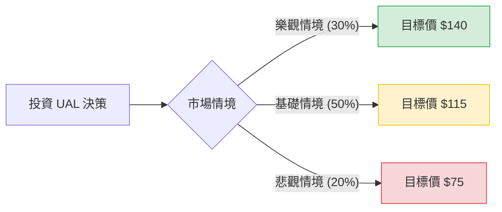

針對美股聯合航空（United Airlines Holdings, Inc., 代號：**UAL**）的投資評估，我結合了您提供的基本面數據，並檢索了最新的市場動態（如 2024 年 Q3 財報表現、股份回購計畫及產業趨勢），進行決策樹與期望值分析。

---

### 一、 核心假設與市場背景分析

在建立模型前，我們先釐清影響 UAL 股價的三大核心因素：

1.  **財務表現與估值（利多）**：
    *   **低估值**：目前 P/E 僅 8.55，Forward P/E 更低至 6.72，PEG 0.41 顯示相對於其成長性，股價被嚴重低估。
    *   **獲利能力**：ROE 高達 25.73%，且最新財報顯示 Q3 營收與獲利均超預期。
    *   **股東回饋**：UAL 宣布了自疫情以來首次的 **15 億美元股份回購計畫**，這對股價有強大支撐。
2.  **產業趨勢（中性偏利多）**：
    *   **需求強勁**：商務旅行與國際航線持續復甦。
    *   **燃油成本**：近期油價波動趨緩，有利於毛利提升。
3.  **風險因素（利空）**：
    *   **高槓桿**：Debt/Eq 達 1.95，負債比率較高，對利率環境敏感。
    *   **宏觀經濟**：若美國經濟陷入衰退，航空業作為週期性行業將首當其衝。

---

### 二、 決策樹分析 (Decision Tree)

以下使用 Markdown 繪製決策樹，模擬未來一年的三種主要情境：

#### 節點詳細說明：

1.  **樂觀情境 (Bull Case) - 30% 機率**：
    *   **條件**：股份回購超預期、燃油價格持續下跌、美國經濟軟著陸、EPS 成長達到預期的 56%。
    *   **預期股價**：$140 (超越分析師平均目標價 $131，反映估值修復)。
    *   **預期報酬率**：+46.3%

2.  **基礎情境 (Base Case) - 50% 機率**：
    *   **條件**：營運穩健，符合分析師預期，市場情緒中性，P/E 緩步回升至 10 倍左右。
    *   **預期股價**：$115 (接近 52 週高點與分析師目標價的中間值)。
    *   **預期報酬率**：+20.2%

3.  **悲觀情境 (Bear Case) - 20% 機率**：
    *   **條件**：地緣政治導致油價飆升、高負債利息壓力加大、經濟衰退導致旅遊需求萎縮。
    *   **預期股價**：$75 (回測 52 週低點支撐)。
    *   **預期報酬率**：-21.6%

---

### 三、 期望值計算 (Expected Value Analysis)

我們根據上述情境的機率與預期股價，計算 UAL 的期望價值（EV）：

#### 1. 期望股價計算：
$$EV_{Price} = (P_{Bull} \times Prob_{Bull}) + (P_{Base} \times Prob_{Base}) + (P_{Bear} \times Prob_{Bear})$$
$$EV_{Price} = (140 \times 0.3) + (115 \times 0.5) + (75 \times 0.2)$$
$$EV_{Price} = 42 + 57.5 + 15 = \mathbf{114.5 \, USD}$$

#### 2. 預期報酬率計算：
*   **目前股價 ($P_0$)**：$95.70
*   **預期報酬率**：$\frac{114.5 - 95.7}{95.7} \times 100\% \approx \mathbf{19.64\%}$

#### 3. 風險報酬比 (Risk/Reward Ratio)：
*   **潛在獲利**：$114.5 - 95.7 = 18.8$
*   **最大潛在虧損**：$95.7 - 75 = 20.7$
*   雖然單純看最大虧損與期望獲利接近，但考慮到 **PEG 0.41** 與 **股份回購** 的下行保護，勝率（80% 的機率處於基礎或樂觀情境）相當高。

---

### 四、 最終結論

**投資建議：適合投資 (Buy)**

#### 判定理由：
1.  **估值極具吸引力**：UAL 目前的 P/E (8.55) 遠低於標普 500 平均水平，且 PEG 僅 0.41，顯示市場尚未完全反映其 EPS 的高成長預期（明年預計成長 56.5%）。
2.  **強大的催化劑 (Catalyst)**：15 億美元的股份回購計畫是強烈的看漲訊號，不僅能提升 EPS，也顯示管理層認為自家股價被低估。
3.  **期望值為正**：經過決策樹加權計算，預期一年內的目標價為 **$114.5**，較目前股價有約 **19.6%** 的上漲空間。
4.  **技術面支撐**：股價目前站穩 SMA20 與 SMA50 之上，短期趨勢向上，雖然 SMA200 仍略微承壓，但基本面的改善正在扭轉長期趨勢。

**風險提示**：
投資者需密切關注 **國際油價** 與 **債務負擔**。由於 UAL 的 Debt/Eq 較高，若聯準會降息節奏慢於預期，其利息支出將持續壓抑淨利。建議分批進場，並將停損點設在 $75 附近。