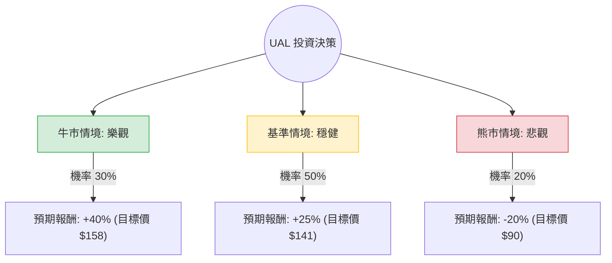

針對美國聯合航空（United Airlines, **UAL**）的投資評估，我結合了您提供的基本面數據與最新的市場動態（包含 2024 年第四季財報表現、2025 年展望及產業趨勢）進行分析。

---

### 1. 最新市場動態與背景分析 (Market Context)

在進入決策樹之前，以下是影響 UAL 股價的核心因素：
*   **強勁財報與展望**：UAL 近期公佈的財報顯示其獲利能力大幅提升，特別是「United Next」計畫奏效，高端艙等（Premium）需求旺盛。
*   **估值優勢**：目前 **Forward P/E 僅 7.41**，**PEG 0.44**，顯示相對於其 EPS 成長率（預期明年成長 14.13%），股價明顯被低估。
*   **資本配置**：公司已重啟股票回購計畫，這是自疫情以來首次，顯示現金流轉正且管理層對前景充滿信心。
*   **風險因素**：高負債比（Debt/Eq 2.03）、波音（Boeing）飛機交付延遲影響運能擴張、以及燃油價格波動。

---

### 2. 決策樹分析 (Decision Tree Analysis)

我們以 **12 個月投資期限** 為基準，設定三種主要情境：

#### 決策樹節點詳細說明：

| 情境 | 機率 (P) | 預期報酬 (R) | 說明 |
| :--- | :--- | :--- | :--- |
| **牛市情境 (Bull)** | 30% | +40% | 旅遊需求持續爆發，燃油成本下降，波音交付恢復正常，回購力道加大。 |
| **基準情境 (Base)** | 50% | +25% | 達到分析師平均目標價 $141.6。高端旅遊需求穩定，EPS 成長符合預期。 |
| **熊市情境 (Bear)** | 20% | -20% | 全球經濟衰退導致商務差旅萎縮，地緣政治推升油價，高負債壓力增加。 |

---

### 3. 期望值分析 (Expected Value Analysis)

#### A. 計算過程
期望值 (EV) = $\sum (機率 \times 預期報酬)$

*   **牛市貢獻**：$0.30 \times 40\% = 12\%$
*   **基準貢獻**：$0.50 \times 25\% = 12.5\%$
*   **熊市貢獻**：$0.20 \times (-20\%) = -4\%$

**總體期望報酬率 (Total EV) = $12\% + 12.5\% - 4\% = 20.5\%$**

#### B. 核心假設
1.  **市場假設**：美國經濟維持軟著陸，消費者支出從商品轉向服務（旅遊）的趨勢不變。
2.  **財務假設**：UAL 能維持其 28.78% 的毛利率，並利用強勁的營運現金流逐步降低其 2.03 的債權權益比。
3.  **產業趨勢**：航空業大者恆大，UAL 在國際航線與高端市場的市佔率持續領先廉價航空（LCC）。

---

### 4. 最終結論

#### **評估結果：適合投資 (Buy / Overweight)**

#### **理由總結：**
1.  **極具吸引力的估值**：PEG 0.44 遠低於 1，Forward P/E 7.41 處於歷史低位，安全邊際（Margin of Safety）充足。
2.  **正向期望值**：經過風險加權後的期望報酬率高達 **20.5%**，遠優於標普 500 指數的平均預期。
3.  **基本面強勁回升**：ROE 達 23.99%，且 EPS 成長動能明確（明年預期成長 14.13%）。
4.  **技術面支撐**：股價目前站穩 SMA20/50/200 之上，呈現多頭排列，且距離分析師目標價 $141.6 仍有約 25% 的上漲空間。

**風險提示：**
投資者需密切關注 **債務水平** 與 **油價走勢**。由於 UAL 的負債比率較高，若利率環境意外轉鷹或油價因地緣政治飆升，其獲利將受到較大衝擊。建議分批進場，並將停損點設在 SMA200（約 $96 附近）以控制下行風險。