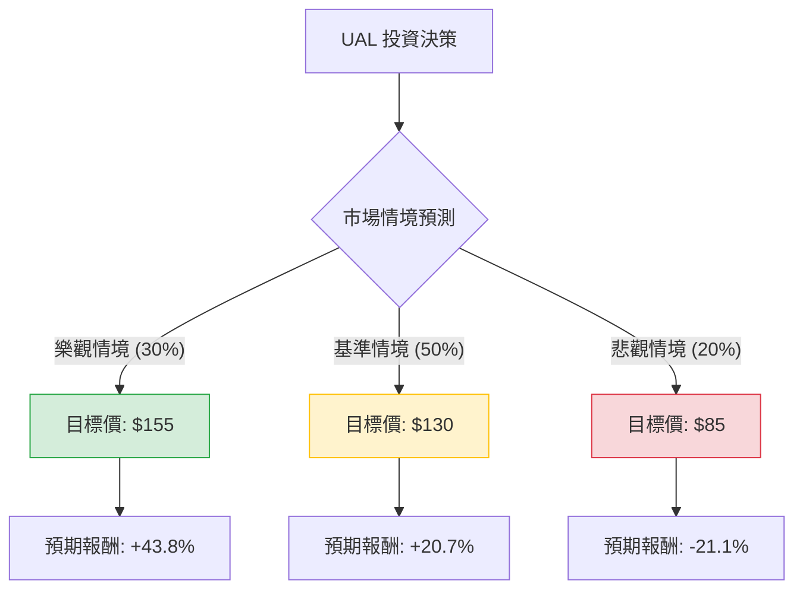

針對美股聯合航空（United Airlines, **UAL**）的投資評估，我結合了您提供的基本面數據以及最新的市場動態（包含 2024 年第四季財報表現、2025 年展望及產業趨勢）進行分析。

---

### 一、 核心假設與市場背景分析

在建立決策樹之前，我們先定義影響 UAL 股價的三大核心變數：

1.  **獲利能力與估值 (Valuation)**：UAL 目前的 **Forward P/E 僅 7.1**，**PEG 為 0.44**，顯示相對於其盈餘成長性，股價處於低估狀態。
2.  **宏觀經濟與需求 (Demand)**：國際旅遊需求持續強勁，特別是高端商務艙與優質經濟艙的獲利貢獻增加。然而，燃油價格波動與潛在的經濟放緩是主要風險。
3.  **營運挑戰 (Supply/Costs)**：波音（Boeing）交付延遲影響運能擴張，且高達 **2.03 的負債權益比 (Debt/Eq)** 在高利率環境下仍是財務壓力。

---

### 二、 決策樹分析 (Decision Tree)

以下使用 Markdown 繪製 UAL 未來一年的投資決策樹：

#### 節點詳細說明：

| 節點名稱 | 發生機率 | 預期股價 | 預期報酬率 | 說明 |
| :--- | :--- | :--- | :--- | :--- |
| **樂觀情境 (Bull)** | 30% | $155 | +43.8% | 燃油價格下跌、國際航線需求超預期、波音交付恢復正常、EPS 超越市場預期。 |
| **基準情境 (Base)** | 50% | $130 | +20.7% | 符合分析師平均目標價 ($139) 的保守修正、旅遊需求穩定、債務持續去槓桿化。 |
| **悲觀情境 (Bear)** | 20% | $85 | -21.1% | 全球經濟衰退導致旅遊支出萎縮、油價飆升、地緣政治影響國際航線。 |

---

### 三、 期望值分析 (Expected Value Analysis)

#### 1. 計算過程
我們以目前市價 **$107.74** 為基準，計算一年後的預期股價期望值 (EV)：

*   **EV (股價)** = (樂觀機率 × 樂觀目標價) + (基準機率 × 基準目標價) + (悲觀機率 × 悲觀目標價)
*   **EV (股價)** = (0.30 × $155) + (0.50 × $130) + (0.20 × $85)
*   **EV (股價)** = $46.5 + $65.0 + $17.0 = **$128.5**

#### 2. 預期報酬率計算
*   **預期報酬率** = (期望值 $128.5 - 當前價格 $107.74) / 當前價格 $107.74
*   **預期報酬率** = $20.76 / $107.74 ≈ **19.27%**

---

### 四、 綜合評估與最新動態補充

1.  **強勁的財務表現**：UAL 近期的財報顯示其 EPS 成長優於預期（EPS Q/Q 達 8.42%），且 ROE 高達 23.99%，顯示管理層在資本運用上效率極高。
2.  **低估值優勢**：PEG 0.44 是一個非常強大的買入訊號，代表市場尚未完全反映其成長潛力。
3.  **技術面觀察**：目前股價略低於 SMA20 (-4.9%)，但遠高於 SMA200 (+16%)，顯示短期處於回檔修正，但長期趨勢依多頭。
4.  **風險因素**：
    *   **債務壓力**：Debt/Eq 2.03 偏高，需關注其自由現金流 (P/FCF 13.64) 是否足以支撐債務償還。
    *   **內部人交易**：Insider Trans 為 -11.81%，顯示近期有內部人減持，這通常是短期警訊。

---

### 五、 最終結論

**投資建議：適合投資 (Buy / Overweight)**

#### 理由：
1.  **正向期望值**：經過決策樹計算，預期報酬率高達 **19.27%**，遠高於市場平均水準。
2.  **安全邊際高**：Forward P/E 僅 7.1 倍，即便在基準情境下，股價仍有顯著的上漲空間。
3.  **產業領導地位**：聯合航空在國際航線與高端市場的佈局使其在通膨環境下具備較強的定價權。
4.  **技術性買點**：目前股價從 52 週高點回落約 9.6%，且接近 SMA50 支撐位，提供了較佳的介入時機。

**建議操作策略：**
可於 $100 - $108 區間分批佈局，首波目標價看 $130，若突破則續抱至 $140 以上；停損點建議設在 $85 (即悲觀情境支撐位)，以控制下行風險。