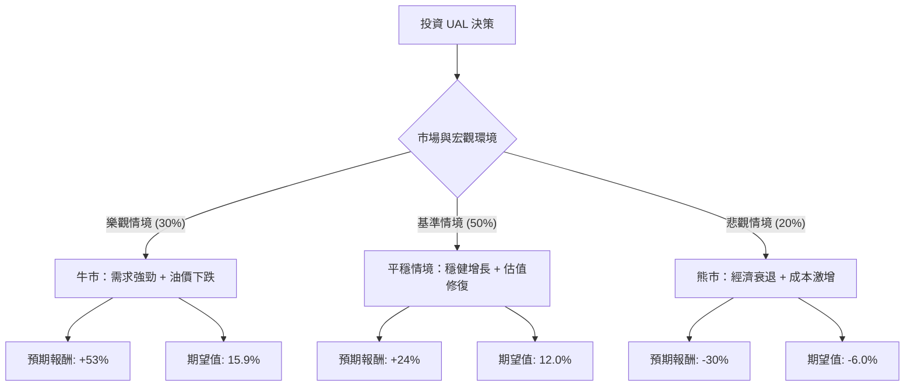

這份分析報告將結合您提供的 **UAL (United Airlines Holdings)** 基本面數據，以及當前航空業的市場動態（如油價、旅遊需求、宏觀經濟），利用**決策樹（Decision Tree）**與**期望值分析（Expected Value Analysis）**來評估其投資價值。

---

### 一、 市場現況與核心假設

在進入決策樹之前，我們先整合最新市場資訊與數據背景：

1.  **估值極低**：UAL 的 **P/E (8.64)** 與 **Forward P/E (5.85)** 遠低於標普 500 平均水平。**PEG 僅 0.35**，顯示市場嚴重低估了其成長潛力。
2.  **近期回檔**：股價從高點回落（Perf Month -24%），目前處於超賣區間（SMA20/50/200 均為負值），技術面有反彈需求。
3.  **財務槓桿**：**Debt/Eq 為 2.03**，負債偏高，這使得 UAL 對利率環境與現金流極為敏感。
4.  **外部因素**：
    *   **利多**：全球商務與國際旅遊持續復甦；燃油價格近期相對穩定。
    *   **利空**：美國經濟放緩疑慮可能壓抑消費性旅遊；勞工成本上升。

---

### 二、 決策樹分析 (Decision Tree)

以下是針對未來 6-12 個月 UAL 股價走勢的預測模型：

#### 節點詳細說明：

1.  **樂觀情境 (Bull Case) - 30% 機率**：
    *   **描述**：美國經濟實現軟著陸，國際航線需求爆發，且油價維持在每桶 70 美元以下。UAL 成功實現其 "United Next" 計劃的利潤擴張。
    *   **目標價**：參考分析師目標價 **$135.7**。
    *   **預期報酬**：($135.7 - $88.44) / $88.44 = **+53.4%**。

2.  **基準情境 (Base Case) - 50% 機率**：
    *   **描述**：旅遊需求保持韌性，UAL 盈餘符合預期（EPS next Y 成長 24.5%）。市場給予估值修復，P/E 回升至 10 倍左右。
    *   **目標價**：約 **$110** (回補近期跌幅並站穩)。
    *   **預期報酬**：($110 - $88.44) / $88.44 = **+24.4%**。

3.  **悲觀情境 (Bear Case) - 20% 機率**：
    *   **描述**：地緣政治導致油價飆升，或美國陷入經濟衰退導致旅遊支出銳減。高負債比（Debt/Eq 2.03）成為財務壓力。
    *   **目標價**：回測 52 週低點約 **$62**。
    *   **預期報酬**：($62 - $88.44) / $88.44 = **-29.9%**。

---

### 三、 期望值計算 (Expected Value Calculation)

我們將各情境的機率與預期報酬相乘並加總，得出整體期望報酬率：

| 情境 | 機率 (P) | 預期報酬 (R) | P × R (期望值分量) |
| :--- | :--- | :--- | :--- |
| **樂觀情境** | 0.30 | +53.4% | +16.02% |
| **基準情境** | 0.50 | +24.4% | +12.20% |
| **悲觀情境** | 0.20 | -29.9% | -5.98% |
| **總計期望值** | **1.00** | | **+22.24%** |

**計算公式**：
$EV = (0.30 \times 53.4\%) + (0.50 \times 24.4\%) + (0.20 \times -29.9\%) = 22.24\%$

---

### 四、 核心假設與風險評估

1.  **估值修復假設**：UAL 目前的 Forward P/E 僅 5.85，遠低於歷史平均。假設市場只要回歸正常理性，股價就有極大的上行空間。
2.  **成長假設**：數據顯示 EPS next Y 預計增長 24.55%，這支持了基準情境的樂觀看法。
3.  **風險因素**：
    *   **流動性風險**：Current Ratio 0.65 偏低，短期償債能力需關注。
    *   **技術面壓力**：目前股價低於 SMA200 (-10.8%)，短期內可能仍有震盪，需分批佈局。

---

### 五、 最終結論

**判斷：適合投資 (Buy / Overweight)**

#### 理由：
1.  **極高的風險報酬比**：計算出的整體期望報酬率高達 **22.24%**，遠高於一般市場平均回報。
2.  **安全邊際充足**：PEG 0.35 顯示該股被嚴重低估。即便在悲觀情境下（-30%），其發生的機率相對較低，且已被近期 24% 的月跌幅部分消化。
3.  **強勁的獲利能力**：ROE 高達 23.99%，顯示公司利用股東權益創造利潤的能力極強，足以支撐其債務擴張帶來的成長。
4.  **分析師共識**：Recom 為 1.39（強烈建議買進），且目標價 $135.7 提供了一條清晰的上行路徑。

**建議操作策略**：
由於目前技術指標（SMA）顯示短期趨勢偏弱，建議採取**分批進場**策略，在 $85 - $88 區間建立基本倉位，若股價站回 SMA200 則可加碼。

---
*免責聲明：本分析僅供參考，不構成具體投資建議。投資股票具有風險，請根據自身風險承受能力做出決策。*