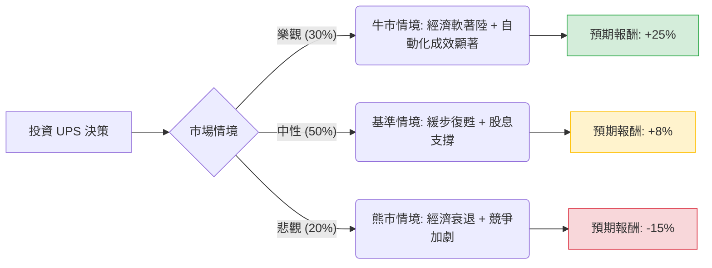

這份分析報告將結合您提供的基本面數據與最新的市場動態（如 2024 年第三季財報表現、全球物流趨勢及宏觀經濟環境），利用**決策樹（Decision Tree）**與**期望值分析（Expected Value Analysis）**評估 UPS 的投資價值。

---

### 一、 核心假設與市場動態分析

在建立模型前，我們先彙整關鍵背景資訊：

1.  **近期業績回升**：UPS 在 2024 年 Q3 結束了連續九個季度的交易量下滑，美國國內業務量增長 5.4%，顯示最壞的情況可能已過。
2.  **高股息誘惑**：目前殖利率高達 **5.68%**，在標普 500 成份股中名列前茅，提供了強大的下行保護。
3.  **成本壓力**：與 Teamsters 工會的新合約導致勞動力成本上升，且公司正在進行「Fit for Purpose」裁員與自動化計畫以抵銷成本。
4.  **競爭環境**：Amazon 持續擴大自營物流，FedEx 則在進行激進的成本削減，UPS 面對價格戰壓力。
5.  **估值**：Forward P/E 為 14.49，低於歷史平均，但 PEG 2.51 顯示相對於增長速度而言，股價並不便宜。

---

### 二、 決策樹分析 (Decision Tree)

我們預測未來一年的三種情境，並計算包含**股價變動**與**股息收益**的總報酬。

#### 節點詳細說明：

1.  **牛市情境 (Bull Case) - 30% 機率**
    *   **描述**：美國經濟強勁，電商需求超預期，UPS 自動化設施成功降低單件成本，EPS 增長超過預期的 13%。
    *   **預期報酬**：股價回升至 $138 (約 +20%) + 5% 股息 = **+25%**。

2.  **基準情境 (Base Case) - 50% 機率**
    *   **描述**：經濟平穩，UPS 營收微增，利潤率受勞工成本抵銷而持平。股價隨大盤波動，主要收益來自股息。
    *   **預期報酬**：股價微漲至 $118 (約 +3%) + 5% 股息 = **+8%**。

3.  **熊市情境 (Bear Case) - 20% 機率**
    *   **描述**：全球貿易摩擦加劇，美國消費疲軟，Amazon 進一步侵蝕市佔率。
    *   **預期報酬**：股價跌至 $92 (約 -20%) + 5% 股息 = **-15%**。

---

### 三、 期望值計算 (Expected Value Calculation)

我們將各情境的機率與預期報酬相乘，得出整體期望值：

| 情境 | 機率 (P) | 預期報酬 (R) | P × R |
| :--- | :--- | :--- | :--- |
| **牛市** | 0.30 | +25% | +7.5% |
| **基準** | 0.50 | +8% | +4.0% |
| **熊市** | 0.20 | -15% | -3.0% |
| **總計期望值** | **1.00** | | **+8.5%** |

**計算公式：**
$EV = (0.30 \times 25\%) + (0.50 \times 8\%) + (0.20 \times -15\%) = 7.5\% + 4.0\% - 3.0\% = 8.5\%$

---

### 四、 核心假設與風險評估

1.  **股息安全性**：UPS 的 P/FCF 為 20.58，現金流尚能支撐股息，但 Debt/Eq 達 1.76，債務負擔較重，若利潤持續受壓，未來增發股息的空間有限。
2.  **技術面**：目前股價高於 SMA200 (19.46%)，顯示短期內有過熱跡象，且 Target Price ($113.88) 低於現價 ($115.37)，暗示分析師認為短期上漲空間已透支。
3.  **宏觀因素**：UPS 對全球貿易高度敏感，若 2025 年關稅政策變動，將直接衝擊其國際快遞業務（利潤最高的部分）。

---

### 五、 最終結論

#### **判斷：適合投資 (偏向「收益型」配置)**

**理由：**
1.  **正向期望值**：8.5% 的預期報酬率雖然不算驚人，但考慮到其 5.68% 的高股息，對於尋求現金流的投資者具有極大吸引力。
2.  **基本面拐點已現**：Q3 財報證實了貨運量回升，這是一個重要的結構性轉折信號。
3.  **下行保護**：高達 5.6% 的殖利率在股價下跌時會產生強大的支撐力（買盤會為了領息而進場）。

**投資建議：**
*   **適合對象**：長期持有者、退休金帳戶、追求穩定配息的投資者。
*   **操作策略**：由於目前股價略高於分析師平均目標價，且 SMA200 顯示短期漲幅已大，建議**分批買入**或等待股價回落至 $110 附近（靠近 SMA50）再行加碼，以優化成本。
*   **風險監控**：需密切關注 2025 年初的零售數據以及公司在自動化成本削減上的進度。