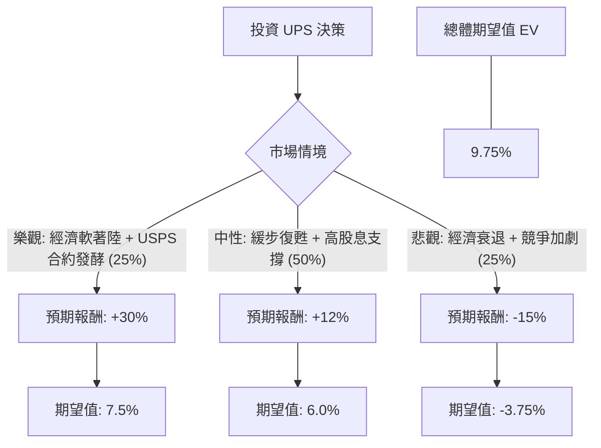

這份分析報告將結合您提供的基本面數據與最新的市場動態（如 2024 年第二季財報表現、USPS 合約進展及宏觀經濟環境），利用**決策樹（Decision Tree）**與**期望值分析（Expected Value Analysis）**評估 UPS 的投資價值。

---

### 一、 核心假設與市場背景分析

在建立模型前，我們先彙整當前 UPS 的關鍵資訊：

1.  **財務壓力與轉機**：UPS 近期財報顯示營收與利潤承壓，主要受美國國內包裹量下降及勞動力成本上升影響。然而，UPS 已取代 FedEx 成為 **USPS（美國郵政）的主要空運供應商**，這將在 2024 年下半年開始貢獻營收。
2.  **估值與股息**：目前 P/E 約 14.46，低於歷史平均；**股息率高達 6.92%**，顯示股價已跌至價值區間，但高股息也反映了市場對其增長停滯的擔憂。
3.  **宏觀環境**：聯準會降息預期有利於消費與物流業回溫，但全球貿易疲軟仍是變數。
4.  **技術面**：股價處於 52 週低點附近（$94.80），SMA20/50/200 均呈負值，顯示短期趨勢偏弱，但具備反彈空間。

---

### 二、 決策樹分析 (Decision Tree)

我們將未來一年的投資情境分為三種：**樂觀（復甦）**、**中性（盤整）**、**悲觀（衰退）**。

#### 節點詳細說明：

1.  **樂觀情境 (Bull Case) - 25% 機率**：
    *   **條件**：美國經濟強勁，USPS 合約利潤率高於預期，自動化設施（Fit to Serve）大幅降低成本。
    *   **預期報酬**：股價回升至目標價 $113.77 以上 + 6.9% 股息 $\approx$ **30%**。
2.  **中性情境 (Base Case) - 50% 機率**：
    *   **條件**：包裹量持平，勞資合約成本被成本削減計畫抵銷，股價隨大盤緩步上行。
    *   **預期報酬**：股價小幅回升至 $100 左右 + 6.9% 股息 $\approx$ **12%**。
3.  **悲觀情境 (Bear Case) - 25% 機率**：
    *   **條件**：經濟衰退導致電商需求萎縮，Amazon 自建物流進一步侵蝕份額，債務壓力（Debt/Eq 1.76）增加。
    *   **預期報酬**：股價跌破 52 週低點至 $80 附近 + 6.9% 股息 $\approx$ **-15%**。

---

### 三、 期望值計算過程 (Expected Value Calculation)

期望值（EV）計算公式：
$$EV = \sum (Probability_i \times Return_i)$$

*   **樂觀節點**：$0.25 \times 30\% = 7.5\%$
*   **中性節點**：$0.50 \times 12\% = 6.0\%$
*   **悲觀節點**：$0.25 \times (-15\%) = -3.75\%$

**總體預期報酬率 (Total EV) = 7.5% + 6.0% - 3.75% = 9.75%**

---

### 四、 綜合評估與核心假設

1.  **估值安全邊際**：Forward P/E 為 11.89，低於當前 P/E (14.46)，預示明年盈利將改善（EPS next Y 預計增長 13.25%）。
2.  **現金流與股息**：P/FCF 為 16.89，雖然不算極低，但足以支撐其 6.9% 的股息發放。這為股價提供了強大的下行支撐（Floor）。
3.  **風險因素**：
    *   **債務比率**：Debt/Eq 1.76 偏高，在利率維持高位時會侵蝕利潤。
    *   **營收增長**：Sales Q/Q 為 -2.96%，顯示核心業務尚未完全止跌。

---

### 五、 最終結論

**判斷：適合投資（分批買入 / 價值投資導向）**

#### 理由：
1.  **正向期望值**：計算出的 9.75% 預期報酬率優於許多保守型資產，且尚未計入聯準會降息可能帶來的估值修復。
2.  **極具吸引力的股息**：6.92% 的股息率在標普 500 成份股中名列前茅，對於尋求現金流的投資者來說，目前的股價（$94.80）提供了極佳的進場點。
3.  **轉型契機**：雖然短期數據（SMA、Sales Q/Q）不佳，但 UPS 正在經歷結構性調整（USPS 合約、自動化），且 Forward P/E 顯示市場預期明年將迎來 13% 的盈利增長。
4.  **目標價空間**：分析師平均目標價為 $113.77，較現價有約 20% 的潛在漲幅。

**建議策略**：
由於短期技術指標（SMA20/50）仍呈空頭排列，建議採取**分批進場（Dollar Cost Averaging）**策略，以應對可能出現的短期波動，同時鎖定高額股息。若股價跌破 $82（52W Low），需重新評估其債務償還能力。