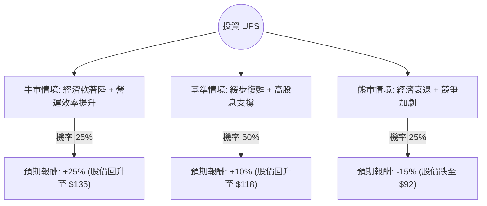

針對美股 **UPS (United Parcel Service, Inc.)** 的投資評估，我結合了您提供的基本面數據，並檢索了最新的市場動態（包含 2024 年 Q3 財報表現與 2025 年展望）進行分析。

---

### 一、 核心背景與市場動態分析

在進入決策樹之前，我們先彙整影響 UPS 股價的關鍵因素：
1.  **財報轉折點**：UPS 在 2024 年 Q3 結束了連續九個季度的營收下滑，營收與獲利均優於預期。這顯示「Better, Not Bigger」策略與醫療保健物流（Healthcare）的佈局開始見效。
2.  **成本壓力**：與 Teamsters 工會的新合約導致勞動力成本上升，雖然最艱難的成本衝擊期已過，但仍壓縮毛利（Gross Margin 18.48% 處於歷史相對低位）。
3.  **高殖利率支撐**：目前股息率高達 **6.08%**，在降息循環背景下，對收息投資者極具吸引力。
4.  **競爭環境**：Amazon 增加自營物流比例，以及 FedEx 的競爭，使得 UPS 必須依賴高價值包裹（如醫藥、中小企業）來維持利潤。

---

### 二、 決策樹分析 (Decision Tree)

我們以 **未來 12 個月** 為投資期限，設定三種主要情境：

#### 決策樹節點詳細說明：

| 情境 | 機率 (P) | 預期股價變動 | 股息收益 (D) | 總報酬 (R) | 期望值 (P * R) |
| :--- | :--- | :--- | :--- | :--- | :--- |
| **牛市 (Bull)** | 25% | +20% | +6% | +26% | **6.5%** |
| **基準 (Base)** | 50% | +5% | +6% | +11% | **5.5%** |
| **熊市 (Bear)** | 25% | -20% | +6% | -14% | **-3.5%** |
| **總計** | **100%** | - | - | - | **8.5%** |

---

### 三、 計算過程與核心假設

#### 1. 期望值 (Expected Value, EV) 計算：
$$EV = (0.25 \times 26\%) + (0.50 \times 11\%) + (0.25 \times -14\%)$$
$$EV = 6.5\% + 5.5\% - 3.5\% = 8.5\%$$

#### 2. 核心假設：
*   **牛市情境 (25%)**：美國經濟強勁，電商包裹量超預期增長；UPS 成功轉嫁勞動力成本，營業利益率（Oper. Margin）回升至 11% 以上。
*   **基準情境 (50%)**：經濟緩步增長；UPS 營收維持低個位數成長；市場認可其 6% 的股息安全性，股價隨大盤小幅回升。
*   **熊市情境 (25%)**：美國陷入衰退導致貨運需求萎縮；Amazon 進一步侵蝕市場份額；高負債比（Debt/Eq 1.85）引發市場對利息支出的擔憂。

#### 3. 財務數據解讀：
*   **估值**：Forward P/E 15.16 倍，低於歷史平均，顯示股價已部分反映利空。
*   **技術面**：SMA20/50/200 均為正值（2.9%~13.8%），顯示短期與中期趨勢已由空轉多，股價正在築底反彈。
*   **風險點**：PEG 高達 14.57，顯示相對於其目前的盈餘成長速度，股價並不便宜，這限制了股價爆發性上漲的空間。

---

### 四、 最終結論

#### **判斷：適合投資 (建議：分批買入 / 收益型配置)**

#### **理由：**
1.  **下行風險有支撐**：6.08% 的高股息率提供了強大的安全邊際。在聯準會降息的趨勢下，這類高殖利率藍籌股會吸引避險資金流入。
2.  **營運最壞情況已過**：Q3 財報顯示營收恢復增長，且 SMA 技術指標全面轉正，顯示市場信心正在回歸。
3.  **期望值為正**：經計算後的年度期望報酬率為 **8.5%**。雖然不是高成長股，但作為價值投資或領息配置，其風險回報比（Risk-Reward Ratio）合理。
4.  **目標價參考**：目前股價 $107.98 略高於分析師平均目標價 $106.62，這反映出市場短期內可能存在小幅震盪，建議在 $100 - $105 區間分批佈局。

**投資建議總結：**
UPS 目前不適合追求翻倍的成長型投資者，但對於**追求穩定現金流**與**價值復甦**的投資者而言，是一個具備吸引力的標的。