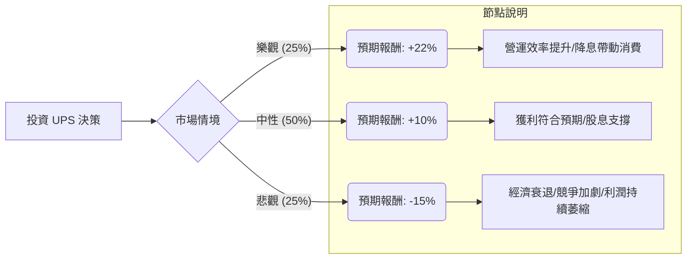

這份分析將結合您提供的數據與最新的市場動態（如 2024 年第二季財報表現、勞動力成本壓力及宏觀經濟環境），利用**決策樹（Decision Tree）**與**期望值分析（Expected Value Analysis）**來評估 UPS 的投資價值。

---

### 一、 核心假設與市場背景分析

在建立模型前，我們先整合最新資訊：
1.  **財務壓力**：UPS 最近一季財報顯示營收與獲利均低於預期，主要受美國包裹量下降及新勞資合約導致的成本上升影響。
2.  **股息誘惑**：目前殖利率高達 **6.66%**，遠高於歷史平均，顯示股價已遭超賣，但也反映市場對其增長性的擔憂。
3.  **轉型計畫**：公司正推動「Better, Not Bigger」策略，並出售毛利較低的 Coyote Logistics 業務，專注於醫療保健物流與中小型企業（SMB）。
4.  **宏觀環境**：聯準會（Fed）降息預期有利於高股息股與資本密集型產業。

---

### 二、 決策樹分析 (Decision Tree)

我們將未來一年的投資情境分為三種：**樂觀（牛市）**、**中性（基準）**、**悲觀（熊市）**。

#### 1. 樂觀情境 (Bull Case) - 機率 25%
*   **條件**：美國經濟軟著陸，電商需求回溫；公司成功轉嫁勞動力成本；醫療物流高毛利業務佔比提升。
*   **預期股價**：回升至分析師目標價 **$113.79**。
*   **計算**：(113.79 - 98.42) / 98.42 + 6.66% (股息) ≈ **+22.3%**

#### 2. 中性情境 (Base Case) - 機率 50%
*   **條件**：包裹量緩步回升，獲利能力持平。股價在當前區間震盪，主要靠股息支撐總回報。
*   **預期股價**：回升至 SMA200 附近約 **$102**。
*   **計算**：(102 - 98.42) / 98.42 + 6.66% (股息) ≈ **+10.3%**

#### 3. 悲觀情境 (Bear Case) - 機率 25%
*   **條件**：經濟進入衰退，亞馬遜（Amazon）進一步侵蝕市佔率，利潤率（Profit Margin 5.94%）持續受壓。
*   **預期股價**：下探 52 週低點約 **$82**。
*   **計算**：(82 - 98.42) / 98.42 + 6.66% (股息) ≈ **-10.0%** (考慮股息抵銷部分跌幅)

---

### 三、 期望值計算 (Expected Value Calculation)

根據上述情境，我們計算投資 UPS 一年的期望報酬率（EV）：

$$EV = (P_{Bull} \times R_{Bull}) + (P_{Base} \times R_{Base}) + (P_{Bear} \times R_{Bear})$$

*   **$P$** = 機率 (Probability)
*   **$R$** = 報酬率 (Return)

**計算過程：**
1.  樂觀：$0.25 \times 22.3\% = 5.575\%$
2.  中性：$0.50 \times 10.3\% = 5.15\%$
3.  悲觀：$0.25 \times (-10.0\%) = -2.5\%$

**總期望報酬率：**
$$5.575\% + 5.15\% - 2.5\% = 8.225\%$$

---

### 四、 核心假設與數據解讀

1.  **估值面 (Valuation)**：Forward P/E 為 12.43，低於過去五年平均，顯示目前股價相對便宜。PEG 為 2.01，顯示相對於其增長速度，股價並非極度廉價，但處於合理區間。
2.  **財務健康度**：Debt/Eq 為 1.82，負債偏高，但在物流業尚可接受。ROE 33.4% 表現優異，顯示管理層運用股東資本效率高。
3.  **技術面**：股價目前低於 SMA20 (-4.98%) 與 SMA50 (-2.6%)，處於短期超賣狀態，但高於 SMA200 (+1.14%)，顯示長期趨勢尚未完全崩壞。
4.  **股息安全性**：6.66% 的股息率非常吸引人，但需注意其 EPS Q/Q 下降了 27.21%。若獲利持續衰退，未來股息增長空間將受限。

---

### 五、 最終結論

#### **判斷：適合投資 (建議：分批買入 / 收益型配置)**

**理由：**
1.  **正向期望值**：經過風險加權後的期望報酬率為 **8.225%**，優於目前無風險利率（美債約 4%），具有投資吸引力。
2.  **高安全邊際**：股價已接近 52 週低點，且 6.66% 的股息提供了強大的下行保護（Downside Protection）。即使股價不動，領取股息亦能產生不錯的現金流。
3.  **週期性底部**：UPS 目前正處於勞資合約衝擊的最壞時期，隨著 2025 年 EPS 預期增長 11.65%，最差的時刻可能已經過去。
4.  **適合對象**：此標的適合「價值投資者」或「尋求穩定現金流的投資者」。對於追求高成長的投資者，UPS 的增長動能可能稍顯不足。

**風險提示：**
*   若美國經濟意外進入深度衰退，包裹量將大幅萎縮，屆時悲觀情境機率將上升。
*   需密切觀察下一個季度的營運利潤率（Oper. Margin）是否能止跌回升。