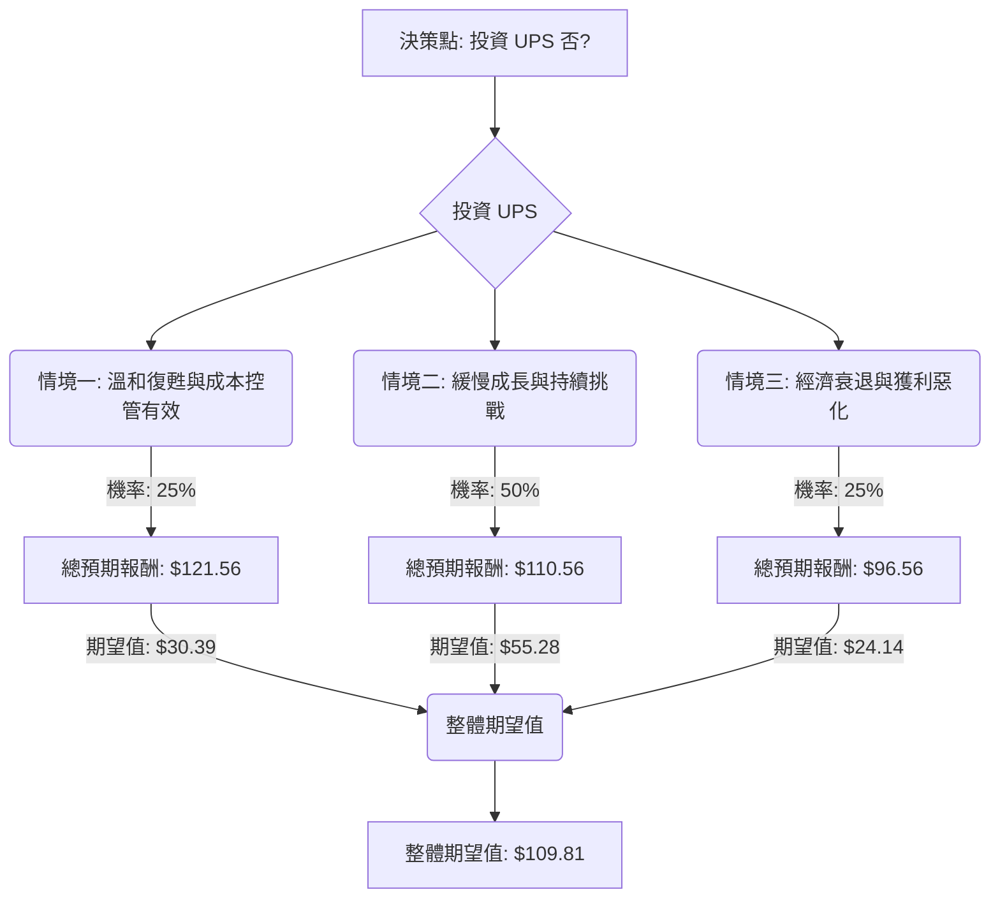

好的，這將是一份基於決策樹分析與期望值分析，並結合最新市場資訊對美股公司 UPS 進行的投資評估報告。

---

## **UPS 投資評估報告**

### **一、最新市場資訊與產業趨勢分析（透過網路搜尋）**

根據對 UPS 及物流產業最新資訊的查詢，歸納出以下關鍵點：

1.  **Q4 2023 財報表現與 2024 展望：**
    *   UPS 在 2023 年第四季度營收與獲利均呈現下滑，主要受到全球包裹量減少、電子商務成長放緩以及新勞工合約導致的成本上升影響。
    *   管理層對 2024 年的展望較為謹慎，預計上半年將持續面臨宏觀經濟逆風，但期望下半年市場會有所改善。全年營收預計在 897 億至 929 億美元之間，調整後營業利潤率在 10% 至 10.6% 之間。
2.  **勞工合約成本：**
    *   2023 年與 Teamsters 工會達成的新勞工合約，導致薪資福利成本顯著增加，這將是 2024 年及未來幾年壓縮獲利能力的主要因素之一。公司正在積極尋求成本效率提升來抵消此影響。
3.  **電商與B2B市場動態：**
    *   雖然疫情期間電商爆炸式成長，但目前已回歸正常化成長軌道，對包裹量成長的動能有所減弱。
    *   B2B (商業對商業) 業務受到企業庫存調整和製造業活動放緩的影響。
4.  **競爭格局：**
    *   物流產業競爭激烈，主要競爭者包括 FedEx、亞馬遜物流 (Amazon Logistics) 等。UPS 必須不斷創新並提升服務效率以保持競爭力。
5.  **股息政策：**
    *   UPS 以其穩定的高股息而聞名，儘管獲利面臨壓力，管理層通常會努力維持股息支付，以保持對股東的吸引力。然而，持續的獲利壓力可能使其可持續性成為關注點。
6.  **宏觀經濟環境：**
    *   全球經濟增長放緩、通脹壓力、高利率環境等因素持續影響消費者支出和企業投資，進而影響物流需求。地緣政治風險也為供應鏈帶來不確定性。

### **二、核心假設**

基於上述基本面數據與最新市場資訊，我們設定以下核心假設：

1.  **市場環境假設：**
    *   全球經濟在 2024 年上半年持續面臨挑戰，下半年有望溫和復甦。
    *   通脹壓力逐漸緩解，但利率可能在高位維持一段時間，影響消費與企業投資。
2.  **產業趨勢假設：**
    *   全球物流與包裹遞送需求成長趨緩，回歸常態化增長。
    *   燃料成本波動和勞動力成本上升將持續對物流公司的營運成本構成壓力。
    *   電商滲透率持續提高，但增速不再像疫情期間那樣爆發。
3.  **公司特定假設（UPS）：**
    *   UPS 的新勞工合約將在短期內繼續壓縮利潤空間。
    *   公司正在實施的「Smarter, Stronger, Bolder」策略，專注於提高效率和成本控制，預計會在中期產生積極效果。
    *   UPS 將努力維持其高額股息，但這會限制其用於再投資或削減債務的現金流。
    *   公司仍擁有強大的全球網絡和品牌優勢，能夠應對市場挑戰。

### **三、決策樹分析與期望值計算**

**投資決策點：** 投資 UPS 否？

**當前股價 (Close)：** $101.92
**分析師目標價 (Target Price)：** $103.81
**股息收益率 (Dividend %)：** 6.44%

我們設定以下三種情境，並為每種情境分配機率及預期報酬：

#### **情境一：溫和復甦與成本控管有效 (Optimistic Scenario)**

*   **說明：** 全球經濟下半年穩健復甦，電商需求略有加速。UPS 的成本控制措施超預期有效，抵消了部分勞工成本上升的影響。市場情緒轉好，給予公司更高的估值。
*   **機率 (Probability)：** 25% (考量到初期逆風)
*   **預期股價變動：** 股價上漲至 $115.00 (約 +12.8% 資本增值，超越分析師目標價)。
*   **預期股息：** 6.44% ($101.92 * 0.0644 = $6.56)
*   **總預期報酬 (Total Return)：** $115.00 + $6.56 = $121.56
*   **期望值 (Expected Value)：** $121.56 * 0.25 = **$30.39**

#### **情境二：緩慢成長與持續挑戰 (Moderate Scenario)**

*   **說明：** 全球經濟溫和成長，但不足以顯著提振包裹量。勞工成本壓力持續，公司效率提升效果符合預期。股價在分析師目標價附近震盪，主要回報來自股息。
*   **機率 (Probability)：** 50% (最可能的情境，平衡了積極面與挑戰)
*   **預期股價變動：** 股價徘徊在分析師目標價附近，考慮略微超出 $104.00 (約 +2.0% 資本增值)。
*   **預期股息：** 6.44% ($101.92 * 0.0644 = $6.56)
*   **總預期報酬 (Total Return)：** $104.00 + $6.56 = $110.56
*   **期望值 (Expected Value)：** $110.56 * 0.50 = **$55.28**

#### **情境三：經濟衰退與獲利惡化 (Pessimistic Scenario)**

*   **說明：** 全球經濟陷入衰退，包裹量大幅下降。勞工成本壓力未能有效緩解，公司營運效率提升不及預期。市場對其獲利能力和股息可持續性產生嚴重擔憂，導致股價下跌。
*   **機率 (Probability)：** 25% (儘管有逆風，但UPS的防禦性較高，極端情況機率較小)
*   **預期股價變動：** 股價下跌至 $90.00 (約 -11.69% 資本虧損，接近 52 週低點附近)。
*   **預期股息：** 即使獲利惡化，短期內公司仍可能努力維持股息。假設股息維持 $6.56。
*   **總預期報酬 (Total Return)：** $90.00 + $6.56 = $96.56
*   **期望值 (Expected Value)：** $96.56 * 0.25 = **$24.14**

---

### **決策樹（Markdown 格式）**

### **計算過程詳述**

**1. 情境一：溫和復甦與成本控管有效**
*   **資本增值：** (預期股價 $115.00 - 當前股價 $101.92) / $101.92 = 12.83%
*   **股息報酬：** 當前股價 $101.92 * 股息收益率 6.44% = $6.56
*   **總預期報酬：** $115.00 (股價) + $6.56 (股息) = $121.56
*   **期望值：** $121.56 * 0.25 (機率) = **$30.39**

**2. 情境二：緩慢成長與持續挑戰**
*   **資本增值：** (預期股價 $104.00 - 當前股價 $101.92) / $101.92 = 2.04%
*   **股息報酬：** 當前股價 $101.92 * 股息收益率 6.44% = $6.56
*   **總預期報酬：** $104.00 (股價) + $6.56 (股息) = $110.56
*   **期望值：** $110.56 * 0.50 (機率) = **$55.28**

**3. 情境三：經濟衰退與獲利惡化**
*   **資本虧損：** (預期股價 $90.00 - 當前股價 $101.92) / $101.92 = -11.69%
*   **股息報酬：** 當前股價 $101.92 * 股息收益率 6.44% = $6.56
*   **總預期報酬：** $90.00 (股價) + $6.56 (股息) = $96.56
*   **期望值：** $96.56 * 0.25 (機率) = **$24.14**

**整體期望值計算：**
$30.39 (情境一) + $55.28 (情境二) + $24.14 (情境三) = **$109.81**

### **四、最終結論**

根據決策樹分析與期望值計算，UPS 的整體期望值為 **$109.81**。

*   **與當前股價 ($101.92) 比較：** $109.81 > $101.92
*   **潛在總回報率：** ($109.81 - $101.92) / $101.92 = 約 7.74% (資本增值) + 6.44% (股息收益率) = 約 14.18%

基於此分析，**目前 UPS 適合投資。**

**簡短理由：**
儘管 UPS 面臨勞工成本上升、電商成長放緩以及宏觀經濟逆風等挑戰，導致短期內獲利承壓，但其強大的品牌、全球網絡和持續的成本控制努力，使其在未來一年內仍有機會實現合理的總體回報。特別是其高達 6.44% 的股息收益率，在多數情境下能夠為投資者提供穩定的現金流，並作為股價波動的緩衝。即使在最悲觀的情境下，股息也能部分抵消資本損失。整體期望值高於當前股價，顯示具有潛在的上漲空間和可觀的總體報酬。然而，投資者應密切關注公司在執行成本控制策略和維持包裹量增長方面的進展。