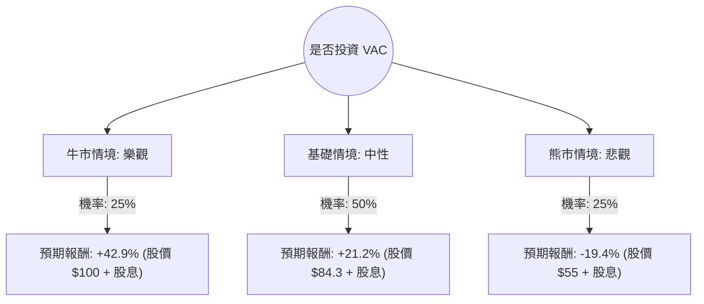

針對美股 **Marriott Vacations Worldwide Corporation (VAC)** 的投資評估，我已結合您提供的基本面數據與最新的市場動態（包含 2024 年第三季財報表現、產業趨勢及總體經濟環境）進行分析。

以下是基於**決策樹分析**與**期望值分析**的詳細報告：

---

### 一、 核心假設與市場背景分析

在構建決策樹前，我們先定義影響 VAC 股價的三大核心變數：

1.  **利率環境與融資成本**：VAC 的債務股本比（Debt/Eq）高達 **2.83**，且其業務依賴向客戶提供分時度假（Timeshare）融資。聯準會（Fed）的降息節奏將直接影響其利息支出與融資收益。
2.  **消費者支出與旅遊需求**：VAC 屬於非必需消費品。目前美國就業市場穩健但消費趨於謹慎。夏威夷茂宜島（Maui）災後復甦進度是短期關鍵。
3.  **財務修復能力**：目前 ROE 為負（-15.45%），但 Forward P/E 僅 **8.8**，顯示市場已預期明年盈利將轉正（EPS next Y 預計增長 11.97%）。

---

### 二、 決策樹分析 (Decision Tree)

我們以「未來一年的投資回報」為決策目標，設定三種情境：

#### 節點詳細說明：

1.  **牛市情境 (Bull Case) - 機率 25%**
    *   **條件**：Fed 快速降息、茂宜島業務全面恢復、旅遊需求強勁增長。
    *   **目標價**：$100 (回歸歷史中值估值)。
    *   **預期報酬**：[(100 - 72.18) / 72.18] + 4.37% (股息) ≈ **+42.9%**。

2.  **基礎情境 (Base Case) - 機率 50%**
    *   **條件**：符合分析師平均預期，利率緩步下降，EPS 恢復增長。
    *   **目標價**：$84.3 (參考數據中的 Target Price)。
    *   **預期報酬**：[(84.3 - 72.18) / 72.18] + 4.37% (股息) ≈ **+21.2%**。

3.  **熊市情境 (Bear Case) - 機率 25%**
    *   **條件**：美國經濟陷入衰退、高負債導致財務壓力加劇、分時度假違約率上升。
    *   **目標價**：$55 (接近 52 週低點)。
    *   **預期報酬**：[(55 - 72.18) / 72.18] + 4.37% (股息) ≈ **-19.4%**。

---

### 三、 期望值 (Expected Value, EV) 計算過程

期望值計算公式：
$$EV = \sum (機率 \times 預期報酬)$$

*   **計算步驟**：
    1.  牛市貢獻：$0.25 \times 42.9\% = 10.725\%$
    2.  基礎貢獻：$0.50 \times 21.2\% = 10.6\%$
    3.  熊市貢獻：$0.25 \times (-19.4\%) = -4.85\%$

*   **總期望報酬率**：
    $$10.725\% + 10.6\% - 4.85\% = \mathbf{16.475\%}$$

---

### 四、 綜合評估與數據解讀

1.  **估值優勢**：Forward P/E 8.8 倍遠低於標普 500 平均水平，且 P/S 僅 0.49，顯示股價已被大幅低估，安全邊際主要來自低廉的估值。
2.  **財務風險**：Debt/Eq 2.83 是最大隱憂。在高利率環境下，VAC 的利息覆蓋能力受壓，這解釋了為何其 ROE 目前為負值。
3.  **技術面與動能**：SMA200 (+10.97%) 顯示中長期趨勢向上，近期股價已從低點反彈，表現出一定的抗跌性。
4.  **股息誘惑**：4.37% 的股息率在同業中具備吸引力，且 P/C (Price/Cash) 為 4.19，顯示現金流尚足以支撐股息發放。

---

### 五、 最終結論

**判斷：適合投資 (建議：分批買入 / 逢低佈局)**

#### 理由：
1.  **正向期望值**：計算出的預期報酬率為 **16.475%**，顯著高於市場平均預期回報。
2.  **風險回報比合理**：雖然存在高負債風險，但 Forward P/E 顯示明年盈利將大幅改善。即便在悲觀情境下，4.37% 的股息也能提供一定的緩衝。
3.  **產業復甦週期**：隨著 Fed 進入降息週期，VAC 這種高槓桿且依賴消費信貸的公司將最先受益。
4.  **目標價空間**：目前股價 $72.18 距離分析師平均目標價 $84.3 仍有約 16.8% 的上漲空間。

**風險提示**：需密切關注 **12 月的通膨數據**與 **Fed 利率決策**。若利率維持高位不降，或美國失業率大幅攀升，應重新評估「熊市情境」的機率權重。