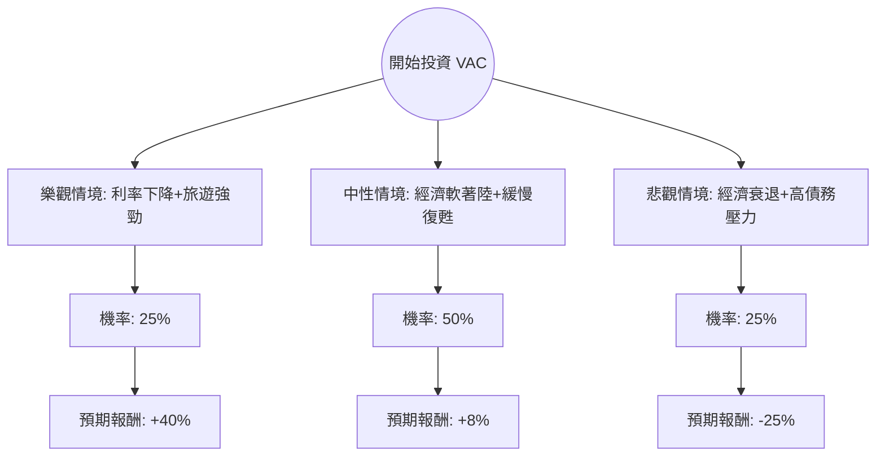

這份分析報告將針對 **Marriott Vacations Worldwide Corporation (VAC)** 進行深入評估。我們結合了您提供的財務數據，以及最新的市場動態（包含 2024 年第三季財報表現、利率環境及旅遊產業趨勢）。

---

### 1. 最新市場動態與背景分析 (Context)

在進入決策樹之前，我們先整合最新的外部資訊：
*   **財務表現：** VAC 最近的財報顯示，儘管合約銷售額（Contract Sales）有所增長，但受到融資成本上升與毛利率壓縮的影響，淨利潤表現疲軟（EPS Q/Q 下降明顯）。
*   **利率敏感度：** 作為度假租賃（Timeshare）龍頭，VAC 的業務高度依賴消費者貸款。高利率環境增加了公司的融資成本，也抑制了消費者的購買意願。
*   **毛威島（Maui）復甦：** 之前的火災對 VAC 影響巨大，目前該地區業務正在緩慢復甦，這是未來一年的潛在增長點。
*   **估值：** 目前 P/B 僅 0.81，遠低於歷史平均，顯示市場已反映了大部分的悲觀預期。

---

### 2. 決策樹分析 (Decision Tree)

我們將未來一年的投資回報分為三種主要情境：**樂觀（Bull）**、**中性（Base）**、**悲觀（Bear）**。

#### 決策樹節點詳細說明：

| 情境 | 機率 (P) | 預期股價目標 | 預期報酬率 (R) | 說明 |
| :--- | :--- | :--- | :--- | :--- |
| **樂觀 (Bull)** | 25% | $80.00 | +39.2% | 聯準會大幅降息，融資成本下降，毛威島業務全面恢復，估值修復至 P/B 1.2。 |
| **中性 (Base)** | 50% | $62.00 | +7.9% | 接近分析師目標價 ($61.91)。利率維持高位但穩定，旅遊需求持平，靠 5.5% 股息支撐總回報。 |
| **悲觀 (Bear)** | 25% | $43.00 | -25.1% | 經濟衰退導致違約率上升，高債務 (Debt/Eq 2.33) 壓力爆發，股價回測 52 週低點。 |

---

### 3. 期望值分析 (Expected Value Analysis)

#### 核心假設：
1.  **持有期限：** 12 個月。
2.  **股息收益：** 考慮到 5.52% 的殖利率，假設公司維持派息，這將作為緩衝加入總報酬。
3.  **估值基準：** 以目前股價 $57.45 為基準。

#### 計算過程：
期望值 (EV) = (P_樂觀 × R_樂觀) + (P_中性 × R_中性) + (P_悲觀 × R_悲觀)

1.  **樂觀貢獻：** $0.25 \times 39.2\% = 9.8\%$
2.  **中性貢獻：** $0.50 \times 7.9\% = 3.95\%$
3.  **悲觀貢獻：** $0.25 \times (-25.1\%) = -6.275\%$

**總預期資本利得：** $9.8\% + 3.95\% - 6.275\% = 7.475\%$
**加計股息收益：** $7.475\% + 5.52\% = 12.995\%$

**最終期望值 (Expected Value) ≈ 13%**

---

### 4. 綜合評估與最終結論

#### 財務健康度檢查：
*   **優勢：** P/B 0.81 具備極高安全邊際；Forward P/E 8.38 顯示未來盈利預期尚可；股息率 5.5% 非常吸引價值投資者。
*   **劣勢：** 債務股本比 (Debt/Eq) 高達 2.33，財務槓桿極高；EPS Q/Q 衰退嚴重 (-102%)，顯示短期營運壓力巨大。

#### 最終判斷：適合投資 (適合價值型與收息投資者)

**理由：**
1.  **正向期望值：** 經過風險加權後的預期總報酬率約為 **13%**，優於一般債券與保守型投資工具。
2.  **估值底部：** 股價已從 52 週高點下跌約 37%，且 P/B 低於 1，顯示資產價值被低估，下行空間受限。
3.  **現金流支撐：** 5.5% 的股息提供了良好的持股信心，即便股價短期震盪，仍有現金流入。
4.  **反轉潛力：** 隨著降息循環開啟，VAC 作為高槓桿、高融資依賴型企業，將是降息政策的主要受益者。

**建議操作：**
由於短期技術面 (SMA200 為 -13.3%) 仍處於弱勢，建議採取**分批買進 (Dollar Cost Averaging)** 策略，以規避短期內因財報波動可能帶來的下行風險。

---
*免責聲明：本分析僅供參考，不構成投資建議。投資美股具備風險，請根據個人風險承受能力做出決策。*