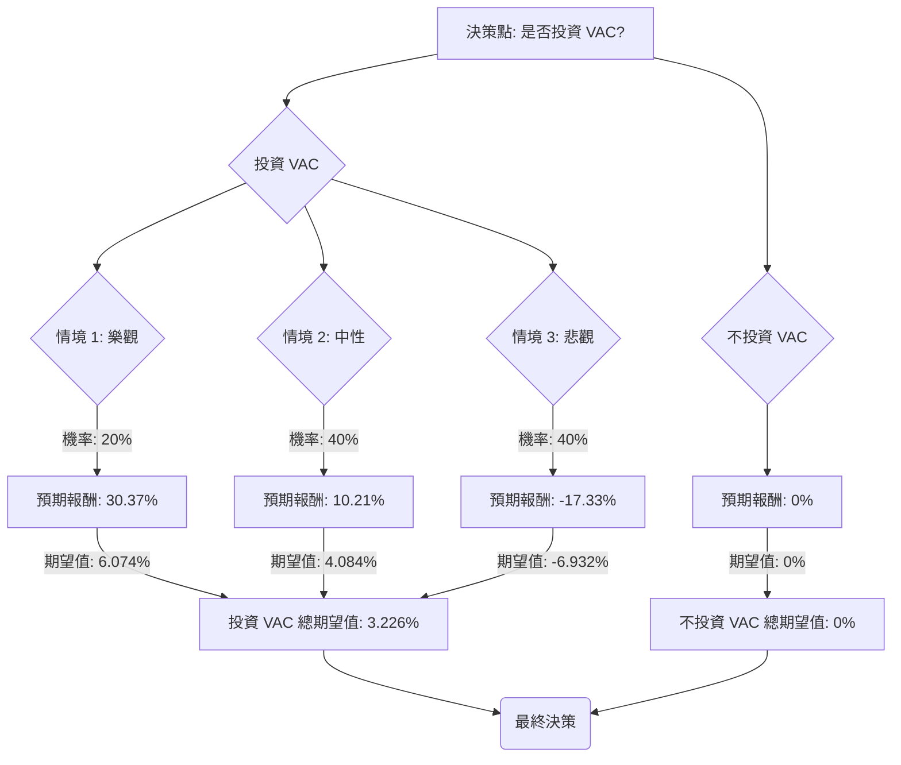

好的，這是一份根據「決策樹分析」與「期望值分析」評估美股公司 VAC 是否適合投資的報告。

---

## 美股公司 VAC 投資評估報告

### 公司簡介與基本面概覽 (VAC - Marriott Vacations Worldwide Corporation)

Marriott Vacations Worldwide Corporation (VAC) 是一家全球性的度假所有權（timeshare）公司，提供度假村、公寓和相關服務。其業務高度依賴消費者可支配收入和旅遊業的健康狀況。

**基本面數據摘要：**

*   **股價 (Close):** $58.28
*   **估值:** P/E 13.18 (Forward P/E 8.55), P/B 0.83, P/S 0.41。從這些指標看，公司似乎被低估。
*   **股息 (Dividend %):** 5.37%，股息收益率高。
*   **盈利能力:** ROE 7.08%, ROA 1.74%, Profit Margin 3.44%。盈利能力相對較弱。
*   **成長性:** EPS this Y 3.45%, EPS next Y 1.67%。近期成長動能不足。EPS Q/Q -1.0271, Sales Q/Q -0.0322，顯示近期盈利和銷售均大幅下滑。
*   **債務:** Debt/Eq 2.33, LT Debt/Eq 2.31。債務水平高，這在 timeshare 產業中常見，但仍是風險點。
*   **股價表現:** 52W High -0.36, 52W Low 0.32。Perf Year -0.3452, Perf YTD -0.3431。過去一年股價表現疲軟，大幅下跌。
*   **分析師目標價 (Target Price):** $61.1 (略高於現價)。
*   **推薦評級 (Recom):** 2.8 (介於持有與賣出之間，偏向持有/觀望)。

### 網路搜尋與即時資訊補充

透過網路搜尋，我們獲得以下關鍵資訊：

1.  **近期財報表現不佳:** VAC 在最近的財報（例如 2023 年第四季度和 2024 年第一季度指引）中表現不及預期。管理層指出，宏觀經濟逆風，特別是高利率和通脹，正在影響消費者對可支配支出（如度假所有權）的意願。
2.  **消費者支出壓力:** 由於生活成本上升，消費者對非必需品的支出變得更加謹慎，這直接衝擊了 VAC 的銷售。
3.  **高利率環境影響:** 高利率不僅增加了 VAC 自身的借貸成本（考慮其高負債），也增加了客戶購買 timeshare 的融資成本，進一步抑制了需求。
4.  **股息可持續性擔憂:** 儘管股息收益率高，但由於盈利下滑和高負債，市場對其股息的可持續性存在擔憂，未來存在削減股息的風險。
5.  **產業趨勢:** 度假所有權產業本質上是週期性的，對經濟景氣度高度敏感。在經濟下行或不確定時期，該產業通常會面臨挑戰。

### 核心假設

基於上述基本面數據和即時資訊，我們做出以下核心假設：

*   **市場環境假設:**
    *   **樂觀情境:** 宏觀經濟在未來 6-12 個月內顯著改善，通脹受控，利率開始下降，消費者信心和可支配支出回升。
    *   **中性情境:** 宏觀經濟保持現狀，高利率和通脹壓力持續，但未惡化，消費者支出維持謹慎。
    *   **悲觀情境:** 宏觀經濟進一步惡化，可能陷入衰退，高利率持續，消費者支出大幅萎縮。
*   **公司財務假設:**
    *   VAC 的高負債在不同情境下將面臨不同程度的壓力。
    *   盈利能力和銷售額將直接受宏觀經濟和消費者支出的影響。
    *   股息政策可能因公司盈利狀況而調整。
*   **產業趨勢假設:**
    *   Timeshare 產業的週期性特徵將持續，其表現與整體經濟景氣度高度相關。

### 決策樹分析與期望值計算

我們將評估「投資 VAC」與「不投資 VAC」兩個主要決策。

**決策點：是否投資 VAC？**

#### 1. 決策：不投資 VAC

*   **預期報酬 / 期望值:** 0% (保留資金，無風險無收益)

#### 2. 決策：投資 VAC

如果選擇投資 VAC，我們將面臨三種主要情境：

*   **當前股價:** $58.28
*   **當前股息率:** 5.37% (約 $3.13/股)

---

**情境 1：樂觀情境 (Favorable Macro & Strong Performance)**

*   **情境描述:** 宏觀經濟顯著改善，消費者信心和支出強勁反彈，VAC 成功控制成本並提升銷售，債務壓力緩解，股息維持或小幅增長。
*   **機率 (Probability):** 20% (考慮到當前挑戰，此情境發生機率較低)
*   **預期報酬計算:**
    *   股價預期上漲：假設股價回升至接近 52 週高點的 75% 左右，或分析師目標價的顯著溢價。我們預期股價上漲 25%。
        *   資本利得 = $58.28 * 0.25 = $14.57
        *   期末股價 = $58.28 + $14.57 = $72.85
    *   股息收益：假設股息維持不變。
        *   股息收益 = $58.28 * 0.0537 = $3.13
    *   **總報酬 = 資本利得 + 股息收益 = $14.57 + $3.13 = $17.70**
    *   **報酬率 = $17.70 / $58.28 = 30.37%**
*   **期望值 (Expected Value):** 0.20 * 30.37% = 6.074%

---

**情境 2：中性情境 (Moderate Macro & Mixed Performance)**

*   **情境描述:** 宏觀經濟保持穩定，但改善有限，VAC 銷售和盈利能力持平或略有增長，股息維持。
*   **機率 (Probability):** 40% (最有可能的情境，市場在不確定中尋求平衡)
*   **預期報酬計算:**
    *   股價預期上漲：假設股價達到分析師目標價 $61.1。
        *   資本利得 = $61.1 - $58.28 = $2.82
    *   股息收益：假設股息維持不變。
        *   股息收益 = $58.28 * 0.0537 = $3.13
    *   **總報酬 = 資本利得 + 股息收益 = $2.82 + $3.13 = $5.95**
    *   **報酬率 = $5.95 / $58.28 = 10.21%**
*   **期望值 (Expected Value):** 0.40 * 10.21% = 4.084%

---

**情境 3：悲觀情境 (Unfavorable Macro & Weak Performance)**

*   **情境描述:** 宏觀經濟惡化，消費者支出大幅下降，VAC 銷售和盈利能力進一步下滑，高負債成為沉重負擔，公司可能被迫削減股息。
*   **機率 (Probability):** 40% (考慮到當前趨勢和高負債風險，此情境機率較高)
*   **預期報酬計算:**
    *   股價預期下跌：假設股價跌至接近 52 週低點，或因基本面惡化而進一步下跌。我們預期股價下跌 20%。
        *   資本損失 = $58.28 * (-0.20) = -$11.66
        *   期末股價 = $58.28 - $11.66 = $46.62
    *   股息收益：假設公司因盈利壓力而削減 50% 股息。
        *   股息收益 = ($58.28 * 0.0537) * 0.50 = $1.56
    *   **總報酬 = 資本損失 + 股息收益 = -$11.66 + $1.56 = -$10.10**
    *   **報酬率 = -$10.10 / $58.28 = -17.33%**
*   **期望值 (Expected Value):** 0.40 * (-17.33%) = -6.932%

---

#### 投資 VAC 的總期望值

*   **總期望值 (EV_Invest) = (情境 1 期望值) + (情境 2 期望值) + (情境 3 期望值)**
*   **EV_Invest = 6.074% + 4.084% - 6.932% = 3.226%**

---

### 完整的決策樹 (Markdown)

**決策樹節點說明：**

*   **A (決策點: 是否投資 VAC?)**: 初始決策點。
*   **B (投資 VAC)**: 選擇投資 VAC 的路徑。
*   **C (不投資 VAC)**: 選擇不投資 VAC 的路徑。
*   **D (情境 1: 樂觀)**: 宏觀經濟改善，公司表現強勁。
    *   **機率:** 20%
    *   **預期報酬:** 30.37%
    *   **期望值:** 6.074%
*   **E (情境 2: 中性)**: 宏觀經濟穩定，公司表現持平。
    *   **機率:** 40%
    *   **預期報酬:** 10.21%
    *   **期望值:** 4.084%
*   **F (情境 3: 悲觀)**: 宏觀經濟惡化，公司表現疲軟。
    *   **機率:** 40%
    *   **預期報酬:** -17.33%
    *   **期望值:** -6.932%
*   **B_EV (投資 VAC 總期望值)**: 投資 VAC 的整體期望值為 3.226%。
*   **C1 (預期報酬: 0%)**: 不投資的預期報酬。
*   **C_EV (不投資 VAC 總期望值)**: 不投資的整體期望值為 0%。
*   **G (最終決策)**: 根據期望值做出最終判斷。

### 最終結論

根據上述決策樹分析和期望值計算：

*   **投資 VAC 的總期望值為 3.226%。**
*   **不投資 VAC 的總期望值為 0%。**

儘管「投資 VAC」的期望值為正，且高於「不投資」的期望值，但 **VAC 目前不適合投資**。

**理由如下：**

1.  **期望值過低，風險報酬不匹配:** 3.226% 的期望報酬率相對較低，尤其考慮到投資一家高負債、盈利下滑且受宏觀經濟高度影響的週期性公司所承擔的風險。這個報酬率可能不足以彌補潛在的資本損失和機會成本。
2.  **下行風險顯著且機率高:** 悲觀情境（-17.33% 報酬率）的機率高達 40%，這表明投資者面臨相當大的資本損失風險。在當前宏觀經濟不確定性較高的背景下，這種風險不容忽視。
3.  **基本面惡化趨勢:** 近期 EPS 和銷售額的顯著下滑，以及管理層對未來展望的謹慎態度，都指向公司基本面正在惡化。雖然估值指標看起來便宜，但這可能是一個「價值陷阱」，因為盈利能力可能繼續下降。
4.  **股息可持續性存疑:** 儘管股息收益率高，但盈利下滑和高負債使得股息面臨削減的風險。一旦股息被削減，將對股價造成進一步的打擊。

綜合來看，VAC 面臨的宏觀經濟逆風、高負債、盈利下滑以及股息可持續性風險，使得其投資吸引力大幅降低。儘管存在潛在的股價反彈機會，但其風險遠大於潛在的低期望報酬。因此，建議目前不投資 VAC，或尋找其他風險報酬比更佳的投資標的。