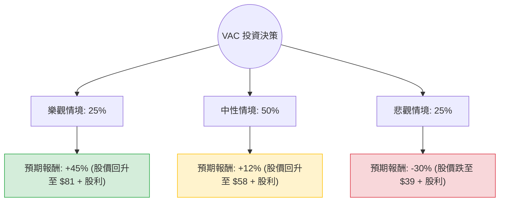

這份分析報告將針對 **Marriott Vacations Worldwide Corporation (股票代碼：VAC)** 進行深度評估。我們將結合您提供的基本面數據，以及最新的市場動態（如：高利率環境對度假租賃業的影響、茂宜島大火後的復甦進度等），透過**決策樹分析**與**期望值分析**來判斷其投資價值。

---

### 一、 核心背景與現狀分析 (Context & Current Status)

根據最新市場資訊與您提供的數據，VAC 目前處於「價值陷阱」與「轉機股」的邊緣：
1.  **估值極低**：P/B 僅 0.83（低於帳面價值），Forward P/E 8.73，顯示市場對其未來極度悲觀。
2.  **財務壓力**：Debt/Eq 高達 2.33，在高利率環境下，利息支出與消費者融資成本增加，直接打擊利潤。
3.  **外部衝擊**：2023 年夏威夷茂宜島大火對其業務造成顯著衝擊（該地為其重要利潤來源），目前正處於緩慢復甦期。
4.  **股利吸引力**：5.38% 的殖利率在同業中偏高，但 EPS Q/Q 下跌 102% 顯示短期獲利能力受挫。

---

### 二、 決策樹分析 (Decision Tree Analysis)

我們將未來一年的表現分為三種情境：**樂觀（復甦與降息）**、**中性（維持現狀）**、**悲觀（衰退與高債務壓力）**。

#### 1. 節點詳細說明與假設：

*   **樂觀情境 (Bull Case) - 25% 機率**：
    *   **假設**：聯準會（Fed）在 2024 年下半年大幅降息，消費者融資成本下降；茂宜島業務復甦超預期；公司成功去槓桿。
    *   **預期報酬**：股價回歸歷史平均估值（P/E 15x），目標價約 $81。加上 5.38% 股利，總報酬約 **+50%**。
*   **中性情境 (Base Case) - 50% 機率**：
    *   **假設**：利率維持高位（Higher for longer），旅遊需求穩定但增長緩慢。公司維持現有派息，EPS 緩步止跌。
    *   **預期報酬**：股價回升至分析師平均目標價 $63 附近。考慮到目前價格 $56.2，漲幅約 12%，加上股利，總報酬約 **+17%**。
*   **悲觀情境 (Bear Case) - 25% 機率**：
    *   **假設**：美國經濟進入衰退，非必要旅遊支出大幅縮減；高債務導致信用評等下調，公司被迫削減股利。
    *   **預期報酬**：股價下探 52 週低點甚至更低（約 $40）。總報酬（含股利抵銷部分損失）約 **-25%**。

---

### 三、 期望值計算 (Expected Value Analysis)

我們將各情境的機率與預期報酬相乘，得出整體期望值：

| 情境 | 機率 (P) | 預期報酬 (R) | P × R |
| :--- | :--- | :--- | :--- |
| 樂觀 | 0.25 | +50% | +12.5% |
| 中性 | 0.50 | +17% | +8.5% |
| 悲觀 | 0.25 | -25% | -6.25% |
| **總計期望值** | **1.00** | | **+14.75%** |

**計算過程：**
$EV = (0.25 \times 0.50) + (0.50 \times 0.17) + (0.25 \times -0.25) = 0.125 + 0.085 - 0.0625 = 0.1475$

---

### 四、 核心假設與風險評估

1.  **利率敏感度**：VAC 的商業模式高度依賴向客戶提供分期付款融資。如果利率不下降，其淨利差（Interest Spread）將持續受壓。
2.  **債務風險**：Debt/Eq 2.33 顯示財務槓桿極高。在經濟下行時，這類公司股價波動會遠超大盤。
3.  **技術面觀察**：SMA20 與 SMA50 均為正值（5.67% 與 1.7%），顯示短期股價有築底回升跡象，但 SMA200 仍為負值（-11.22%），長期趨勢尚未完全反轉。

---

### 五、 最終結論

**判斷：適合投資（建議：分批買入 / 價值投資導向）**

#### 理由：
1.  **期望值為正 (14.75%)**：儘管面臨高債務與經濟不確定性，但目前的股價已反映了大部分利空（P/B < 1），期望值顯示潛在收益大於風險。
2.  **安全邊際**：P/B 0.83 提供了較強的下行保護。即使在悲觀情境下，其資產價值仍具支撐。
3.  **現金流與股利**：5.38% 的殖利率能為投資者在等待股價回升期間提供穩定的現金流補償。
4.  **反轉信號**：近期（週、季）表現已開始轉正（Perf Quarter +26.45%），顯示市場信心正在修復。

**投資建議：**
由於 VAC 屬於**高槓桿、高週期性**股票，建議投資者不要一次性重倉。適合採取「分批佈局」策略，並密切關注 Fed 的利率決策以及公司下一季的 EPS Q/Q 是否由負轉正。若股價跌破 $44 (52W Low)，應重新評估其破產風險或削減股利的可能性。