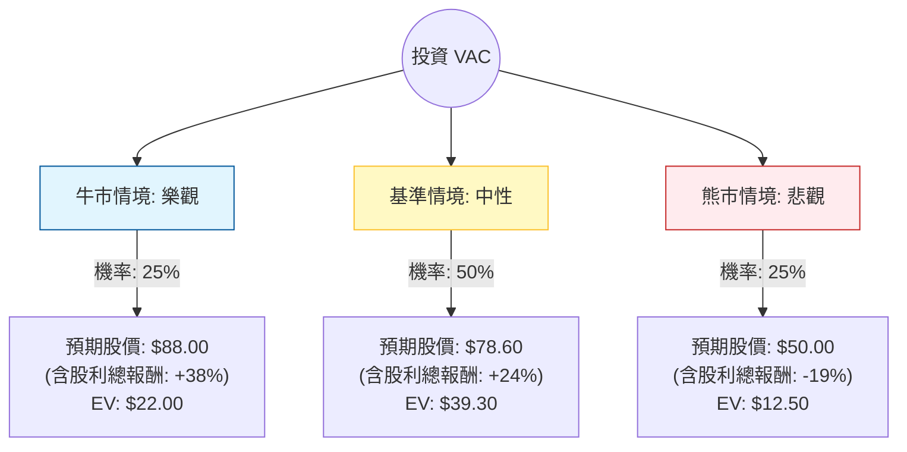

這份分析報告將針對 **Marriott Vacations Worldwide Corporation (VAC)** 進行深入評估。我們將結合您提供的財務數據與最新的市場動態（如茂宜島復甦進度、利率環境、旅遊需求趨勢），透過**決策樹分析**與**期望值分析**來判斷其投資價值。

---

### 一、 市場動態與背景分析 (最新資訊補充)

在進入計算前，根據最新財報與市場趨勢，VAC 面臨以下關鍵因素：

1.  **茂宜島 (Maui) 復甦壓力**：VAC 在夏威夷茂宜島擁有大量物業。2023年的野火持續影響其 2024 年的業績，導致合約銷售額（Contract Sales）增長放緩，這是近期股價承壓的主因。
2.  **利率環境**：VAC 的業務高度依賴消費者融資。高利率環境增加了消費者的分期負擔，同時也增加了 VAC 自身的債務成本（Debt/Eq 高達 2.89）。
3.  **估值低廉**：Forward P/E 僅 8.19，遠低於歷史平均，顯示市場已反映大部分利空。
4.  **股利吸引力**：約 4.8% 的殖利率在旅遊板塊中具有競爭力，提供了一定的下行保護。

---

### 二、 決策樹分析 (Decision Tree)

以下決策樹模擬了未來 12 個月內 VAC 可能面臨的三種主要情境：

---

### 三、 期望值分析 (Expected Value Analysis)

#### 1. 核心假設
*   **當前股價 ($P_0$)**: $66.08
*   **預期股利**: $3.18 (約 4.8%)
*   **牛市情境 (25%)**: 聯準會降息超預期，茂宜島旅遊全面復甦，合約銷售強勁。目標價參考 52 週高點附近 ($88)。
*   **基準情境 (50%)**: 達到分析師平均目標價 ($78.6)。反映公司營運穩健但受限於高債務成本。
*   **熊市情境 (25%)**: 美國經濟陷入衰退，消費者削減奢侈旅遊支出，債務違約風險上升。股價回測支撐位 ($50)。

#### 2. 計算過程
我們計算 **12 個月後的預期總價值 (股價 + 股利)**：

*   **牛市期望值**: $0.25 \times (88.00 + 3.18) = 0.25 \times 91.18 = \mathbf{22.795}$
*   **基準期望值**: $0.50 \times (78.60 + 3.18) = 0.50 \times 81.78 = \mathbf{40.89}$
*   **熊市期望值**: $0.25 \times (50.00 + 3.18) = 0.25 \times 53.18 = \mathbf{13.295}$

**總期望值 (Total EV)** = $22.795 + 40.89 + 13.295 = \mathbf{\$76.98}$

#### 3. 預期報酬率計算
*   **預期總報酬率**: $(\$76.98 - \$66.08) / \$66.08 = \mathbf{+16.5\%}$

---

### 四、 綜合評估與最終結論

#### 財務數據亮點與隱憂：
*   **優勢**：Forward P/E (8.19) 極低，P/S (0.45) 顯示營收價值被低估。內部人交易 (Insider Trans: 5.43%) 為正值，顯示管理層有信心。
*   **劣勢**：債務股本比 (Debt/Eq: 2.89) 極高，在利率維持高位時利息壓力大。ROE 為負值 (-13.89%)，反映近期受茂宜島事件衝擊導致的虧損。

#### 最終判斷：適合投資 (適度配置)

**理由：**
1.  **正向期望值**：計算出的預期報酬率為 **16.5%**，顯著高於市場平均預期，且期望值價格 ($76.98) 遠高於現價。
2.  **安全邊際**：目前股價 ($66.08) 接近 52 週區間的中低位，且 P/B 僅 1.13，下行空間相對有限。
3.  **催化劑明確**：隨著 2025 年潛在的降息循環，VAC 的融資成本將下降，且消費者購買意願將回升。
4.  **現金流補償**：4.8% 的殖利率讓投資者在等待股價回升的過程中能獲得穩定的現金流。

**風險提示：**
VAC 屬於**高槓桿、週期性**股票。若美國經濟意外陷入深度衰退，其高債務壓力可能導致股價跌破熊市預期。建議投資者將其視為「價值反轉型」配置，佔投資組合比例不宜過高。