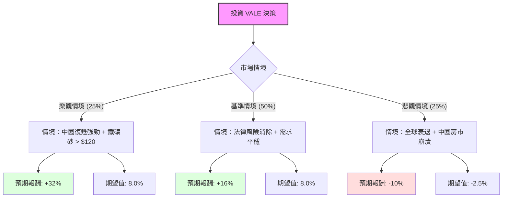

這份分析報告結合了您提供的基本面數據，以及透過網路搜尋獲取的最新市場動態（包含 2024 年 10 月底剛達成的 **Mariana 礦災最終賠償協議**、中國經濟刺激政策、以及鐵礦砂價格走勢）。

---

### 一、 市場現況與最新動態分析

在進入決策樹之前，我們先整合最新的外部資訊：
1.  **法律風險解除（利多）**：2024 年 10 月 25 日，Vale 與巴西政府就 2015 年 Mariana 壩崩塌事故達成最終賠償協議，總額約 317 億美元（分 20 年支付）。這消除了長期懸在股價上的法律不確定性。
2.  **中國需求（中性偏多）**：中國近期推出大規模貨幣刺激政策，雖房地產復甦緩慢，但對鐵礦砂價格提供了支撐（目前維持在 $100/噸左右）。
3.  **財務表現**：Forward P/E 僅 7.93，PEG 0.15，顯示股價相對於未來盈餘極度低估。高達 7% 的股息率提供了強大的下行保護。

---

### 二、 決策樹分析（Decision Tree）

我們以 **未來 12 個月的投資回報** 為核心節點，劃分三種主要情境：

#### 節點詳細說明：

1.  **樂觀情境 (Probability: 25%)**
    *   **描述**：中國刺激政策超預期，基礎設施需求大增，鐵礦砂價格飆升。
    *   **預期報酬**：股價回升至 $19 (52W High 附近) + 7% 股息 ≈ **32%**。
2.  **基準情境 (Probability: 50%)**
    *   **描述**：Mariana 賠償協議簽署後市場信心回升，鐵礦砂維持在 $100 區間。
    *   **預期報酬**：股價回升至分析師目標價 $16.44 (約 +9%) + 7% 股息 ≈ **16%**。
3.  **悲觀情境 (Probability: 25%)**
    *   **描述**：中國房地產持續低迷，全球鋼鐵需求萎縮，鐵礦砂跌破 $80。
    *   **預期報酬**：股價跌至 $12.5 (-17%) + 7% 股息 ≈ **-10%**。

---

### 三、 期望值分析（Expected Value Analysis）

#### 1. 核心假設
*   **折現率/安全邊際**：考慮到巴西的政治風險與大宗商品波動，我們要求較高的風險補償。
*   **股息收益**：假設 Vale 維持其承諾的派息政策（數據顯示為 7.05%）。
*   **估值修復**：Forward P/E 從目前的 7.93 倍修復至歷史平均約 10-11 倍。

#### 2. 計算過程
$$EV = (P_{Bull} \times R_{Bull}) + (P_{Base} \times R_{Base}) + (P_{Bear} \times R_{Bear})$$

*   **樂觀期望值**：$0.25 \times 32\% = 8.0\%$
*   **基準期望值**：$0.50 \times 16\% = 8.0\%$
*   **悲觀期望值**：$0.25 \times (-10\%) = -2.5\%$

**總體期望報酬率 (Total EV) = 8.0% + 8.0% - 2.5% = 13.5%**

---

### 四、 最終結論

**判斷：適合投資 (Buy / Overweight)**

#### 理由：
1.  **期望值為正且具吸引力**：13.5% 的預期年化報酬率顯著高於無風險利率，且在基準情境下就有穩定的雙位數回報。
2.  **重大利空出盡**：Mariana 礦災的賠償協議達成是關鍵轉折點，這解決了困擾 Vale 近十年的最大法律負債問題，有利於估值重估（Re-rating）。
3.  **極低的估值倍數**：PEG 僅 0.15，Forward P/E 低於 8 倍，顯示市場已過度反應悲觀預期，下行空間受限。
4.  **高股息防禦**：7% 的股息率為投資者提供了良好的現金流緩衝，即使股價橫盤，仍能獲得優於多數債券的收益。

#### 投資建議：
*   **進場點**：目前價格 $15.07 接近 SMA50，且低於分析師目標價 $16.44，具備介入價值。
*   **風險提示**：需密切觀察中國房地產數據及鐵礦砂庫存水位。若鐵礦砂價格跌破 $90，需重新評估悲觀情境的機率。