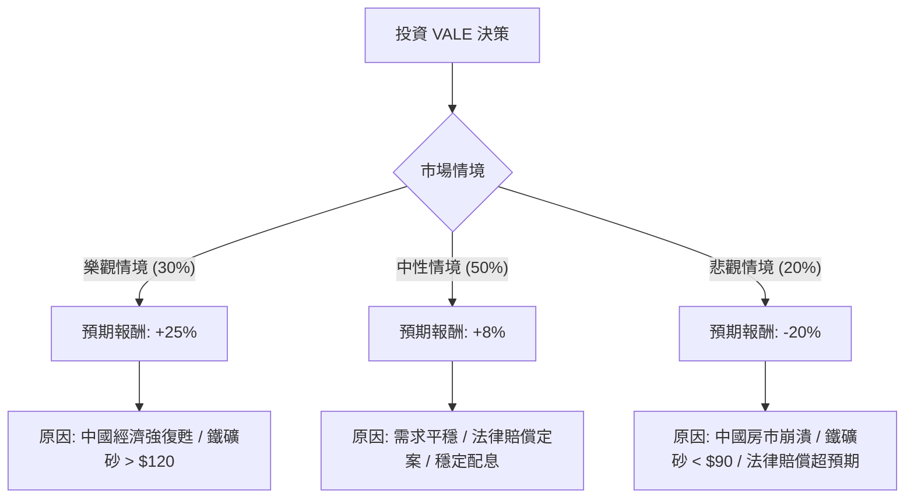

這份分析報告將結合您提供的財務數據與當前市場動態（特別是鐵礦砂價格趨勢、中國經濟政策及 Vale 的法律訴訟進展），利用**決策樹（Decision Tree）**與**期望值分析（Expected Value Analysis）**來評估 VALE 的投資價值。

---

### 1. 核心假設與市場背景分析

在建立決策樹之前，我們必須考慮以下關鍵變數：

*   **中國需求（權重最高）**：Vale 超過 50% 的營收來自中國。中國近期推出的房地產刺激政策與基礎建設支出是鐵礦砂價格的支撐點。
*   **鐵礦砂價格**：目前價格在每噸 100-110 美元區間震盪。若跌破 90 美元，Vale 獲利將大幅縮水；若回升至 120 美元以上，則有強大上行空間。
*   **法律與 ESG 風險**：關於 2015 年馬里亞納（Mariana）大壩潰堤案的最終賠償協議（預計金額高達數十億美元）已接近達成，這將消除長期不確定性，但也涉及大筆現金流出。
*   **財務數據解讀**：
    *   **Forward P/E (8.53)** 與 **PEG (0.16)**：顯示相對於未來盈餘，股價目前被嚴重低估。
    *   **Dividend (4.22%)**：提供穩定的下行保護。
    *   **1Y Perf (94.97%)**：股價已有一波強勁漲幅，需警惕回檔風險。

---

### 2. 決策樹分析 (Decision Tree)

我們將未來一年的情境分為三種：**樂觀（牛市）**、**中性（基準）**、**悲觀（熊市）**。

#### 節點詳細說明：

1.  **樂觀情境 (Probability: 0.30)**
    *   **情境**：中國刺激政策超預期，全球製造業回暖。
    *   **預期報酬**：股價回升至歷史高點區域，加上 4% 股息，總報酬約 **25%**。
    *   **期望值貢獻**：$0.30 \times 25\% = 7.5\%$

2.  **中性情境 (Probability: 0.50)**
    *   **情境**：鐵礦砂價格維持在 $100 左右，法律訴訟達成協議（利空出盡），公司維持回購與配息。
    *   **預期報酬**：股價隨大盤波動，主要收益來自股息與小幅估值修復，總報酬約 **8%**。
    *   **期望值貢獻**：$0.50 \times 8\% = 4.0\%$

3.  **悲觀情境 (Probability: 0.20)**
    *   **情境**：全球衰退，中國房地產危機惡化，鐵礦砂需求萎縮。
    *   **預期報酬**：股價回測 52 週低點，總報酬約 **-20%**。
    *   **期望值貢獻**：$0.20 \times (-20\%) = -4.0\%$

---

### 3. 期望值計算過程

根據上述決策樹節點，我們計算整體的**預期報酬率 (Expected Return, E(R))**：

$$E(R) = (P_{Bull} \times R_{Bull}) + (P_{Base} \times R_{Base}) + (P_{Bear} \times R_{Bear})$$

**計算步驟：**
1.  樂觀：$0.30 \times 0.25 = 0.075$
2.  中性：$0.50 \times 0.08 = 0.040$
3.  悲觀：$0.20 \times (-0.20) = -0.040$

**總期望值：**
$$0.075 + 0.040 - 0.040 = 0.075 = 7.5\%$$

---

### 4. 綜合評估與最終結論

#### 財務數據補充分析：
*   **估值優勢**：Forward P/E 僅 8.53，遠低於標普 500 平均水平，且 PEG 0.16 顯示其成長性未被充分定價。
*   **技術面**：股價目前在 $16.96，極度接近分析師目標價 $17.09。短期內上行空間看似有限，但 SMA200 (0.3532) 顯示長期趨勢仍向上。
*   **風險點**：EPS Q/Q 下跌 3.86 倍，反映了近期營運成本或一次性法律撥備的衝擊，這解釋了為何 P/E 較高（31.47）。

#### 最終結論：適合投資 (但建議分批買入)

**判斷理由：**
1.  **正向期望值**：經過風險加權後的預期報酬率為 **7.5%**，優於持有現金或低風險債券。
2.  **利空出盡預期**：Vale 長期受困於馬里亞納大壩的法律賠償，近期新聞顯示協議即將達成，這通常是週期性股票「估值重估（Re-rating）」的催化劑。
3.  **極低 PEG 比率**：0.16 的 PEG 顯示市場對其未來的盈餘增長過於悲觀，存在安全邊際。
4.  **股息支撐**：4.22% 的股息率在商品循環下行時提供了良好的緩衝。

**操作建議：**
由於目前股價已接近分析師目標價 ($17.09)，且過去一年漲幅巨大，不建議一次性歐印（All-in）。建議在 **$15.5 - $16.5** 區間分批佈局，以應對鐵礦砂價格的短期波動。

---
*免責聲明：本分析僅供參考，不構成投資建議。投資者應自行承擔市場風險。*