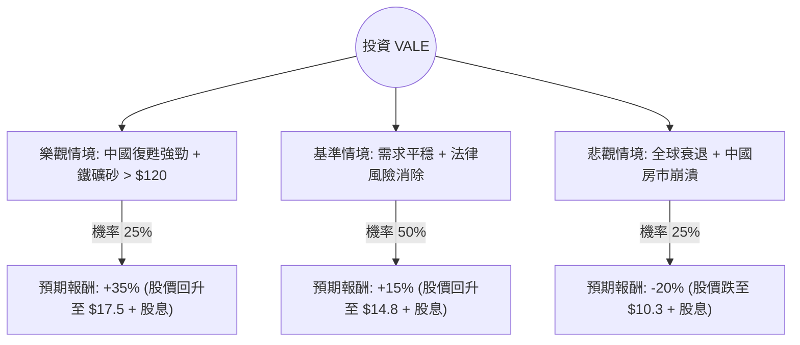

針對美股 **VALE (淡水河谷)** 的投資評估，我已結合您提供的基本面數據，並透過網路搜尋更新了最新的市場動態（如：Mariana 礦災賠償協議進展、中國刺激政策影響、鐵礦砂價格走勢）。

以下是基於**決策樹分析**與**期望值分析**的詳細報告。

---

### 一、 核心背景與最新資訊分析

在進行建模前，整合以下關鍵資訊：
1.  **Mariana 礦災和解（利多/不確定性消除）**：2024 年 10 月底，Vale 與巴西政府達成了約 300 億美元的最終賠償協議。雖然金額龐大，但這消除了長期懸在股價上的法律不確定性（Overhang），市場普遍視為利空出盡。
2.  **中國需求（關鍵變數）**：Vale 的營收高度依賴中國鋼鐵需求。近期中國政府推出一系列貨幣與財政刺激政策，雖房地產復甦緩慢，但對鐵礦砂價格形成支撐。
3.  **財務健康度**：
    *   **低估值**：Forward P/E 僅 6.78，PEG 0.69，顯示股價相對於盈餘成長被低估。
    *   **高股息**：殖利率約 8.37%，提供強大的下行保護。
    *   **營運效率**：ROE 13.65%，營業利益率 26.85%，表現穩健。

---

### 二、 決策樹分析 (Decision Tree)

我們預測未來 12 個月的投資回報，將情境分為「樂觀」、「基準」與「悲觀」。

#### 節點詳細說明：

| 情境 | 機率 (P) | 預期報酬 (R) | 說明 |
| :--- | :--- | :--- | :--- |
| **樂觀 (Bull)** | 25% | **+35%** | 中國刺激政策超預期，鐵礦砂價格大漲，Vale 恢復大規模回購。 |
| **基準 (Base)** | 50% | **+15%** | 鐵礦砂維持在 $100-$110，賠償金分期支付不影響現金流，股價回歸 Target Price ($14.05)。 |
| **悲觀 (Bear)** | 25% | **-20%** | 中國需求持續萎縮，鐵礦砂跌破 $90，巴西政府干預公司治理。 |

---

### 三、 期望值分析 (Expected Value Analysis)

#### 1. 計算過程
期望值 (EV) = $\sum (機率 \times 預期報酬)$

*   **樂觀情境貢獻**：$0.25 \times 35\% = 8.75\%$
*   **基準情境貢獻**：$0.50 \times 15\% = 7.5\%$
*   **悲觀情境貢獻**：$0.25 \times (-20\%) = -5\%$

**總體期望報酬率 (Total EV) = $8.75\% + 7.5\% - 5\% = 11.25\%$**

#### 2. 核心假設
*   **市場假設**：鐵礦砂價格不會長期低於 $90/噸（Vale 的現金成本極低，具備競爭優勢）。
*   **財務假設**：8% 的股息發放具有持續性，能抵銷部分股價波動。
*   **產業趨勢**：能源轉型對高品質鐵礦砂（Vale 的強項）需求長期看好。

---

### 四、 最終結論

**判斷：適合投資 (Buy / Overweight)**

#### 理由：
1.  **期望值為正 (11.25%)**：在考慮了悲觀風險後，整體預期回報仍優於多數保守型投資工具。
2.  **估值極具吸引力**：Forward P/E 6.78 倍遠低於歷史均值與同業（如 Rio Tinto），且 PEG < 1 顯示市場過度低估其成長性。
3.  **重大利空出盡**：Mariana 賠償協議的達成是重要的轉折點，消除了長達 9 年的法律陰影，有利於機構法人重新配置資金。
4.  **高安全邊際**：8.37% 的股息率與 1.35 的 P/B 比提供了強大的下行緩衝。即使股價盤整，投資者仍能獲得優渥的現金流。

**建議操作：**
目前股價 $12.92 接近 52 週高點，但距離分析師目標價 $14.05 仍有空間。建議採**分批進場**策略，以應對大宗商品市場的短期波動。

---
*風險提示：VALE 受宏觀經濟與巴西政治影響較大，投資者應密切關注中國房地產數據及巴西匯率 (BRL) 走勢。*