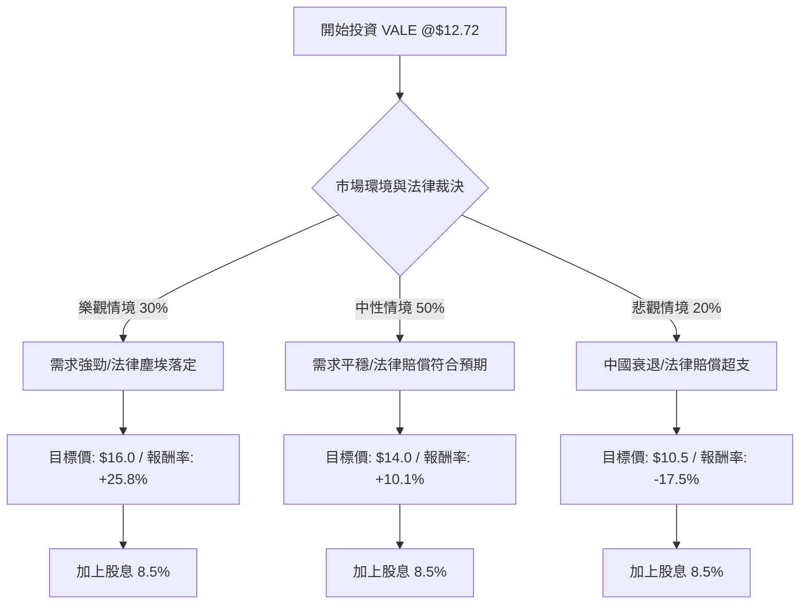

這份分析報告將結合您提供的財務數據與最新的市場動態（包括中國經濟刺激政策、鐵礦砂價格走勢及 Mariana 水壩事故賠償進展），利用**決策樹（Decision Tree）**與**期望值分析（Expected Value Analysis）**來評估 VALE 的投資潛力。

---

### 1. 最新市場動態與背景分析 (補充資訊)

在進行計算前，我們先整理影響 VALE 未來一年股價的核心變數：
1.  **中國經濟需求**：VALE 的營收高度依賴鐵礦砂。近期中國宣布強力的貨幣與房地產刺激政策，帶動鐵礦砂價格重回 $100/t 以上，對 VALE 是重大利多。
2.  **Mariana 礦災賠償**：近期報導指出，Vale 及其合作夥伴即將與巴西政府達成約 300 億美元的最終賠償協議。雖然金額龐大，但市場普遍認為這將消除長期懸而未決的不確定性（Remove the Overhang）。
3.  **財務健康度**：目前 Forward P/E 僅 6.69，PEG 0.71，顯示估值極低。股息率 8.5% 提供強大的下檔保護。

---

### 2. 決策樹分析 (Decision Tree)

以下是 VALE 未來一年投資回報的情境預測：

| 情境 (Scenario) | 機率 (P) | 股價變動預測 | 股息收益 (D) | 總報酬率 (R) |
| :--- | :--- | :--- | :--- | :--- |
| **樂觀 (Bull Case)** | 30% | +25.8% ($16.0) | 8.5% | **+34.3%** |
| **中性 (Base Case)** | 50% | +10.1% ($14.0) | 8.5% | **+18.6%** |
| **悲觀 (Bear Case)** | 20% | -17.5% ($10.5) | 8.5% | **-9.0%** |

---

### 3. 期望值分析 (Expected Value Analysis)

#### A. 核心假設
1.  **持有時間**：12 個月。
2.  **現金流**：假設公司維持 8.5% 的配息政策（基於其強勁的 FCF 17.9 估值）。
3.  **估值修正**：
    *   **樂觀**：中國房地產回暖，鐵礦砂價格站穩 $120，P/E 回歸歷史均值 10x。
    *   **中性**：鐵礦砂維持 $100-$110，市場消化水壩賠償金，股價接近分析師目標價 $14.01。
    *   **悲觀**：中國刺激無效，全球經濟衰退，鐵礦砂跌破 $90，股價回測 52 週低點附近。

#### B. 期望報酬率計算
$$EV = (P_1 \times R_1) + (P_2 \times R_2) + (P_3 \times R_3)$$

*   **樂觀部分**：$0.30 \times 34.3\% = 10.29\%$
*   **中性部分**：$0.50 \times 18.6\% = 9.30\%$
*   **悲觀部分**：$0.20 \times (-9.0\%) = -1.80\%$

**總預期報酬率 (Expected Return) = 17.79%**

---

### 4. 數據點評 (基本面參考)

*   **低估值指標**：Forward P/E 6.69 與 PEG 0.71 顯示股價相對於盈餘成長非常廉價。
*   **獲利能力**：ROE 13.65% 與 Operating Margin 26.85% 顯示其在採礦成本控制上具有護城河（主要是其高品質鐵礦砂 S11D 項目）。
*   **風險點**：Current Ratio 1.24 雖健康，但 Quick Ratio 0.82 略低，需注意短期法律賠償金支付時的現金流壓力。

---

### 5. 最終結論

**評估結果：適合投資 (Buy / Overweight)**

#### 理由：
1.  **期望值吸引力高**：經機率加權後的預期報酬率高達 **17.79%**，遠高於標普 500 的長期平均報酬。
2.  **強大的安全邊際**：8.5% 的高股息率為投資者提供了極佳的緩衝，即使股價盤整，領取股息仍具競爭力。
3.  **週期性反轉機會**：VALE 目前處於 52 週範圍的中低位（$12.72 相較於 $13.32 高點仍有空間），且受惠於近期中國宏觀政策的轉向。
4.  **不確定性消除**：Mariana 水壩法律協議的達成將使 VALE 擺脫長年的估值折價。

**操作建議：**
考慮到鐵礦砂的波動性，建議採取**分批買入**策略。若股價因法律賠償細節公佈而出現短暫非理性下跌，將是更好的切入點。

***

*免責聲明：本分析僅供參考，不構成投資建議。投資股票具有風險，請根據自身風險承受能力做出決策。*