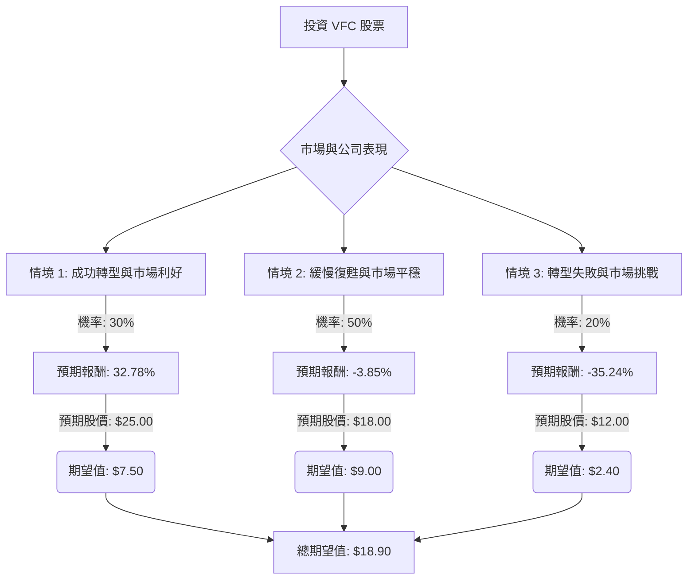

根據對美股公司 VFC 的決策樹分析與期望值分析，並參考其基本面數據及最新市場資訊，以下是評估結果：

### **核心假設**

1.  **市場假設：**
    *   **消費者支出：** 預計 2025 年美國消費者支出將溫和增長（J.P. Morgan 預計 2.3%），但 2026 年可能放緩至 1.6% (Deloitte)。消費者將持續對價格敏感，並傾向於追求價值導向的消費，減少非必需品的支出。
    *   **通膨與利率：** 通膨和利率仍將是影響消費者購買力的重要因素。
    *   **產業趨勢：** 服裝和鞋類市場將繼續受運動休閒 (athleisure)、DTC (Direct-to-Consumer) 模式和永續發展趨勢的影響。
    *   **關稅影響：** 關稅成本上升對供應鏈和利潤率構成壓力，VFC 已採取初步定價措施以抵消影響，預計將在 2026 財年第四季度反映。

2.  **財務假設 (VFC 特定)：**
    *   **「Reinvent」轉型計畫：** VFC 的「Reinvent」轉型計畫旨在改善營運、降低成本、提高利潤率和重新定位品牌。該計畫的大部分重組行動已於 2026 財年第一季度末完成。
    *   **品牌表現：** The North Face 和 Timberland 表現強勁，但在 2026 財年第三季度 Vans 銷售額仍下降 8.2%，其復甦對整體業績至關重要。
    *   **債務狀況：** VFC 正在積極減少債務，目標是在 2026 財年末將槓桿率降至 3.5 倍或以下（2025 財年末為 4.1 倍），並在 2028 財年達到約 2.5 倍。然而，其高負債權益比 (3.92) 仍是主要風險。公司已於 2026 財年第三季度完成 Dickies 品牌的出售，有助於債務削減。
    *   **利潤率：** 2026 財年第三季度毛利率為 56.3%，公司目標是 2026 財年毛利率達到 54.5% 或更高，並在 2028 財年實現約 10% 的營運利潤率。
    *   **股息：** 公司已宣佈每股 0.09 美元的季度股息，年化殖利率約 1.9%。

### **決策樹分析**

**決策點：投資 VFC 股票**

*   **當前股價 (Close):** $19.11

### **計算過程**

**1. 情境設定與預期股價：**

*   **情境 1: 成功轉型與市場利好 (Optimistic Scenario)**
    *   **情境描述：** VFC 的「Reinvent」轉型策略取得顯著成功，Vans 品牌實現明確復甦，債務削減進度超預期。消費者可支配支出強勁增長，尤其是在戶外和運動休閒領域。關稅影響被有效化解。
    *   **機率 (Probability)：** 30%
    *   **預期未來股價：** $25.00 (接近分析師最高目標價 $27.00，反映強勁執行和市場順風。)
    *   **預期報酬 (Expected Return)：**
        *   股價收益 = ($25.00 - $19.11) / $19.11 = 0.3082 或 30.82%
        *   總報酬 = 股價收益 + 股息殖利率 = 0.3082 + 0.0196 = 0.3278 或 32.78%
    *   **期望值 (Expected Value)：** $25.00 * 0.30 = $7.50

*   **情境 2: 緩慢復甦與市場平穩 (Neutral Scenario)**
    *   **情境描述：** VFC 的轉型計畫持續推進，但進展緩慢，Vans 品牌仍是拖累或僅有溫和改善。債務削減持續但速度較慢，可能需要進一步資產出售。消費者支出保持謹慎，對價格敏感。The North Face 和 Timberland 表現良好，但整體增長溫和。關稅影響得到控制但對利潤率構成壓力。
    *   **機率 (Probability)：** 50%
    *   **預期未來股價：** $18.00 (略低於當前股價，接近分析師中位目標價 $17.09 - $18.00，反映緩慢進展和持續挑戰。)
    *   **預期報酬 (Expected Return)：**
        *   股價收益 = ($18.00 - $19.11) / $19.11 = -0.0581 或 -5.81%
        *   總報酬 = 股價收益 + 股息殖利率 = -0.0581 + 0.0196 = -0.0385 或 -3.85%
    *   **期望值 (Expected Value)：** $18.00 * 0.50 = $9.00

*   **情境 3: 轉型失敗與市場挑戰 (Pessimistic Scenario)**
    *   **情境描述：** VFC 的轉型策略失敗，Vans 品牌持續大幅下滑。債務問題惡化，公司難以達到槓桿目標。消費者可支配支出進一步疲軟，影響所有品牌。競爭加劇，VFC 市場份額流失。關稅成本嚴重侵蝕盈利能力。
    *   **機率 (Probability)：** 20%
    *   **預期未來股價：** $12.00 (低於分析師最低目標價 $10.00，反映重大價值損失。)
    *   **預期報酬 (Expected Return)：**
        *   股價收益 = ($12.00 - $19.11) / $19.11 = -0.3720 或 -37.20%
        *   總報酬 = 股價收益 + 股息殖利率 = -0.3720 + 0.0196 = -0.3524 或 -35.24%
    *   **期望值 (Expected Value)：** $12.00 * 0.20 = $2.40

**2. 整體期望值計算：**

*   整體期望值 = (情境 1 期望值) + (情境 2 期望值) + (情境 3 期望值)
*   整體期望值 = $7.50 + $9.00 + $2.40 = $18.90

### **最終結論**

根據上述決策樹分析和期望值計算，VFC 股票的整體期望值為 **$18.90**。

*   **判斷：不適合投資**

**簡短理由：**
VFC 的整體期望值 ($18.90) 略低於其當前股價 ($19.11)。這表明在考慮了各種可能的市場和公司表現情境及其相關機率後，預期該股票在未來 12-18 個月內的回報可能為負值。儘管 VFC 在 2026 財年第三季度表現超出預期，並在「Reinvent」轉型計畫中取得進展，但 Vans 品牌的持續掙扎、高負債水平以及謹慎的消費者支出環境，都為其未來表現帶來不確定性。 分析師的共識目標價也普遍低於當前股價，暗示潛在的下行風險。 因此，目前 VFC 股票不適合投資。