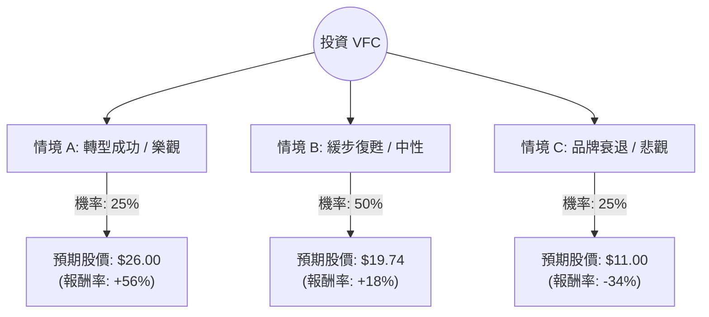

這份分析報告將結合您提供的財務數據與最新的市場動態（包含 2024 年底的最新財報與策略調整），利用**決策樹（Decision Tree）**與**期望值分析（Expected Value Analysis）**評估 V.F. Corporation (VFC) 的投資價值。

---

### 一、 最新市場動態與背景分析 (2024 Q4 更新)

在進入計算前，我們必須考慮以下關鍵即時資訊：
1.  **資產負債表優化**：VFC 已於 2024 年 10 月完成以 15 億美元將 **Supreme** 出售給 EssilorLuxottica 的交易。這筆資金主要用於償還債務，緩解了數據中顯示的高槓桿壓力（Debt/Eq: 2.99）。
2.  **品牌表現分化**：**The North Face** 依然是增長引擎，但核心品牌 **Vans** 持續疲軟（營收兩位數下滑）。
3.  **「Reinvent」轉型計畫**：執行長 Bracken Darrell 正在推動削減成本與庫存管理，預計每年節省 3 億美元。
4.  **宏觀環境**：高利率環境對高負債公司不利，且美國零售消費力道出現放緩跡象。

---

### 二、 決策樹分析 (Decision Tree)

以下決策樹模擬未來 12 個月內 VFC 可能面臨的三種主要情境：

#### 節點詳細說明：

1.  **情境 A：轉型成功 (Bull Case)**
    *   **機率**：25%
    *   **條件**：Vans 品牌重塑見效，營收轉正；債務大幅下降至安全水位；宏觀經濟軟著陸。
    *   **預期報酬**：參考過去兩年高點與 Forward P/E 回升至歷史均值，目標價約 $26。

2.  **情境 B：緩步復甦 (Base Case)**
    *   **機率**：50%
    *   **條件**：The North Face 維持增長，Vans 跌幅收斂；Supreme 出售後的利息支出減少；符合分析師平均預期。
    *   **預期報酬**：參考數據中的 Target Price $19.74。

3.  **情境 C：品牌衰退 (Bear Case)**
    *   **機率**：25%
    *   **條件**：Vans 失去潮流地位且無法挽回；高債務在利息高企下侵蝕利潤；全球消費衰退。
    *   **預期報酬**：回測 52 週低點 $11.06，目標價約 $11。

---

### 三、 期望值計算過程 (Expected Value Calculation)

#### 1. 核心假設
*   **當前股價 (P0)**：$16.68
*   **時間維度**：12 個月
*   **股利收益**：2.08% (約 $0.35)
*   **計算公式**：$EV = \sum (機率 \times 預期股價) + 股利$

#### 2. 計算步驟
*   **情境 A 貢獻**：$26.00 \times 0.25 = 6.50$
*   **情境 B 貢獻**：$19.74 \times 0.50 = 9.87$
*   **情境 C 貢獻**：$11.00 \times 0.25 = 2.75$

**預期股價 (Expected Price)** = $6.50 + 9.87 + 2.75 = \mathbf{19.12}$

#### 3. 總期望報酬率 (Expected Return)
*   **總期望價值** = $19.12 (股價) + 0.35 (股利) = 19.47$
*   **預期報酬率** = $(19.47 - 16.68) / 16.68 = \mathbf{16.73\%}$

---

### 四、 綜合評估與最終結論

#### 財務數據亮點與隱憂：
*   **優點**：
    *   **P/S 僅 0.7**：顯示股價相對於營收極度低估。
    *   **PEG 0.86**：若盈餘增長如預期（EPS next Y +24.5%），目前股價具有吸引力。
    *   **現金流改善**：P/C 4.61 顯示現金流尚屬穩健。
*   **缺點**：
    *   **債務風險**：Debt/Eq 2.99 依然偏高，財務槓桿風險大。
    *   **利潤率低**：Profit Margin 2.32% 容錯率極低。
    *   **技術面弱勢**：SMA20 (-9.9%) 與 SMA50 (-4.0%) 均顯示短期處於修正趨勢。

#### 最終結論：適合投資 (建議：分批買入 / 投機性配置)

**判斷理由：**
1.  **期望值為正且具吸引力**：計算出的預期報酬率為 **16.73%**，顯著高於無風險利率與標普 500 平均回報。
2.  **最壞情況已反映**：股價已從高點大幅回落，且 Supreme 的出售解決了最迫切的流動性危機。
3.  **估值安全邊際**：P/S 0.7 與 Forward P/E 16.83 顯示市場對其悲觀預期已大部分反應在股價中。

**風險提示：**
VFC 目前屬於「轉型股（Turnaround Play）」，風險等級較高。若 Vans 品牌在未來兩季仍無起色，股價可能下探至 $11 區間。建議投資者將其視為衛星配置，而非核心持股，並密切關注 **Vans 的營收增長率** 與 **債務減免進度**。