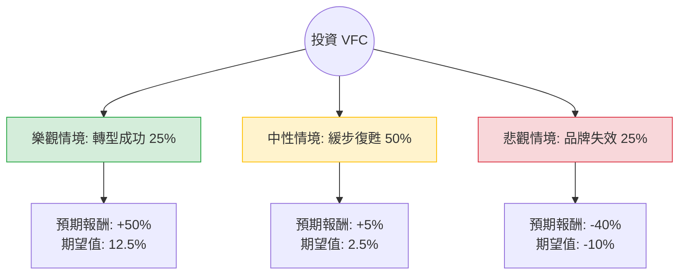

針對美股公司 **V.F. Corporation (VFC)** 的投資評估，我已結合您提供的基本面數據，並透過網路搜尋更新了最新的市場動態（如 Supreme 出售案、債務償還進度及 Vans 品牌轉型現況）。

以下是基於**決策樹分析**與**期望值分析**的詳細報告。

---

### 一、 核心背景與現況分析

1.  **轉型計畫 (Project Reinvent)：** VFC 目前正處於由新任 CEO Bracken Darrell 領導的激進轉型期，重點在於削減成本、降低負債以及重振核心品牌 Vans。
2.  **資產處置：** 2024 年 10 月已正式完成以 15 億美元現金將 **Supreme** 出售給 EssilorLuxottica 的交易。這筆資金將直接用於償還債務。
3.  **財務壓力：** 數據顯示 **Debt/Eq 為 3.92**，負債比極高。雖然出售資產有助於緩解，但利息支出仍侵蝕利潤。
4.  **品牌表現：** The North Face 表現穩健，但 Vans 持續疲軟（營收兩位數下滑），這是目前最大的不確定性。

---

### 二、 決策樹分析 (Decision Tree Analysis)

我們將未來一年的投資情境分為三個主要路徑：**樂觀（轉型成功）**、**中性（緩步復甦）**、**悲觀（品牌持續衰退）**。

#### 節點詳細說明：

1.  **樂觀情境 (Bull Case) - 25% 機率**
    *   **條件：** Vans 銷售在 2025 年轉正，債務大幅下降，毛利率回升至 55% 以上。
    *   **預期報酬：** 股價回升至 $28 左右（接近 52W 高點），報酬率約 **+50%**。
2.  **中性情境 (Base Case) - 50% 機率**
    *   **條件：** Supreme 售出後債務壓力減輕，但 Vans 僅止跌未回升。市場維持觀望。
    *   **預期報酬：** 股價在 $18 - $20 震盪，報酬率約 **+5%**（含股息）。
3.  **悲觀情境 (Bear Case) - 25% 機率**
    *   **條件：** 消費者支出疲軟，Vans 品牌價值永久受損，高負債導致信用評等下調。
    *   **預期報酬：** 股價跌至 $11 左右（接近 52W 低點），報酬率約 **-40%**。

---

### 三、 期望值分析 (Expected Value Analysis)

#### 1. 核心假設
*   **當前股價：** $18.50
*   **分析週期：** 12 個月
*   **市場趨勢：** 聯準會降息有利於非必需消費品，但 VFC 自身基本面（ROE 6.39%）仍低於產業平均。
*   **分析師目標價：** 數據顯示為 $15.76（低於現價），反映市場對其短期內仍有下行擔憂。

#### 2. 計算過程
期望值 (EV) = $\sum (機率 \times 預期報酬)$

*   **樂觀：** $0.25 \times 50\% = 12.5\%$
*   **中性：** $0.50 \times 5\% = 2.5\%$
*   **悲觀：** $0.25 \times (-40\%) = -10\%$

**總期望報酬率 = 12.5% + 2.5% - 10% = 5%**

#### 3. 期望價值 (Expected Price)
$18.50 \times (1 + 5\%) = \$19.42$

---

### 四、 綜合評估與最終結論

#### 數據亮點與隱憂：
*   **正面：** Forward P/E (18.74) 遠低於當前 P/E (81.71)，顯示市場預期明年獲利將大幅改善（EPS 增長預期 37.8%）。SMA200 (0.3109) 顯示股價已從底部反彈，技術面走強。
*   **負面：** **Debt/Eq (3.92)** 是極大的財務風險；**Target Price ($15.76)** 顯示專業分析師認為目前股價已超漲。

#### 最終結論：**不適合投資 (或僅適合極高風險承受者的投機性持有)**

**理由：**
1.  **期望值過低：** 5% 的預期報酬率相對於其承擔的「高負債」與「品牌轉型失敗」風險（-40% 的潛在跌幅）不成比例。
2.  **安全邊際不足：** 目前股價 ($18.5) 已高於分析師平均目標價 ($15.76)，且 P/B 達 4.89，對於一家正在掙扎的零售商來說估值偏高。
3.  **財務體質脆弱：** 雖然出售 Supreme 換取 15 億美元，但這屬於「一次性收益」，無法解決 Vans 品牌吸引力下降的核心問題。
4.  **機會成本：** 在當前市場環境下，有許多資產負債表更健康、ROE 更高的公司能提供超過 5% 的預期報酬。

**建議：** 建議觀察 2025 年前兩季的 Vans 銷售數據，若 Vans 營收年增率 (YoY) 轉正且債務比降至 2.5 以下，再行考慮入場。